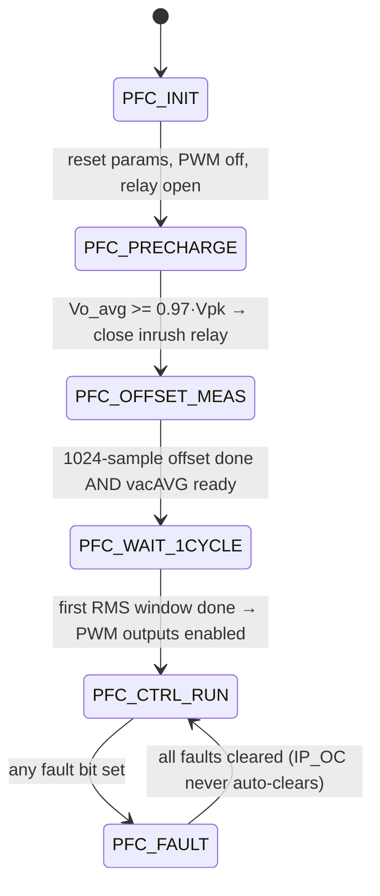

# PFC Control — Theory, Design and Implementation Reference

**Project:** `pfc_1phases_dspic33ak` — single-phase, single-stage boost PFC on dsPIC33AK128MC106
**Branch documented:** `claude/dcm-mcm-wip` (commit `580783c` and working tree)
**Date:** 2026-07-27

---

## How to read this document

This is a *research/reference report*: it starts from first principles (the boost
converter), builds up to power-factor correction, and then derives every calculation the
firmware performs, with a pointer to the exact line that implements it.

Conventions used throughout:

| Symbol | Meaning | Firmware name |
|---|---|---|
| `Vg`, `vg` | rectified instantaneous input voltage \|v_ac\| | `pfcParam.rectifiedVac` |
| `Vo`, `vo` | DC-bus (output) voltage, instantaneous | `pfcParam.pfcVoltage.vdc` |
| `Vo_avg` | DC-bus voltage, averaged over one 100 Hz ripple period | `pfcParam.vdcAVG.output`, `outputVdc` |
| `Vo_filt` | DC-bus voltage as the voltage PI sees it (notched, §4.6) | `pfcParam.vdcFeedback` |
| `Vrms` | RMS of the rectified input | `sqrt(pfcParam.vacRMS.sqrOutput)` |
| `iL` | inductor current, sampled | `pfcParam.iL` |
| `I_avg` | *cycle-average* inductor current | `pfcParam.averageCurrent` |
| `d`, `d1` | applied ON duty ratio of the boost switch | `pfcParam.dutyRatio` |
| `d2` | demagnetising (diode conduction) duty in DCM | not stored |
| `D_ideal` | CCM steady-state duty `(Vo−Vg)/Vo` | `pfcParam.boostDutyRatio` |
| `Ts` | switching / control period, 15.625 µs | `PFC_LOOPTIME_SEC` |
| `L` | boost inductance, 680 µH | `PFC_INDUCTANCE` |
| `C` | DC-bus capacitance, 1410 µF | plant only (`C` in the `.m` file) |

**Maths rendering.** Equations are written in LaTeX (`$…$` inline, `$$…$$` display). These
render in **VS Code's built-in Markdown preview** (`Ctrl+Shift+V` — KaTeX, enabled by
default) and on GitHub. They will **not** render in MPLAB X, which shows the raw source.
Waveform sketches and block diagrams stay as ASCII art, which is clearer as a drawing and
readable everywhere.

Display equations are numbered by chapter — `(1.4)` is the fourth in chapter 1 — so later
sections can refer to them precisely instead of saying "as shown above".

> **Conversion status.** **Chapters 1–3 and 5–11, plus §4.4–4.6 and §15.1, are complete**
> in this style — numbered equations, explicit assumptions, step-by-step derivations,
> worked numbers for this hardware, and a traps box per section. Chapters 12–14 and 16–20,
> and §4.1–4.3, still use the older terse ASCII form and read as a reference rather than a
> tutorial; they are being converted incrementally.
>
> Where a chapter is only partly converted, equation numbers are reserved for the sections
> still to come: §4 therefore starts at **(4.5)**, reserving 4.1 to 4.4 for §4.2–4.3.
>
> If you are here to understand the loop tuning specifically, read
> **§1.5 → §2.4 → §15.1 → §15.2–15.4**, in that order.

Statements are labelled where they are not directly readable from the source:
**[derived]** = obtained here from the code/parameters by calculation;
**[inferred]** = a plausible reading that has not been confirmed against hardware or a
datasheet; **[open]** = a known gap or caveat.

**Contents**

1. [The boost converter](#1-the-boost-converter)
2. [Power-factor correction fundamentals](#2-power-factor-correction-fundamentals)
3. [Firmware architecture and timing](#3-firmware-architecture-and-timing)
4. [The measurement chain](#4-the-measurement-chain)
5. [Outer loop: bus voltage → power command](#5-outer-loop-bus-voltage--power-command)
6. [Current reference generation (the multiplier)](#6-current-reference-generation-the-multiplier)
7. [Load-power feed-forward](#7-load-power-feed-forward)
8. [Inner loop: current control](#8-inner-loop-current-control)
9. [Duty feed-forward](#9-duty-feed-forward)
10. [Conduction-mode detection](#10-conduction-mode-detection)
11. [Current-sample reconstruction (DCM/MCM)](#11-current-sample-reconstruction-dcmmcm)
12. [Burst control at light load](#12-burst-control-at-light-load)
13. [Start-up: precharge, offset, soft start](#13-start-up-precharge-offset-soft-start)
14. [Protection and fault handling](#14-protection-and-fault-handling)
15. [Loop tuning: where the gains come from](#15-loop-tuning-where-the-gains-come-from)
16. [Operating-point map for this hardware](#16-operating-point-map-for-this-hardware)
17. [Verification: SiL and X2C-Scope](#17-verification-sil-and-x2c-scope)
18. [Parameter reference](#18-parameter-reference)
19. [Known limitations and open items](#19-known-limitations-and-open-items)
20. [References](#20-references)

---

## 1. The boost converter

### 1.1 Topology and switching states

**The question.** What are the pieces, and what does each switching state do to the
inductor current? Everything in chapters 1–2 follows from the answer, because a boost
converter has exactly one actuator — the fraction of each period the switch is closed —
and its entire behaviour is the consequence of applying two different voltages to one
inductor.

#### Physical picture

```
        L            D
  Vg o--UUUU--+-----|>|-----+----o Vo
              |             |
             _|_           ---
          Q  |_| (switch)  --- C     R (load)
              |             |
  GND o-------+-------------+----o
```

In this project $V_g$ is **not** a DC source: it is the *rectified line*,

$$V_g(t) = \hat{V}\left|\sin(\omega_{line} t)\right| \tag{1.1}$$

produced by the input diode bridge. The bus capacitor $C$ sits on the output, so $V_o$ is
nearly DC and — crucially — always larger than $V_g$.

> **Assumptions.** Carried through all of chapter 1.
>
> 1. **Ideal switch and diode.** No forward drop, no on-resistance, no switching time,
>    no diode reverse recovery. Real drops shift the duty slightly but change nothing
>    structural.
> 2. **$V_o$ is stiff within a switching period.** $C$ is large enough that $V_o$ barely
>    moves in 15.6 µs. It does move at 100 Hz — that is the bus ripple of §2.5 — but
>    that is slow compared with the switching period.
> 3. **$V_g$ is quasi-static within a switching period.** $f_{sw}$ is 1280× the line
>    frequency, so $V_g$ changes by well under 1 % per period.

#### The two states

The switch alternately connects the inductor's right-hand end to ground or to the bus.
That is the whole mechanism — two different voltages across one inductor:

| State | Duration | Inductor voltage $v_L$ | $di/dt = v_L/L$ | what it does |
|---|---|---|---|---|
| **ON** (Q closed, D blocked) | $d\,T_s$ | $+V_g$ | $+V_g/L$ | stores energy in $L$; the load is fed by $C$ alone |
| **OFF** (Q open, D conducting) | $(1-d)T_s$ in CCM | $V_g - V_o$ (negative) | $(V_g-V_o)/L$ | dumps $L$'s energy *plus* the input into the bus |

A **third** state exists only in DCM: once the inductor current reaches zero the diode
stops conducting and $i_L = 0$ for the rest of the period (§1.4).

Note the asymmetry that makes a boost a boost: during ON the load is supported entirely by
the capacitor, and during OFF the inductor delivers current at a voltage *higher* than the
input. Energy only ever moves input → inductor → bus.

#### Numbers for this hardware

At the line peak ($V_g = 325.3$ V, $V_o = 380$ V, $L = 680\ \mu H$): [derived]

$$\left.\frac{di}{dt}\right|_{ON} = \frac{325.3}{680\mu} = +0.478\ \text{A}/\mu s,
\qquad
\left.\frac{di}{dt}\right|_{OFF} = \frac{325.3-380}{680\mu} = -0.081\ \text{A}/\mu s$$

The rise is nearly six times steeper than the fall, which is why the ON time is short and
the duty is small near the line peak — quantified in §1.2.

> **Traps.**
>
> * **The OFF-state inductor voltage is $V_g - V_o$, not $-V_o$.** The input stays
>   connected throughout; the inductor sees the *difference*. Getting this wrong is the
>   most common sign error in boost analysis, and it propagates into $d_2$ in §1.4.
> * **"OFF" does not mean "not conducting".** During OFF the inductor is delivering
>   current to the load through the diode. It is the ON state in which the bus is
>   unsupported.

### 1.2 CCM steady state — volt-second balance and the gain formula

**The question.** Given an input $V_g$ and a desired output $V_o$, what duty does the
converter settle at in steady state? This produces $D_{ideal}$, the single most reused
quantity in the firmware — it appears in the duty feed-forward (§9), the conduction-mode
detector (§10) and the sample reconstruction (§11).

#### Physical picture

In steady state the inductor current must end each period exactly where it started —
otherwise it would drift away period after period, which is not a steady state. Since
$v_L = L\,di/dt$, "current returns to its starting value" is the same statement as "the
*area* under the voltage waveform over one period is zero":

```
  v_L
   |    +Vg
   |  +------+                        area ABOVE the axis (during ON)
 0 |--+------+------------------+---  must equal
   |         |                  |     area BELOW it (during OFF)
   |         +------------------+
   |              Vg - Vo
      |<-d.Ts->|<---(1-d).Ts--->|
```

This is **volt-second balance**. It is not an approximation — it is exact for any
periodic steady state.

> **Assumptions.** Those of §1.1, plus **CCM** (the current never reaches zero, so there
> are only two intervals) and **steady state** (this says nothing about transients — during
> a load step the duty is deliberately *not* $D_{ideal}$).

#### Derivation

**Step 1 — write the balance.** Voltage $\times$ time for each interval, summed to zero:

$$V_g\,(d\,T_s) \;+\; (V_g - V_o)\bigl((1-d)T_s\bigr) = 0 \tag{1.2}$$

**Step 2 — divide out $T_s$.** It appears in both terms, so the result cannot depend on
the switching frequency:

$$V_g\,d + (V_g - V_o)(1-d) = 0$$

**Step 3 — expand the product.**

$$V_g d + V_g - V_g d - V_o + V_o d = 0$$

**Step 4 — cancel.** The $+V_g d$ and $-V_g d$ terms cancel exactly, which is what makes
the result so simple:

$$V_g - V_o + V_o d = 0 \;\;\Longrightarrow\;\; V_g = V_o(1-d)$$

**Step 5 — read it two ways.** Solving for the ratio gives the voltage gain; solving for
$d$ gives the duty the converter needs:

$$M(d) = \frac{V_o}{V_g} = \frac{1}{1-d} \tag{1.3a}$$

$$\boxed{\;D_{ideal} = \frac{V_o - V_g}{V_o} = 1 - \frac{V_g}{V_o}\;} \tag{1.3b}$$

#### Numbers for this hardware

$D_{ideal}$ is not a constant — in a PFC it sweeps the *entire* usable range twice per
line cycle. At 230 Vrms ($\hat V = 325.3$ V) into a 380 V bus: [derived]

| $\theta$ | 0° | 15° | 30° | 45° | 60° | 75° | 90° |
|---|---|---|---|---|---|---|---|
| $V_g$ (V) | 0 | 84.2 | 162.6 | 230.0 | 281.7 | 314.2 | 325.3 |
| $D_{ideal}$ | 1.000 | 0.778 | 0.572 | 0.395 | 0.259 | 0.173 | **0.144** |

and it does that 100 times a second. The steepest slew is at the zero crossing:

$$\left.\frac{dD_{ideal}}{dt}\right|_{\theta=0}
= \frac{\hat V}{V_o}\,\omega_{line} = 0.856 \times 314.2 = 269\ \mathrm{s^{-1}}
\;\;\Longrightarrow\;\; 0.42\ \%\ \text{of full duty per switching period}$$

That number is the whole motivation for §9. A PI controller asked to *synthesise* a ramp
this steep through its integrator will always lag it — a classic velocity error — and the
lag shows up directly as input-current distortion. Feeding $D_{ideal}$ forward instead,
and letting the PI trim only the residue, removes the ramp from the integrator's job.

#### In the firmware

Computed once per ISR, straight from the two live measurements:

> `PFC_UpdateBoostDutyRatio()` — [pfc.c:334](project/pfc/pfc.c:334)
> ```c
> pfcData->boostDutyRatio = ((pVoltage->vdc - pfcData->rectifiedVac) / pVoltage->vdc);
> ```

Note it uses **instantaneous** `vdc`, not the averaged bus voltage. That is deliberate: it
makes the feed-forward cancel bus ripple as well as the line sweep (§9).

> **Traps.**
>
> * **$M \ge 1$ always — a boost cannot step down.** Whenever $V_g > V_o$ the converter
>   has *no control authority*: current flows through $L$ and $D$ into the bus regardless
>   of $d$. This is exactly the situation during precharge (§13.1), and it is why
>   $D_{ideal}$ from (1.3b) goes negative there and has to be guarded (§9.4).
> * **$D_{ideal}$ is the *steady-state CCM* duty, not "the duty to apply".** In DCM the
>   converter does not sit at $D_{ideal}$ at all — volt-second balance no longer pins the
>   duty, and the applied $d_1$ is free (§1.4). The firmware uses $D_{ideal}$ in *both*
>   modes, but for different purposes: as the duty itself in CCM, and as a known
>   coefficient inside (1.10) and (1.12) in DCM.
> * **$D_{ideal} \to 1$ at the zero crossing**, beyond `PFC_MAX_DUTY = 0.95`. The
>   converter simply cannot follow there; the feed-forward is clamped rather than allowed
>   to command a duty the PWM would clip anyway (§9.4).

### 1.3 Inductor current ripple and the CCM/DCM boundary

**The question.** Within one switching period the inductor current does not sit still — it
ramps up while the switch is ON and down while it is OFF. How big is that swing, and when
does it get large enough that the current reaches zero before the period ends? That second
question matters enormously, because a converter whose current hits zero obeys completely
different equations (§1.4) and presents a completely different plant to the controller.

#### Physical picture

```
  iL                                              iL
   |      /\      /\      /\                       |   /\          /\
   |     /  \    /  \    /  \                      |  /  \        /  \
Iavg|---/----\--/----\--/----\---               Iavg| /    \      /    \
   |   /      \/      \/      \                     |/      \    /      \
   |  /                                             |        \  /        \
  0 +--------------------------- t                 0 +---------\/---------\--- t
        valley stays above zero                          |<d1>|<d2>|<d3>|
              (CCM)                                 current sits at zero (DCM)
```

In CCM the current never reaches zero, so the diode conducts for the whole OFF time and
the switch always turns on into a non-zero current. In DCM the current hits zero partway
through the OFF time, the diode stops conducting, and the inductor simply idles for the
rest of the period.

> **Assumptions.** All of §1.3–1.4 rests on these. Every formula below stops being exact
> when one of them is violated.
>
> 1. **Small-ripple / linear-ramp.** $V_g$ and $V_o$ are treated as constant across one
>    switching period, so the current ramps are straight lines. Valid here because
>    $f_{sw}=64\ \text{kHz}$ is $1280\times$ the line frequency, so $V_g$ moves by well
>    under 1 % per period.
> 2. **Ideal switches.** No forward drops, no switching time, no diode reverse recovery.
> 3. **Steady state within the period** — the CCM duty is the volt-second-balance value
>    of §1.2. During a transient the applied duty differs and $\Delta I$ changes with it.
> 4. **Constant $L$.** Not true for a swinging (gapped, saturating) choke — see §10.4.

#### Derivation

**Step 1 — the ripple comes straight from the inductor law.** During the ON interval the
full input voltage is across the inductor, so $v_L = V_g$ and $\;di/dt = V_g/L$. Holding
that for a time $d\,T_s$ gives the peak-to-peak swing:

$$\Delta I = \frac{V_g}{L}\,d\,T_s \tag{1.4}$$

**Step 2 — substitute the steady-state duty.** In CCM, volt-second balance fixes the duty
at $d = D_{ideal} = 1 - V_g/V_o$ by (1.3b), regardless of load. Putting that into (1.4)
expresses the ripple purely in terms of the operating point:

$$\Delta I(V_g) = \frac{T_s}{L}\,V_g\left(1 - \frac{V_g}{V_o}\right) \tag{1.5}$$

**Step 3 — find the worst case.** Read (1.5) as a function of $V_g$: it is
$\frac{T_s}{L}\left(V_g - V_g^2/V_o\right)$, a downward parabola that is zero at $V_g=0$
and at $V_g=V_o$. By symmetry its maximum is halfway between, at $V_g = V_o/2$.
Substituting that back:

$$\Delta I_{max} = \frac{T_s}{L}\cdot\frac{V_o}{2}\cdot\frac{1}{2} = \frac{T_s\,V_o}{4L} \tag{1.6}$$

Note what this says physically: ripple is worst *mid-rise* of the rectified sine, not at
the peak. At the peak the duty is small, so the ON time is short and there is little time
to build ripple.

**Step 4 — the boundary condition.** The current stays positive for the whole period as
long as the valley of the triangle, $I_{avg} - \Delta I/2$, stays above zero. So:

$$\boxed{\;\text{CCM}\iff I_{avg} > \frac{\Delta I}{2} = \frac{T_s}{2L}V_g\left(1-\frac{V_g}{V_o}\right)\;} \tag{1.7}$$

#### Numbers for this hardware

With $T_s = 15.625\ \mu s$, $L = 680\ \mu H$, $V_o = 380\ \text{V}$: [derived]

$$\Delta I_{max} = \frac{15.625\times10^{-6}}{680\times10^{-6}}\cdot\frac{380}{4}
                 = 0.02298 \times 95 = 2.18\ \text{A pk-pk} \quad\text{at } V_g = 190\ \text{V}$$

The boundary (1.7) is a *current* condition, but it is more useful as a *power* one. Over
a line cycle the PFC forces $I_{avg}(\theta) = \hat{I}\sin\theta$ while
$V_g(\theta) = \hat{V}\sin\theta$. Substituting both into (1.7), the $\sin\theta$ cancels
on each side and leaves

$$\hat{I} > \frac{T_s}{2L}\hat{V}\left(1 - \frac{\hat{V}\sin\theta}{V_o}\right)$$

whose right-hand side is *largest as $\sin\theta \to 0$*. So the zero crossings are the
hardest place to stay in CCM, and at 230 Vrms ($\hat{V} = 325.3$ V):

| condition | requirement | input power |
|---|---|---|
| CCM everywhere in the line cycle | $\hat{I} > \frac{T_s}{2L}\hat{V} = 3.74$ A | **above ≈ 608 W** |
| CCM at the line peak only | $\hat{I} > \frac{T_s}{2L}\hat{V}(1-\hat{V}/V_o) = 0.54$ A | **above ≈ 88 W** |

Between those two figures the converter is in **mixed conduction mode (MCM)**: CCM around
the line peak, DCM near the zero crossings. §16 maps the crossover angle against load.

#### In the firmware

Both constants are pre-folded so the ISR never divides: [pfc_userparams.h:189](project/pfc/pfc_userparams.h:189)

```c
#define PFC_TS_OVER_L      (float)(PFC_LOOPTIME_SEC/PFC_INDUCTANCE)      /* 0.02298 A/V */
#define PFC_TWO_L_OVER_TS  (float)(2.0f*PFC_INDUCTANCE/PFC_LOOPTIME_SEC) /* 87.04 V/A  */
```

`PFC_TS_OVER_L` builds the ripple estimate for the mode detector (§10); `PFC_TWO_L_OVER_TS`
is the $2L/T_s$ that appears in the DCM duty feed-forward (§9).

> **Traps.**
>
> * $\Delta I$ in (1.4) is **peak-to-peak**, not an amplitude. The boundary uses
>   $\Delta I/2$ for exactly this reason. Dropping the factor 2 is the most common slip
>   here and it moves the CCM/DCM boundary by a factor of two.
> * The boundary is **not a fixed load threshold.** It moves across the line cycle, which
>   is why a PFC is in MCM rather than cleanly one mode — see the table above.
> * Ripple peaks at $V_g = V_o/2$, *not* at the line peak. If you size the inductor by
>   looking only at the peak of the sine you will under-size it.

### 1.4 DCM analysis

**The question.** Once condition (1.7) fails, what replaces the CCM relations? This single
section produces the equations behind the duty feed-forward (§9), the conduction-mode
detector (§10) *and* the current-sample reconstruction (§11) — it is the most reused
derivation in the document.

#### Physical picture

The period splits into **three** intervals, not two:

```
       Ipk  .              d1 = ON        (switch conducting, current ramps up)
           /|\             d2 = OFF-1     (diode conducting, current ramps down)
          / | \            d3 = OFF-2     (everything off, current sits at zero)
         /  |  \
    ____/   |   \________
     |<d1>|<-d2->|<-d3->|
                             d1 + d2 + d3 = 1
```

That idle interval $d_3$ is the whole story. In CCM the OFF interval is $1-d_1$ by
definition; in DCM the *conducting* part of the OFF interval is only $d_2$, and $d_2$ is
set by the physics, not by the controller.

> **Assumptions.** Everything from §1.3, plus:
>
> 5. **The diode blocks cleanly.** Once $i_L$ reaches zero it stays there — no negative
>    current, no reverse recovery.
> 6. **No ringing during $d_3$.** Real hardware rings at the $L$–$C_{oss}$ resonance
>    during the idle interval; the average of that ringing is taken as zero.
> 7. $d_3 \ge 0$. At exactly $d_3 = 0$ we are at the boundary and both this section and
>    §1.3 apply — which is the continuity check at the end.

#### Derivation

**Step 1 — the peak.** Identical to (1.4), but starting from zero rather than from a
valley, so the peak *is* the whole ramp:

$$I_{pk} = \frac{V_g}{L}\,d_1 T_s \tag{1.8}$$

**Step 2 — how long demagnetising takes.** During $d_2$ the inductor sees $V_g - V_o$,
i.e. it discharges at a rate $(V_o - V_g)/L$. The time to fall from $I_{pk}$ back to zero
must satisfy

$$I_{pk} = \frac{V_o - V_g}{L}\,d_2 T_s
\;\;\Longrightarrow\;\;
d_2 = \frac{I_{pk}L}{(V_o-V_g)T_s}$$

Substituting $I_{pk}$ from (1.8), the $L$ and $T_s$ cancel:

$$d_2 = d_1\,\frac{V_g}{V_o - V_g} \tag{1.9}$$

Sanity check: a bigger $V_o$ means a steeper discharge, so $d_2$ shrinks — as it should.

**Step 3 — average the triangle.** The current is a single triangle of height $I_{pk}$
and base $(d_1 + d_2)T_s$, sitting in a period of length $T_s$. Its area divided by $T_s$
is the cycle average:

$$I_{avg} = \frac{1}{2}I_{pk}(d_1 + d_2)$$

Substituting (1.8) and (1.9):

$$I_{avg} = \frac{1}{2}\left(\frac{V_g d_1 T_s}{L}\right)d_1\left(1 + \frac{V_g}{V_o-V_g}\right)$$

**Step 4 — simplify the bracket.** This is the step worth doing slowly. Put the bracket
over a common denominator:

$$1 + \frac{V_g}{V_o - V_g}
= \frac{(V_o - V_g) + V_g}{V_o - V_g}
= \frac{V_o}{V_o - V_g}$$

so that

$$I_{avg} = \frac{T_s V_g d_1^{\,2}}{2L}\cdot\frac{V_o}{V_o - V_g}$$

**Step 5 — recognise the ideal duty.** By (1.3b), $D_{ideal} = (V_o - V_g)/V_o$ — which is
exactly the reciprocal of that last fraction. Therefore:

$$\boxed{\;I_{avg} = \frac{T_s\,V_g\,d_1^{\,2}}{2\,L\,D_{ideal}}\;}\tag{1.10}$$

#### Why (1.10) matters so much

Compare the two modes as *plants seen by the current controller*:

| | CCM | DCM |
|---|---|---|
| what fixes the duty | volt-second balance pins $d = D_{ideal}$ | nothing — $d_1$ is free |
| relation to current | current is independent of $d$ in steady state | $I_{avg} \propto d_1^{\,2}$, a **static** function |
| controller sees | an integrator, $V_o/(sL)$ | a square-law gain, no state |

These are fundamentally different plants. A single fixed controller cannot be right for
both, which is precisely why the firmware detects the mode (§10) and switches its
feed-forward branch (§9).

#### Two identities that fall straight out

Rearranging (1.9) with the same $V_o/(V_o-V_g) = 1/D_{ideal}$ substitution:

$$d_1 + d_2 = d_1\left(1 + \frac{V_g}{V_o-V_g}\right) = \frac{d_1}{D_{ideal}}
\tag{1.11}$$

and solving (1.10) for $d_1$:

$$d_1 = \sqrt{\frac{2L}{T_s}\cdot\frac{I_{avg}\,D_{ideal}}{V_g}} \tag{1.12}$$

(1.11) is the **conduction fraction** used to reconstruct an average from a single sample
(§11); (1.12) is the **DCM duty feed-forward** (§9). Both are just (1.10) rearranged.

#### The continuity check

Does (1.10) agree with §1.3 at the boundary? At the boundary $d_3 = 0$, and the converter
is simultaneously "just barely CCM", so $d_1 = D_{ideal}$. Substituting that into (1.10):

$$I_{avg} = \frac{T_s V_g D_{ideal}^{\,2}}{2L\,D_{ideal}}
          = \frac{T_s V_g D_{ideal}}{2L}
          = \frac{T_s}{2L}V_g\left(1 - \frac{V_g}{V_o}\right)$$

which is exactly $\Delta I/2$ from (1.7). **The two modes meet continuously.** [derived]

This is not a curiosity — it is what makes the composite feed-forward of §9 bumpless. If
the two branches did not agree at the boundary, every mode transition would step the duty
and the mode detector's inevitable chatter would become visible distortion.

#### Numbers for this hardware

Take $V_g = 100$ V (well down the sine, where DCM lives) and a commanded $d_1 = 0.20$:

$$D_{ideal} = \frac{380-100}{380} = 0.7368,\qquad
I_{pk} = \frac{100}{680\mu}\cdot0.2\cdot15.625\mu = 0.460\ \text{A}$$

$$d_2 = 0.2\cdot\frac{100}{280} = 0.0714,\qquad d_1 + d_2 = 0.271\;(\text{so } d_3 = 0.729)$$

$$I_{avg} = \tfrac12 \cdot 0.460 \cdot 0.271 = 0.0624\ \text{A}
\qquad\text{and via (1.10)}\qquad
\frac{15.625\mu\cdot100\cdot0.04}{2\cdot680\mu\cdot0.7368} = 0.0624\ \text{A}\;\checkmark$$

Cross-check against the boundary (1.7) at this $V_g$: $\Delta I/2 = 0.85$ A, and
$0.0624 \ll 0.85$ — deeply into DCM, as expected. Note also that (1.11) gives
$d_1/D_{ideal} = 0.2/0.7368 = 0.271$, matching $d_1+d_2$ directly.

> **Traps.**
>
> * **$d_2 \ne 1 - d_1$.** There is a third interval. Assuming the OFF time is all
>   diode conduction is the classic DCM error — and it is exactly what the CCM formulas
>   silently assume, which is why applying them in DCM fails.
> * **The mid-ON sample is $I_{pk}/2$, not $I_{avg}$.** In DCM those differ by the factor
>   $(d_1+d_2)$ of (1.11), so a sample taken mid-ON over-reads the true average by
>   $1/(d_1+d_2)$. That single fact is the entire subject of §11.
> * **(1.10) is quadratic in $d_1$.** The small-signal gain of the DCM plant therefore
>   depends on the operating point, doubling as $d_1$ doubles. A controller tuned at one
>   DCM operating point is not tuned at another.

### 1.5 Averaged small-signal model

**The question.** §1.2–1.4 describe steady state. To *tune* a controller we need to know
how the converter responds to a small change in duty — that is, a transfer function. This
section produces the two plants that every gain in §15 is derived from.

> **Assumptions.**
>
> 1. **Averaging.** Switching detail is discarded and only the cycle-average is modelled.
>    Valid only well below the switching frequency — as a rule of thumb below
>    $f_{sw}/5$ to $f_{sw}/10$. Both loops here sit far below that.
> 2. **Small signal.** Perturbations are small enough about the operating point that
>    products of perturbations can be dropped. This is what makes the model linear.
> 3. **CCM** for the current-loop plant. The DCM plant is (1.10) and is different.

#### The inner plant: duty to inductor current

Averaging the inductor law over a period and perturbing about an operating point gives,
for a CCM boost:

$$G_{id}(s) = \frac{\hat{i}_L(s)}{\hat{d}(s)} \approx \frac{V_o}{sL} \tag{1.13}$$

The intuition is direct: nudging the duty by $\hat d$ changes the average voltage applied
to the inductor by $V_o\hat d$, and an inductor integrates applied voltage into current.
Hence a pure integrator with gain $V_o/L$.

The exact expression also has a pole pair at the load-damped $L$–$C$ resonance, but the
current loop crosses over in the kilohertz — far above it — where the bus capacitor makes
$V_o$ look like a stiff voltage source. That is why (1.13) is accurate where it is used.

> [SimulinkProject/mchp_pfc_foc_dsPIC33A_data.m:109](SimulinkProject/mchp_pfc_foc_dsPIC33A_data.m:109)
> ```matlab
> Gid = Vout/(s*L);
> ```

#### Why the inner loop controls current, not voltage

The **control-to-output-voltage** transfer function of a boost contains a **right-half-plane
zero**:

$$\omega_{RHPZ} = \frac{R\,(1-D)^2}{L} \tag{1.14}$$

An RHP zero adds phase *lag* while adding gain — the pathological combination for feedback
— and it hard-limits achievable bandwidth. Physically it is the boost's "wrong-way" step
response: increase the duty to raise the output and the output initially *falls*, because
the diode is disconnected for longer before the extra inductor energy can arrive.

At the line peak and full load, $R = V_o^2/P_o = 96.3\ \Omega$ and $D = 0.144$: [derived]

$$\omega_{RHPZ} = \frac{96.3\times(0.856)^2}{680\times10^{-6}} \approx 1.04\times10^{5}\ \text{rad/s}
\;\;\Rightarrow\;\; \approx 16.5\ \text{kHz}$$

comfortably above the 3.2 kHz current-loop crossover (§15.2). But note that $(1-D)^2$
collapses as $V_g \to 0$, dragging the RHP zero toward DC near the zero crossings.

**The resolution:** $G_{id}$ in (1.13) has **no** RHP zero — it is minimum-phase. Closing
the fast loop on *inductor current* rather than output voltage sidesteps the problem
entirely, and the slow outer loop never gets near the RHP zero anyway. This is the
structural reason for average current mode control (§2.3), not merely a convention.

#### The outer plant: power command to bus voltage

The bus capacitor is an *energy* store, so start from energy rather than voltage. The
capacitor stores $E = \tfrac12 C V_o^2$, and its rate of change is the power imbalance:

$$\frac{d}{dt}\left(\tfrac12 C V_o^2\right) = P_{in} - P_{out}$$

Differentiating the left side ($\tfrac12 C \cdot 2V_o \dot V_o$) gives

$$C\,V_o\,\frac{dV_o}{dt} = P_{in} - P_{out} \tag{1.15}$$

Now linearise: write $V_o \to V_o + \hat v_o$ and $P_{in}-P_{out} \to \hat p$, and drop
the product of perturbations. The coefficient $CV_o$ is evaluated at the operating point,
so in the Laplace domain $C V_o \, s\, \hat v_o = \hat p$, giving

$$\boxed{\;\frac{\hat v_o(s)}{\hat p(s)} = \frac{1}{s\,C\,V_o}\;} \tag{1.16}$$

Another pure integrator — which is why the outer loop is a PI on an integrator, and why
its phase margin is so sensitive to any extra delay in the feedback path (§4.5).

For this hardware, $C = 1410\ \mu F$ and $V_o = 380$ V: [derived]

$$\frac{1}{C V_o} = \frac{1}{1410\times10^{-6}\times380} = \frac{1}{0.5358} = 1.866\ \mathrm{s^{-1}}$$

> **Traps.**
>
> * **(1.16) is where a real bug lived.** The design script used $2/(sCV_o)$ — twice the
>   correct value. The factor 2 is right for the *squared-voltage* form
>   $\hat{V_o^2}/\hat p = 2/(sC)$, but converting that back to $V_o$ requires dividing by
>   $2V_o$, not $V_o$. The consequence was a documented 12 Hz crossover against a real one
>   of 6.9 Hz. Fixed; see §15.4.
> * **$\hat p$ is in watts, not volts or duty.** (1.16) is only valid because the
>   multiplier (§6) makes the voltage-PI output a genuine power command.
> * **Both plants are integrators**, so both loops have $-90°$ of phase before the
>   compensator does anything. All the phase margin has to come from the PI zero, minus
>   whatever the feedback filtering and computational delay take back.

§15 derives the actual gains from (1.13) and (1.16).

---

## 2. Power-factor correction fundamentals

### 2.1 What the problem is

**The question.** A diode bridge feeding a bulk capacitor works perfectly well as a power
supply. What exactly is wrong with it, and how do we put a number on "wrong"?

#### Physical picture

The capacitor holds up near the peak of the line, so the diodes can only conduct during
the brief window when the instantaneous line voltage exceeds it. The result is a narrow,
tall current pulse twice per cycle:

```
  v_line   ___                       ___
          /   \                     /   \        cap voltage (nearly flat) ....
    ...../.....\.................../.....\....
        /       \                 /       \
  -----+---------+---------------+---------+-----
  i_in      ||                        ||
            ||   <- conducts only     ||         narrow, tall pulses
            ||      here (~20-30 deg) ||
```

The load gets its power, so nothing looks broken. The damage is entirely in the *shape* of
the current.

#### Derivation: why shape costs you power factor

Power factor is real power over apparent power:

$$\text{PF} = \frac{P}{V_{rms} I_{rms}} \tag{2.1}$$

**Step 1 — only the fundamental carries real power.** With a sinusoidal supply voltage,
the average of $v \cdot i$ over a cycle picks out only the current component at the same
frequency; every harmonic integrates to zero against it. So
$P = V_{rms} I_{1,rms}\cos\varphi_1$, where $I_1$ is the fundamental and $\varphi_1$ its
phase.

**Step 2 — but every harmonic still counts toward $I_{rms}$.** RMS adds in quadrature
across all components:

$$I_{rms}^2 = I_{1,rms}^2 + \sum_{n\ge2} I_{n,rms}^2
= I_{1,rms}^2\left(1 + \text{THD}_i^2\right)$$

using the definition $\text{THD}_i = \sqrt{\sum_{n\ge2}I_n^2}\,/\,I_1$.

**Step 3 — substitute both into (2.1).** The $I_{1,rms}$ cancels:

$$\boxed{\;\text{PF} = \underbrace{\cos\varphi_1}_{\text{displacement}}
        \cdot \underbrace{\frac{1}{\sqrt{1+\text{THD}_i^2}}}_{\text{distortion}}\;}
\tag{2.2}$$

This is the key insight: **you can lose power factor without any phase shift at all.** The
rectifier's current pulse is centred on the voltage peak, so $\cos\varphi_1 \approx 1$ —
the displacement term is nearly perfect. All the loss is in the second factor.

#### Numbers

Inverting (2.2) at $\cos\varphi_1 = 1$: [derived]

| PF | implied THD$_i$ |
|---|---|
| 0.60 (typical capacitor-input rectifier) | **133 %** |
| 0.70 | 102 % |
| 0.95 | 33 % |
| 0.99 (a working PFC) | 14 % |

Three consequences follow:

* **Harmonic currents** (3rd, 5th, 7th …) flow back into the supply, heating neutral
  conductors and transformers. Limited by standards such as IEC 61000-3-2.
* **Wasted socket capacity.** A 230 V / 10 A outlet supplies 2300 VA. At PF 0.6 that is
  only **1380 W** of real power; at PF 0.99, 2277 W.
* **Higher RMS current for the same power**, so more $I^2R$ loss everywhere upstream.

An active boost PFC stage fixes this by forcing the input current to be proportional to,
and in phase with, the input voltage.

> **Traps.**
>
> * **PF is not $\cos\varphi$.** That equivalence holds only for sinusoidal current. For
>   a rectifier the displacement term is the *good* one and the distortion term is what
>   ruins the result — quoting "power factor" as a phase angle is meaningless here.
> * **THD is referenced to the fundamental, not to the total.** THD > 100 % is perfectly
>   possible and routine for capacitor-input rectifiers, as the table shows.

### 2.2 Resistor emulation

**The question.** "Make the current sinusoidal" is a waveform description, not a control
law. What quantity should the controller actually regulate?

#### The objective

A pure resistor is the ideal load as far as the mains is concerned: its current is
proportional to voltage and exactly in phase, so both factors in (2.2) are unity by
construction. So state the goal as *make the converter look like a resistor*:

$$i_{in}(t) = \frac{v_{in}(t)}{R_e} \tag{2.3}$$

where $R_e$ is an **emulated** resistance — a number the controller chooses, not a
component.

#### Derivation: turning that into a reference

The average power drawn by (2.3) is $P = V_{rms}^2/R_e$, so the emulated *conductance*
the controller must set is $1/R_e = P/V_{rms}^2$. Substituting back into (2.3), with the
rectified input $v_g$ in place of $v_{in}$:

$$\boxed{\;i_{ref}(t) = P_{cmd}\cdot\frac{v_g(t)}{V_{rms}^2}\;} \tag{2.4}$$

Check the units: $[\mathrm{W}]\cdot[\mathrm{V}]/[\mathrm{V^2}] = [\mathrm{A}]$. The
voltage-loop output is therefore genuinely in **watts** — which is why its clamp is
`PI_V_OUT_MAX = 1500`, the board's rated power, and why the bus plant (1.16) is a
power-to-voltage transfer.

This turns the whole outer loop into a single sentence: **the voltage loop's job is to
choose the emulated resistance.** If the bus is sagging it lowers $R_e$ to draw more
power; if the bus is high it raises it.

#### Numbers

At 375 W from a 230 Vrms line: [derived]

$$R_e = \frac{230^2}{375} = 141\ \Omega,\qquad
\hat{I} = \frac{325.3}{141} = 2.31\ \text{A},\qquad
I_{rms} = \frac{375}{230} = 1.63\ \text{A}$$

and $2.31/\sqrt2 = 1.63$ ✓ — the current really is sinusoidal, so peak and RMS are related
by $\sqrt2$ exactly.

#### In the firmware

Equation (2.4) is implemented literally — see §6:

> [pfc.c:1012](project/pfc/pfc.c:1012)
> ```c
> pData->currentReference = (float)((powerCommand * pData->rectifiedVac * KMUL)
>                     / pData->vacRMS.sqrOutput);
> ```

> **Traps.**
>
> * **$R_e$ dissipates nothing.** The converter *behaves* like a resistor at its input
>   while delivering the energy to the bus. The analogy is about the terminal
>   relationship only.
> * **The emulation is only valid on a switching-period average.** Within one period the
>   input current is a triangle (§1.3); it is the *average* of that triangle which
>   follows (2.4).
> * **$V_{rms}^2$ in the denominator is a measured, filtered quantity** that updates once
>   per half line cycle (§4.4). After a line step it is stale, which briefly mis-scales
>   $R_e$.

### 2.3 Control strategy: average current mode control (ACMC)

**The question.** Given the reference (2.4), what control architecture actually forces the
inductor current to follow it?

#### The options

| Method | Sensing | Switching freq. | Notes |
|---|---|---|---|
| Peak current mode | comparator on $i_L$ | fixed | needs slope compensation; peak ≠ average, so the error is duty-dependent → distortion |
| Hysteretic | comparator, two thresholds | variable | simple, but variable-frequency EMI is hard to filter |
| Boundary / critical (BCM) | zero-current detect | variable | popular below ~300 W; high peak currents, poor at high power |
| **Average current mode (ACMC)** | **sampled $i_L$, digital PI** | **fixed 64 kHz** | **used here**: fixed frequency, low distortion, works in CCM and — with §11 — in DCM |

ACMC closes a fast loop on the *cycle-average* inductor current against the sinusoidal
reference. Two properties make it the right choice here: the switching frequency is fixed
(so the EMI filter is a fixed design), and it regulates the quantity that (2.4) actually
specifies — the average, not the peak.

That last point is also its one weakness, and it propagates through much of this document:
**ACMC is only as good as its estimate of the true cycle average.** A single ADC sample
per period is exact in CCM only if taken at the right instant (§3.2), and in DCM it is
wrong by a known factor that has to be reconstructed (§11).

> **Traps.**
>
> * **Peak current mode's error is not a constant offset.** The peak-to-average gap is
>   $\Delta I/2$, which by (1.5) varies across the line cycle — so it distorts the
>   waveform rather than just scaling it. That is the main reason it is not used here.
> * **"Average" means average over one switching period**, not over the line cycle. The
>   reference itself is a rectified sinusoid that the loop must track.

### 2.4 Two-loop structure and the bandwidth split

**The question.** Why must the voltage loop be made *deliberately slow* — slower than the
disturbance it is supposed to reject? This is the least intuitive decision in the whole
design, and getting it wrong is the classic way to build a PFC with poor THD.

#### Physical picture

Two nested loops, sharing the multiplier of (2.4) as the handover point. The outer loop
sets *how much* power to draw; the inner loop shapes *when* to draw it:

```
                                            ┌─────────────────────────────┐
 Vo_ref ──►(+)──► voltage PI ──► P_cmd ─►(+)─► × vg/Vrms² ──► i_ref ──►(+)──► current PI ──► d_trim
             ▲   (5.3 kHz tick,     ▲     │      (multiplier)              ▲                    │
             │    6.9 Hz BW)        │     │                                │                 (+)│
             └── Vo_filt (§4.6)     │     │                                └── I_avg           │
                                    │     │                                    (reconstructed) │
                            load FF ┘     └──────────► duty FF ─────────────────────────────►(+)
                          (§7)                          (§9)                                   │
                                                                                         d ──► PWM
```

The bandwidths differ by a factor of ~500 — 6.9 Hz against 3.2 kHz. The next three steps
explain why that gap is mandatory rather than merely convenient.

#### Step 1 — the bus ripple is unavoidable physics

A resistor-emulating input draws $i = \hat I\sin\omega t$ from $v = \hat V\sin\omega t$,
so the instantaneous input power is

$$p_{in}(t) = \hat V\hat I\sin^2(\omega t)
            = \underbrace{\frac{\hat V\hat I}{2}}_{P}\bigl(1 - \cos 2\omega t\bigr)
\tag{2.5}$$

The load, meanwhile, draws a constant $P$. The difference — a full-amplitude cosine at
**twice the line frequency** — has nowhere to go but the bus capacitor. So a single-phase
PFC bus *must* carry a $2f_{line}$ ripple. It is not a design flaw, a tuning problem, or
something a better controller could remove; it is the consequence of drawing sinusoidal
power from a single-phase source to feed a constant load. §2.5 sizes it.

#### Step 2 — what happens if the voltage loop reacts to it

Suppose the ripple leaks through the feedback path and modulates the power command by a
fraction $m$:

$$P_{cmd}(t) = P_0\bigl(1 + m\cos 2\omega t\bigr)$$

Feed that through the multiplier (2.4), whose other input is $v_g \propto \sin\omega t$:

$$i_{ref}(t) \;\propto\; P_0\bigl(1 + m\cos2\omega t\bigr)\sin\omega t
= P_0\Bigl[\sin\omega t + m\,\underbrace{\cos2\omega t\,\sin\omega t}_{\text{product}}\Bigr]$$

Apply the product-to-sum identity
$\sin A\cos B = \tfrac12\left[\sin(A{+}B) + \sin(A{-}B)\right]$ with $A=\omega t$,
$B=2\omega t$:

$$\cos2\omega t\,\sin\omega t = \tfrac12\bigl[\sin 3\omega t + \sin(-\omega t)\bigr]
= \tfrac12\bigl[\sin 3\omega t - \sin\omega t\bigr]$$

Substituting back and collecting terms:

$$i_{ref}(t) \;\propto\; \left(1-\frac{m}{2}\right)\sin\omega t
\;+\;\frac{m}{2}\sin 3\omega t \tag{2.6}$$

**A ripple on the power command becomes a third harmonic in the input current.** The
fundamental shrinks slightly and a third harmonic appears from nowhere. Its relative size:

$$\frac{I_3}{I_1} = \frac{m/2}{1 - m/2} \;\approx\; \frac{m}{2}
\qquad\text{for small } m \tag{2.7}$$

So **a 1 % ripple on $P_{cmd}$ buys roughly 0.5 % third-harmonic distortion** — a clean,
memorable design rule, and the number that every filtering decision in §4.5–4.6 is
measured against.

#### Numbers

Using (2.7) with the measured power-command ripple from the SiL model: [derived]

| Vdc feedback path | $P_{cmd}$ ripple $m$ | implied $I_3/I_1$ |
|---|---|---|
| none (raw `vdc` into the PI) | ~6 % | **3.1 %** |
| 10 ms block average, 50.0 Hz line | 0.00 % | ~0 |
| notch + pole, 50.0 Hz line | 0.01 % | 0.01 % |
| notch + pole, 50.5 Hz line (1 % off-tune) | 1.11 % | **0.56 %** |

Even the worst filtered case sits far below the IEC 61000-3-2 third-harmonic limit. The
unfiltered case does not, which is why this is not optional.

#### Step 3 — the three defences

$$\text{ripple at the PI} = \underbrace{|H_{fb}(j2\omega)|}_{\text{filtering}}
\times\underbrace{|S(j2\omega)|}_{\text{loop is slow here}}\times\;\hat v_{ripple}$$

* **A slow loop.** Crossover designed at 12 Hz
  ([data file:99](SimulinkProject/mchp_pfc_foc_dsPIC33A_data.m:99)) — though the script's
  plant carries a factor-2 error and the loop actually crosses at **6.9 Hz** (§15.4). At
  100 Hz the loop gain is far below 1, so $|S|\to1$ and the feedback simply does not act.
* **A structural null.** The bus feedback is averaged over exactly one 100 Hz ripple
  period, so the ripple and all its harmonics are nulled before reaching the PI (§4.5).
* **A notch.** Same null for a fraction of the phase cost, which is what keeps the phase
  margin healthy at that crossover (§4.6).

The current loop has the opposite requirement: it must be *fast* enough to track a
rectified sinusoid and its harmonics — designed at 6.4 kHz, shipped at 3.2 kHz (§15.2).
The two-loop split exists precisely because these requirements are irreconcilable in one
controller.

> **Traps.**
>
> * **It is the *voltage* loop that must be slow.** Slowing the current loop to fix THD
>   would make it worse — that loop has to track the reference, not reject it.
> * **The 100 Hz bus ripple is not a fault.** It is (2.5). Do not tune it away; the only
>   lever on its size is $C$ (§2.5).
> * **A perfectly nulled filter still leaves this exposure.** The boxcar's null is exact
>   only at exactly 100 Hz; real mains drifts, and the notch is narrower still (§4.6).
>   The right question is never "is it nulled" but "how much survives, and does (2.7)
>   turn that into acceptable THD".

### 2.5 Bus sizing, ripple and hold-up

**The question.** How large must the bus capacitor be? Two independent requirements set
it — the ripple of (2.5) must stay small, and the bus must hold up long enough through a
line dropout.

#### Derivation: the ripple

From (2.5), the power the capacitor must absorb and return is $-P\cos2\omega t$. Dividing
by the bus voltage gives the capacitor current, and integrating gives the voltage:

$$i_C(t) = \frac{-P\cos2\omega t}{V_o}
\;\;\Longrightarrow\;\;
\hat v_{ripple} = \frac{1}{C}\int i_C\,dt = \frac{P}{2\,\omega_{line}\,V_o\,C} \tag{2.8}$$

Note the $2\omega$ in the denominator — the ripple is at twice the line frequency, which
halves it compared with a naive single-frequency estimate.

#### Derivation: the hold-up

Hold-up is an *energy* question. Usable energy is what sits between the nominal bus and
the under-voltage trip, and the time it lasts is that energy divided by the load:

$$E_{usable} = \tfrac12 C\left(V_o^2 - V_{UV}^2\right),
\qquad t_{hold} = \frac{E_{usable}}{P} \tag{2.9}$$

#### Numbers for this hardware

With $C = 1410\ \mu F$ ($3\times470\ \mu F$), $V_o = 380$ V, $V_{UV} = 310$ V
(`PFC_OUTPUT_UNDER_VOLTAGE`): [derived]

$$2\omega_{line}V_oC = 2(314.16)(380)(1410\times10^{-6}) = 336.7
\;\;\Longrightarrow\;\; \hat v_{ripple} = \frac{P}{336.7}$$

$$E_{usable} = \tfrac12(1410\mu)(380^2 - 310^2) = 34.0\ \text{J}$$

| load | bus ripple | hold-up |
|---|---|---|
| 120 W | 0.71 V pk-pk | 284 ms |
| **375 W** | **2.23 V pk-pk** | **91 ms** |
| 1500 W | 8.9 V pk-pk | 23 ms |

The 91 ms figure is the quantity of interest for the pulse-load / bus-hold requirement
motivating this project. The 2.23 V pk-pk figure is the disturbance the voltage loop must
*not* respond to (§2.4) — and it is the number the plant model was validated against in
§15.4.

> **Traps.**
>
> * **Ripple and hold-up both improve with larger $C$** — they are not in tension with
>   each other. The real cost of more capacitance is size, price, inrush current and
>   precharge time (§13.1).
> * **Hold-up depends on where the UV trip sits, not on the nominal voltage.** Raising
>   `PFC_OUTPUT_UNDER_VOLTAGE` from 310 V shortens ride-through sharply, because (2.9)
>   goes as the *difference of squares*.
> * **Ripple sets a floor on regulation tightness.** Quoting a bus regulation tighter
>   than $\pm\hat v_{ripple}$ is meaningless — at full load this bus is inherently
>   ±4.5 V before the controller does anything at all.

---

## 3. Firmware architecture and timing

### 3.1 Execution model

**The question.** Chapters 1–2 describe a continuous-time converter. The firmware is a
sequence of discrete operations at fixed rates. What runs when, and at what rate?

Everything in the control path runs in **one interrupt**: the ADC channel-1 (inductor
current) conversion-complete ISR, at the PWM rate.

> `PFC_ADCInterrupt()` — [pfc.c:116](project/pfc/pfc.c:116)
> ```c
> pfcParam.pfcVoltage.outputVoltage    = ADCBUF_VDC>>1;
> pfcParam.pfcVoltage.acVoltage        = ADCBUF_PFC_VAC;
> pfcParam.pfcCurrent.inductorCurrent  = ADCBUF_PFC_IL;
> pfcParam.pfcCurrent2.inductorCurrent = ADCBUF_PFC_IL2;
> ...
> PFC_StateMachine(&pfcParam);
> PFC_PWM_PDC = pfcParam.duty;
> ```

`main()` runs only housekeeping: LED/button service and the X2C-Scope UART pump
([main.c:125](project/main.c:125)).

| Rate | Period | What runs |
|---|---|---|
| 64 kHz | 15.625 µs | ADC ISR: measurement, state machine, current loop, PWM update |
| 5.33 kHz | 187.5 µs | voltage PI (`VOLTAGE_LOOP_EXE_RATE = 12`), and the notch of §4.6 |
| 16 kHz | 62.5 µs | X2C-Scope sampling (`PFC_DIAGNOSTICS_DECIMATION = 4`) |
| 100 Hz | 10 ms | `vdcAVG` and `vacRMS` window completion |
| 50 Hz | 20 ms | `vacAVG` (AC offset) window completion |
| 1 kHz | 1 ms | Timer1 board service (buttons, LEDs) |

Two consequences of the single-ISR design worth stating: nothing in the control path can
block or be pre-empted, so timing is deterministic by construction; and every rate above is
an exact integer division of 64 kHz, so no two loops can drift in phase relative to each
other.

> **Trap. [open]** The whole control path is in one 64 kHz ISR with no headroom analysis
> recorded, and the DCM branch of §9 calls `sqrtf` on the critical path (review §3.2). The
> deterministic timing is only a benefit if the worst-case path actually fits in 15.6 µs.

### 3.2 PWM and the sampling instant

> [pwm.h:83](project/hal/pwm.h:83), [pwm.c:154](project/hal/pwm.c:154)

```
PWM generator            PG4, output PWM4H only (PENL = 0, no complementary switch)
Mode                     MODSEL = 4  → centre-aligned, one update/interrupt per cycle
Master PWM clock         PWM_CLOCK_MHZ = 400; the ×8 in PFC_LOOPTIME_TCY implies a
                         3.2 GHz high-resolution count → 312.5 ps per LSB   [inferred]
Period register PG4PER   PFC_LOOPTIME_TCY = 400·8·15.625 − 16 = 49984 counts (15.625 µs)
Duty register  PG4DC     dutyRatio × 49984, clamped to [0, 0.95·49984 = 47484]
Duty update    UPDTRG=1  writing PG4DC arms the update; UPDMOD=0 → applied at next SOC
ADC trigger    PG4TRIGA  = PFC_LOOPTIME_TCY − 50, CAHALF = 1 (second half of the carrier)
                          → ADC Trigger 2 (ADTR2EN1 = 1) → all four channels
```

#### Why the trigger sits where it does

In centre-aligned mode the ON pulse is centred on the carrier's turning point, so a trigger
placed 50 counts (≈16 ns) before that point samples the inductor current at the **middle of
the ON interval**. This placement is not cosmetic — it is a hard prerequisite for the whole
current-measurement scheme, and it is worth proving rather than asserting.

**Claim: in CCM the mid-ON sample is *exactly* the cycle average, for any duty.**

The inductor current in CCM is a triangle: it rises linearly from a valley $I_v$ at the
start of the ON interval to a peak $I_p$ at its end, then falls linearly back to $I_v$. The
area under a trapezoid is the mean of its two ends times its width, so summing the two
intervals:

$$\int_0^{T_s}\! i_L\,dt = \underbrace{\frac{I_v+I_p}{2}dT_s}_{\text{ON}}
   + \underbrace{\frac{I_p+I_v}{2}(1-d)T_s}_{\text{OFF}}
   = \frac{I_v+I_p}{2}T_s$$

so the cycle average is

$$I_{avg} = \frac{I_v + I_p}{2} \tag{3.1}$$

which is exactly the value a straight ramp from $I_v$ to $I_p$ takes at **its own
midpoint** — the middle of the ON interval. No filtering, no correction, and critically **no
dependence on $d$**. [derived]

That single identity is why a PFC that only ever runs in CCM needs no current
reconstruction at all, and why everything in §11 exists purely to handle DCM, where the
current is no longer a triangle spanning the whole period and (3.1) breaks.

#### Actuation delay

The ISR samples at mid-ON of cycle $n$, computes, and writes `PG4DC`; with `UPDMOD = 0`
the value takes effect at the start of cycle $n+1$. Combined with the half-period average
staleness of the sample-and-hold, this is the ~1.5 $T_s$ delay budget that §15.1 uses to
justify halving the current-loop gains.

The firmware handles the resulting one-cycle skew explicitly: `pfcParam.dutyRatio` is
updated at the *end* of `PFC_CurrentControlLoop`, so when the next ISR reads it, it holds
"the duty that produced the sample I am now looking at" — see [pfc.c:939](project/pfc/pfc.c:939)
and the field documentation at [pfc.h:214](project/pfc/pfc.h:214).

> **Traps.**
>
> * **[open] The `CAHALF` semantics are unconfirmed on hardware.** Scope the gate drive
>   against an ADC-trigger test pin. Every result in §10 and §11 assumes mid-ON sampling;
>   a sample taken elsewhere in the ON interval would bias the current loop by a
>   *duty-dependent* factor — which, since $d$ sweeps the full range every half cycle
>   (§1.2), is a distortion mechanism rather than a gain error.
> * **(3.1) holds only in CCM.** It needs the current to be a single triangle spanning the
>   whole period. The moment there is an idle interval $d_3$ (§1.4), the mid-ON sample
>   reads $I_{pk}/2$ and the average does not.

### 3.3 State machine

**The question.** The control law of chapters 5–11 assumes a charged bus, a known current
offset and a valid $V_{rms}^2$. None of those exist at power-on. What sequences them?

> `PFC_StateMachine()` — [pfc.c:168](project/pfc/pfc.c:168); enum at [pfc.h:131](project/pfc/pfc.h:131)



`PFC_UpdateMeasurements()` runs **before** the switch, in every state
([pfc.c:173](project/pfc/pfc.c:173)) — the averages, RMS, rectification and the notch of
§4.6 must keep running even while faulted, otherwise the recovery tests would never see the
line come back, and the filters would have to re-settle on every recovery.

`PFC_CTRL_RUN` is the closed-loop sequence, and the order matters:

> [pfc.c:461](project/pfc/pfc.c:461)
> ```c
> PFC_UpdateCurrentFeedback(pfcData);   /* iL ← sample (− offset) */
> PFC_FaultCheck(pfcData);              /* → PFC_FAULT on any fault */
> PFC_SoftStartUpdate(pfcData);         /* ramp piVoltage.reference */
> PFC_CurrentRefGenerate(pfcData);      /* voltage PI (÷12) + multiplier */
> PFC_UpdateBoostDutyRatio(pfcData);    /* D_ideal from *this* cycle's Vg,Vo */
> PFC_CurrentControlLoop(pfcData);      /* reconstruction, PI, duty FF, clamp */
> PFC_BurstModeUpdate(pfcData);         /* kill duty below PFC_MIN_POWER */
> ```

The pairing is deliberate: `boostDutyRatio` is **fresh** (this cycle's operating point)
while `dutyRatio` is **one cycle old** (the duty that actually produced the present
sample). §10 and §11 both depend on exactly that pairing — (10.1) and (11.1) each combine
one of each.

> **Trap.** The sequence is not arbitrary and cannot be reordered casually.
> `PFC_UpdateBoostDutyRatio` must run *after* `PFC_CurrentRefGenerate` (which needs the
> previous $D_{ideal}$ nowhere, but the multiplier's output feeds the DCM feed-forward) and
> *before* `PFC_CurrentControlLoop` (which consumes the fresh $D_{ideal}$ in both (10.1)
> and (9.3)). Moving `PFC_BurstModeUpdate` earlier would let it zero a duty that later code
> then overwrites.

---

## 4. The measurement chain

### 4.1 ADC front end

> [adc.h:68](project/hal/adc.h:68), [adc.c:75](project/hal/adc.c:75)

| Signal | ADC channel | Pin | Raw macro | Format |
|---|---|---|---|---|
| `IL` inductor current | AD1CH1 (**ISR source**) | AD1AN8 / RB6 | `(AD1CH1DATA − 2048)<<4` | bipolar ±32768 |
| `VAC` line voltage | AD2CH0 | AD2AN8 / RB7 | `(AD2CH0DATA − 2048)<<4` | bipolar ±32768 |
| `VDC` bus voltage | AD1CH0 | AD1AN6 / RA7 | `AD1CH0DATA<<4` | unipolar 0…65520 |
| `IL2` load current | AD1CH3 | AD1AN7 / RA1 | `(AD1CH3DATA − 2048)<<4` | bipolar ±32768 |

All four are triggered simultaneously from PWM4 Trigger 2; the ISR vector is the **IL**
channel's completion interrupt, which guarantees the current sample is valid when the
control code runs.

**[open]** Channels AD1CH0/CH1/CH3 share ADC core 1. If that core converts its channels
sequentially in priority order, `IL2` (CH3) may still be converting when CH1's interrupt
fires, making the load-current sample one cycle stale. This is harmless for its only
consumer — the heavily filtered load feed-forward (§7) — but should be confirmed against
the family reference manual before `IL2` is used for anything faster.

### 4.2 Scaling to engineering units

Full-scale values come from the sensor front ends
([pfc_userparams.h:104](project/pfc/pfc_userparams.h:104)):

```
Voltage divider   2.2k/(300k + 2.2k) = 0.00727995 ;  3.3 V / 0.00728 = 453 V full scale
Current shunt     0.015 Ω, gain 3.1k/(560+39) = 5.1753 ; 1.65 V / (0.015·5.1753) = 21.3 A → 22 A

ADC_VOLTAGE_SCALE = 453.0/32768 = 0.013824 V per count
ADC_CURRENT_SCALE = 22.0/32768  = 0.000671 A per count
```

> [pfc.c:122](project/pfc/pfc.c:122)
> ```c
> pfcParam.pfcVoltage.vdc = (float)(pfcParam.pfcVoltage.outputVoltage*ADC_VOLTAGE_SCALE);
> pfcParam.pfcVoltage.vac = (float)(pfcParam.pfcVoltage.acVoltage*ADC_VOLTAGE_SCALE);
> pfcParam.pfcCurrent.iL  = (float)(pfcParam.pfcCurrent.inductorCurrent*ADC_CURRENT_SCALE);
> ```

Note the `>>1` applied to `ADCBUF_VDC` in the ISR: the VDC macro produces a full 16-bit
unsigned value, and the shift brings it back into the signed 15-bit range that
`ADC_VOLTAGE_SCALE` is defined against. Net resolution: **0.111 V per 12-bit ADC LSB** on
the bus, **0.0107 A per LSB** on the current. **[open]** The same `ADC_VOLTAGE_SCALE` is
applied to both the AC and DC front ends; if the two dividers ever differ, this is the
line to fix (see review §3.3/3.4).

### 4.3 AC offset removal and rectification

The AC sense sits on a mid-scale bias, so the DC component of `vac` over a **full line
period** *is* the offset:

> `PFC_Average(&vacAVG, vac)` with `sampleLimit = PFC_INPUT_FREQUENCY_COUNTER = 64000/50 = 1280`
> ([pfc.c:210](project/pfc/pfc.c:210), [pfc_userparams.h:87](project/pfc/pfc_userparams.h:87))

```
offsetVac    = mean of vac over 20 ms
rectifiedVac = |vac − offsetVac|
```

> `PFC_SignalRectification()` — [pfc.c:946](project/pfc/pfc.c:946)

Averaging over exactly one line period is what makes this work: the fundamental and all
its harmonics integrate to zero over an integer number of periods, so only the DC bias
survives.

### 4.4 RMS-square of the input

**The question.** The multiplier (2.4) divides by $V_{rms}^2$. How is that measured, and
what makes the measurement unbiased?

#### Derivation: why a half-line-period window is exact

The firmware needs $V_{rms}^2$, never $V_{rms}$ — so it never takes a square root in the
control path. The estimator is the definition itself, over a window of $N$ samples:

$$V_{rms}^2 \;\approx\; \frac{1}{N}\sum_{k=0}^{N-1} v_g^2[k] \tag{4.5}$$

For this to be *exact* rather than approximate, the window must span a whole number of
periods of $v_g^2$. Write $v_g = \hat V\sin\omega t$ and use the identity
$\sin^2\theta = \tfrac12(1 - \cos 2\theta)$:

$$\frac{1}{N}\sum v_g^2
= \frac{\hat V^2}{2}\left(1 - \underbrace{\frac{1}{N}\sum\cos 2\omega t_k}_{\to\;0}\right)
= \frac{\hat V^2}{2} = V_{rms}^2 \tag{4.6}$$

The cosine term vanishes **exactly** — not approximately — provided the window covers an
integer number of cycles of $\cos2\omega t$, whose period is *half* the line period. So a
10 ms window on a 50 Hz line does it:

$$N = \text{PFC\_RMS\_SQUARE\_COUNTMAX} = \frac{64000}{2\times50} = 640
\;\;\text{samples} = 10\ \text{ms}$$

#### In the firmware

> `PFC_SquaredRMSCalculate()` — [pfc.c:968](project/pfc/pfc.c:968)
> ```c
> pData->sum += (float)(input*input);
> pData->samples++;
> if(pData->samples >= pData->sampleLimit) {
>     pData->sqrOutput = pData->sum/pData->sampleLimit;
>     pData->status = 1; pData->samples = 0; pData->sum = 0;
> }
> ```

The ordering — accumulate, **then** increment, **then** test with `>=` — is deliberate: it
puts exactly `sampleLimit` terms over a `sampleLimit` divisor. Earlier code accumulated one
extra term, and the consequences are worth seeing because they are not what you would
guess: [derived]

| | mean error | window-to-window spread |
|---|---|---|
| 640 terms / 640 (current) | 0 (exact) | 0 |
| 641 terms / 640 (old) | **+0.082 %** | **0.215 %**, beating with a 6.4 s period |

The mean error is *not* the naive $1/640 = 0.156\,\%$ — that would be the answer for a DC
input. For a sinusoid the extra sample lands at a different phase each window, so the real
damage is that each window is 10.0156 ms instead of 10 ms. The window walks one sample per
cycle relative to the line, (4.6) stops holding exactly, and `sqrOutput` develops a slow
beat that takes 6.4 s to come back round.

#### Numbers

At 230 Vrms the estimator settles at $\hat V^2/2 = 52\,900\ \mathrm{V^2}$ — i.e. `sqrOutput`
reads $230^2$ directly, which is why the protection thresholds in §14 are all pre-squared.

> **Traps.**
>
> * **The window is tied to `PFC_INPUT_FREQUENCY`.** It is a compile-time 50 Hz. On a
>   60 Hz line the window is no longer an integer number of half-periods, (4.6) stops
>   holding, and `sqrOutput` ripples at the difference frequency.
> * **`sqrOutput` updates once per 10 ms and is then held**, exactly like §4.5. After a
>   line step the multiplier divides by a value up to a half-cycle stale (review §2.2,
>   still open).
> * **It is $V_{rms}^2$, not $V_{rms}$.** Anything compared against it must be squared
>   too — a 255 V threshold is stored as `255*255`.

### 4.5 Bus averaging

**The question.** The bus carries an unavoidable 100 Hz ripple (2.5), and §2.4 showed that
letting it reach the voltage PI produces third-harmonic distortion. How is it removed, and
what does the removal cost?

#### Derivation: why a boxcar nulls a comb of frequencies

> `PFC_Average(&vdcAVG, vdc)`, `sampleLimit = PFC_VDC_AVG_SAMPLES = 64000/(2·50) = 640`
> ([pfc.c:200](project/pfc/pfc.c:200), [pfc_userparams.h:102](project/pfc/pfc_userparams.h:102))

An average over a window $T_w$ has the frequency response derived in (15.10):

$$H(j\omega) = e^{-j\omega T_w/2}\;\mathrm{sinc}\!\left(\frac{\omega T_w}{2}\right),
\qquad \mathrm{sinc}(x) \equiv \frac{\sin x}{x}$$

The magnitude vanishes wherever $\sin(\omega T_w/2) = 0$ with $\omega \ne 0$, i.e.

$$\frac{\omega T_w}{2} = k\pi
\;\;\Longrightarrow\;\;
f = \frac{k}{T_w} = k \times 100\ \text{Hz},\quad k = 1,2,3\ldots \tag{4.7}$$

So a 10 ms window does not merely attenuate the ripple — it places **exact nulls at 100 Hz
and every one of its harmonics simultaneously**. That is what "structurally nulled" means,
and it is a stronger guarantee than any tuned filter can give.

#### What it costs

The catch is in the phase term. This is a **block** average, not a moving one: `output`
updates once per 10 ms and is then held. Averaging contributes $T_w/2$ of delay, and the
hold contributes another $T_h/2$:

$$\tau = \frac{T_w + T_h + T_{sv}}{2}
       = \frac{10 + 10 + 0.1875\ \text{ms}}{2} = 10.09\ \text{ms} \tag{4.8}$$

**A 10 ms window costs 10 ms of delay, not 5** — the hold is exactly as expensive as the
average. By (15.9) that is ~25° of phase at the 6.90 Hz crossover, and by (15.11) it comes
straight off the phase margin.

#### Numbers

Both windows were made 5× longer than the original 128-sample one when the ripple-nulling
fix landed. That re-verification has now been done (2026-08-02), against the corrected
plant of §15.4: [derived]

| Vdc feedback path | τ | $f_c$ | PM | GM |
|---|---|---|---|---|
| old 128-sample (2 ms) window | 2.09 ms | 6.98 Hz | 53.9° | 27.4 dB |
| 640-sample (10 ms) window | 10.09 ms | 6.90 Hz | **33.8°** | 12.4 dB |
| 10 ms window + notch (§4.6) | — | 6.97 Hz | **54.1°** | 19.3 dB |

The longer window cost ~20° of phase margin. `KP_V`/`KI_V` are nonetheless **unchanged** —
the margin turned out to be cheaper to buy back in the filter than in the gains, which is
what §4.6 does.

> **Traps.**
>
> * **Block average ≠ moving average.** A true sliding average over the same window would
>   cost half the delay, because there would be no hold term in (4.8). The nulls of (4.7)
>   would be identical. This is the single cheapest available improvement if the notch is
>   ever removed.
> * **The nulls are exact only at exactly 100 Hz.** They are deep and wide enough that
>   ±1 % line drift is immaterial (−80 dB), but the guarantee is not unconditional.
> * **`vacRMS.sqrOutput` has the same structure and the same staleness** (§4.4).

### 4.6 Bus notch and anti-noise pole

**The question.** §4.5 rejects 100 Hz by low-passing everything, and pays 25° of phase for
it. Can the same rejection be had for less phase?

#### The idea

Yes — because a boxcar is solving a harder problem than necessary. It attenuates every
frequency above ~1/$T_w$, when all that is actually required is a null at 100 Hz. A
second-order notch is *selective*: it can be deep at 100 Hz while barely touching 7 Hz.

| filter | phase @7 Hz | @100 Hz | @101 Hz | @120 Hz | broadband noise |
|---|---|---|---|---|---|
| 10 ms block average | −25.2° | exact null | −80 dB | −32 dB | 0.03× |
| notch Q=1 + 500 Hz pole | **−4.61°** | −137 dB | −34 dB | −10 dB | 0.14× |

Five times less phase for the same job at the design frequency — that is the whole
argument, and it is why the fix for the margin problem was a filter change rather than a
gain change.

#### The filter

> `PFC_VdcFilterUpdate()` — [pfc.c:249](project/pfc/pfc.c:249),
> constants at [pfc_userparams.h:126](project/pfc/pfc_userparams.h:126)

A single real pole followed by an RBJ notch, both at the voltage-loop rate
$f_s = f_{sw}/\text{VOLTAGE\_LOOP\_EXE\_RATE} = 5333.33$ Hz:

$$y[k] \mathrel{+}= \bigl(v_{dc}[k] - y[k-1]\bigr)\alpha,
\qquad \alpha = 1 - e^{-2\pi f_p/f_s} = 0.445145 \tag{4.9}$$

$$\omega_0 = \frac{2\pi f_0}{f_s},\quad
a_\alpha = \frac{\sin\omega_0}{2Q},\quad a_0 = 1 + a_\alpha,\qquad
\begin{aligned}
b &= [\,1,\; -2\cos\omega_0,\; 1\,]/a_0\\
a &= [\,a_0,\; -2\cos\omega_0,\; 1-a_\alpha\,]/a_0
\end{aligned} \tag{4.10}$$

giving $b_0 = b_2 = 0.944493355$, $b_1 = a_1 = -1.875893116$, $a_2 = 0.888986709$.

#### Three design points [derived]

* **The pole is not optional.** A bare notch does no broadband averaging at all (1.0×
  against the boxcar's 0.03×), so ADC noise would reach `KP_V` unattenuated. The 500 Hz
  pole restores most of that for ~0.8° of phase.
* **Run it at the voltage-loop rate, never at the 64 kHz ISR.** At 64 kHz a 100 Hz biquad
  sits at a pole radius of ~0.995, and float32 cancellation against the ~380 V DC pedestal
  caps the achievable null near −33 dB — discarding most of the benefit.
* **DC gain is exactly 1**, so $x_1=x_2=y_1=y_2=v$ is a true fixed point.
  `PFC_VdcFilterReset()` exploits that to start the chain already settled rather than
  charging up from zero.

Only the voltage PI consumes the result, via `PFC_T.vdcFeedback`. Precharge, the OV/UV
trips and the load feed-forward keep reading `vdcAVG.output` — protection wants noise
immunity, not bandwidth.

#### Numbers

On a 120 W → 375 W load step with gains unchanged: [derived]

| | dip | overshoot | settling |
|---|---|---|---|
| block average alone | 11.47 V | 1.66 V | 160 ms |
| **+ notch and pole** | **9.00 V** | **0.77 V** | **106 ms** |

> **Traps.**
>
> * **This is a 50 Hz-only tuning, and it degrades faster off-tune than the boxcar** —
>   −34 dB at 101 Hz against −80 dB, and only −10 dB at 120 Hz. At 50 Hz ±1 % the
>   resulting feedthrough is ~0.23 % of the power command, which by (2.7) is ~0.12 %
>   third harmonic — immaterial. On **60 Hz mains it is not adequate**: retune $f_0$ to
>   120 Hz along with `PFC_INPUT_FREQUENCY`, or set `pfcParam.vdcNotch.enable = 0`, which
>   restores the §4.5 behaviour exactly.
> * **A notch is not a delay**, so (15.11) cannot be used with it — read its phase
>   directly off (4.10) at the crossover frequency instead.
> * **The coefficients are tied to $f_s$.** Changing `VOLTAGE_LOOP_EXE_RATE` invalidates
>   every literal in (4.10), and nothing in the build will warn you.

---

## 5. Outer loop: bus voltage → power command

### 5.1 The PI controller

One shared implementation for both loops:

> `PFC_ControllerPIUpdate()` — [pfc_pi.c:68](project/pfc/pfc_pi.c:68)
> ```c
> pPIParam->integralOut += pPIParam->ki * pPIParam->error;
> pPIParam->propOut      = pPIParam->kp * pPIParam->error;
> U = pPIParam->integralOut + pPIParam->propOut;
> if (U > maxOutput)      { output = maxOutput; integralOut = maxOutput; }
> else if (U < minOutput) { output = minOutput; integralOut = minOutput; }
> else                    { output = U; }
> ```

This is a **backward-Euler PI with clamping anti-windup**. Backward, not forward: the
integrator is advanced using the *current* error `e[k]`, not the previous one, so
`I[k] = I[k-1] + ki·e[k]`. That maps `s → (1−z⁻¹)/T`, which is why the discrete gain
absorbs the sample period as `ki_firmware = Ki_continuous · T_exec` — derived as (15.12).

> **Trap. [open]** On saturation the integrator is *overwritten* with the output limit
> rather than held or back-calculated, so the voltage loop discards accumulated state
> whenever it clips (review §2.5). The **current** loop no longer relies on this path — its
> saturation is handled by explicit back-calculation on the summed duty (§8.3). This
> matters more the higher `KP_V` goes: §15.4 notes that at the aggressive retune the
> proportional term alone saturates at only 15.7 V of error.

### 5.2 Execution rate and gain scheduling

> `PFC_CurrentRefGenerate()` — [pfc.c:970](project/pfc/pfc.c:970)
> ```c
> if (++pData->voltLoopExeRate >= VOLTAGE_LOOP_EXE_RATE) {
>     pData->piVoltage.error = pData->piVoltage.reference - pData->vdcFeedback;
>     ...
>     PFC_ControllerPIUpdate(&pData->piVoltage);
>     pData->voltLoopExeRate = 0;
> }
> ```

`VOLTAGE_LOOP_EXE_RATE = 12` → the voltage PI runs at 64 kHz/12 = **5.333 kHz**
(187.5 µs). The error is formed against `vdcFeedback` — the *conditioned* bus voltage, never
the instantaneous one: the notched signal of §4.6 when `vdcNotch.enable` is set, otherwise
the 10 ms block average of §4.5.

**Gain scheduling with hysteresis** ([pfc.c:982](project/pfc/pfc.c:982)):

```
|error| > PFC_VOLTAGE_ERR_GAIN_HI (12 V)  →  ki = KI_V/2   (large transient: less integral)
|error| < PFC_VOLTAGE_ERR_GAIN_LO ( 8 V)  →  ki = KI_V     (small error: full integral)
otherwise                                 →  hold previous ki
```

The dead band between 8 V and 12 V is what makes this safe: a bare threshold would let
`ki` dither tick-to-tick at the switch point, which is a limit-cycle generator. `ki` lives
in the PI struct, so the hysteresis needs no extra state.

Halving `ki` for *large* errors (rather than raising it) is the deliberate choice: during
a big transient the proportional term already commands a large correction, and a fast
integrator on top of it is what causes overshoot on a bus with 91 ms of stored energy.

There is a second, quantitative reason. Halving `ki` halves the PI zero, and by (15.11)
that *increases* the lead term — so the large-error branch is not merely gentler, it is
better damped: [derived]

| branch | $f_z$ | $f_c$ | PM |
|---|---|---|---|
| small error, full `KI_V` | 4.17 Hz | 6.97 Hz | 54.1° |
| large error, `KI_V/2` | 2.08 Hz | 6.31 Hz | **67.2°** |

The loop trades ~10 % of bandwidth for 13° of extra margin exactly when a large transient
is in progress. (Both figures assume the notch of §4.6 is enabled.)

### 5.3 Output limits and the meaning of the output

```
piVoltage.minOutput = 0        → the PFC can never command negative power (no regeneration)
piVoltage.maxOutput = 1500     → PI_V_OUT_MAX, the board's rated power in watts
```

The zero floor has a consequence worth knowing: once the load feed-forward carries the
load (§7), the voltage PI legitimately sits **near zero at full load** and cannot trim
downwards. That is exactly the trap the burst-mode fix addressed (§12).

---

## 6. Current reference generation (the multiplier)

**The question.** This is the handover point between the two loops — where a scalar power
command becomes a shaped current reference. It is equation (2.4) implemented, so what is
left to say is what the implementation adds beyond the theory.

> [pfc.c:1004](project/pfc/pfc.c:1004)
> ```c
> float powerCommand = pData->piVoltage.output;
> if (pData->loadFF.enable) powerCommand += pData->loadFF.powerFF;
> pData->powerCommand = powerCommand;
> pData->currentReference = (float)((powerCommand * pData->rectifiedVac * KMUL)
>                                   / pData->vacRMS.sqrOutput);
> ```

$$i_{ref} = \frac{P_{cmd}\cdot|v_g|\cdot K_{MUL}}{V_{rms}^2}\qquad[\text{A}] \tag{6.1}$$

#### Three things the implementation adds

* **`KMUL = 1`.** In fixed-point ports this constant absorbs the sensor normalisations
  ($K_{vin}$, $K_{iL}$, $K_{vo}$). Here everything is in SI floats so it is unity, but it
  is left in place as the single knob if the sensing scales are ever renormalised.
* **The $1/V_{rms}^2$ term is a line feed-forward, not just a normalisation.** It makes
  the gain from $P_{cmd}$ to actual input power independent of line voltage. Without it
  that gain would scale as $V_{rms}^2$ — a span of
  $(255/110)^2 = \mathbf{5.4{:}1}$ across the declared 110–255 Vrms input range — and no
  single set of voltage-loop gains could serve the whole range. With it, the outer loop
  sees the same plant at every line voltage, which is why §15.3 can quote one crossover
  figure rather than a range.
* **$i_{ref}$ inherits the shape of $v_g$**, including the flat notch at the zero
  crossing. There the reference is ~0 while $D_{ideal}\to1$ (§1.2) — the single most
  dangerous corner in the whole control law. Both the $V_g$ floor of §9.4 and the mode
  detection of §10 exist partly to handle it.

#### Boundary check

> [pfc.c:1016](project/pfc/pfc.c:1016) — $i_{ref}$ clamped to
> $[0,\ \text{PFC\_IREF\_PEAK\_MAX} = 14.14\ \text{A}]$

$14.14 = \sqrt2\times10$ Arms design input current, deliberately **below** the
$\sqrt2\times12 = 16.97$ A software OCP trip (§14), so the controller clamps before
protection fires. The ordering is the point: a clamp degrades performance, a trip stops
the converter.

> **Traps.**
>
> * **[open] $V_{rms}^2$ is a divisor with no lower bound.** It is non-zero after the
>   first RMS window closes — which the state machine enforces before entering
>   `PFC_CTRL_RUN` — but a total line loss mid-run drives it toward zero (review §3.1).
> * **The clamp is on the reference, not the current.** Clamping $i_{ref}$ flat-tops the
>   requested waveform, which is itself a distortion mechanism; it is an abnormal-condition
>   guard, not an operating mode.
> * **$P_{cmd}$ is the sum of the PI output and the load feed-forward** (§7), which is why
>   burst control must test `powerCommand` and not `piVoltage.output` (§12).

---

## 7. Load-power feed-forward

### 7.1 Why

**The question.** §2.4 forces the voltage loop to be slow, and §15.3 puts its crossover at
6.9 Hz. A load step therefore produces a bus excursion lasting tens of milliseconds. Can
anything recover that without speeding the loop up?

#### The idea

Yes — because a *feedback* loop must wait for an error to appear before it can act, but a
**feed-forward** path does not. The load current is directly measurable: `IL2` is the
output current, sensed on the load path after the DC link. Adding the measured load power
straight to the power command cancels the disturbance in the bus power balance (1.15)
*before* it moves the bus at all:

$$P_{cmd} = P_{PI} + \underbrace{g\cdot V_{o,avg}\cdot I_{load,filt}}_{P_{FF}} \tag{7.1}$$

leaving the slow voltage loop to trim only losses and modelling error.

> Computed every ISR in `PFC_UpdateMeasurements()` — [pfc.c:214](project/pfc/pfc.c:214)
> ```c
> pfcData->loadFF.currentFilt += (pfcData->loadFF.current - pfcData->loadFF.currentFilt)
>                                * pfcData->loadFF.filtCoeff;
> pfcData->loadFF.powerFF = pfcData->loadFF.gain * pfcData->outputVdc
>                                * pfcData->loadFF.currentFilt;
> ```

The measurement is smoothed by a first-order IIR with
$\alpha = \text{PFC\_LOAD\_FF\_FILT\_COEFF} = 0.05$ at 64 kHz:

$$f_{corner} = \frac{-\ln(1-\alpha)}{2\pi T_s} = 523\ \text{Hz}
\qquad\left(\text{the usual } \frac{\alpha}{2\pi T_s} = 509\ \text{Hz approximation is 2.6 \% low}\right)
\tag{7.2}$$

$V_{o,avg}$ — not instantaneous `vdc` — is used deliberately, so the 100 Hz bus ripple of
(2.5) is not injected into the power command, where by (2.7) it would become third-harmonic
distortion.

### 7.2 Why the gain must be below 1.0

**The question.** If the feed-forward cancels the load disturbance, why not set the gain to
exactly 1.0 and cancel it completely?

#### Derivation: the bus loses its restoring force

Because the load itself is part of the bus's stability. Take the worst case — a resistive
load, whose current *rises* with bus voltage, $I = V_o/R$:

$$P_{FF} = g\,V_o I = \frac{g\,V_o^2}{R},
\qquad P_{out} = \frac{V_o^2}{R}$$

The net power injected into the bus as a function of bus voltage is what determines whether
a perturbation grows or decays. Differentiating:

$$\frac{d\,(P_{FF} - P_{out})}{dV_o} = \frac{2(g-1)V_o}{R} \tag{7.3}$$

At $g = 1.0$ this is **exactly zero**. Normally a bus that sags draws less load power and
therefore recovers — that is the load's own self-regulation, and it is a genuine damping
term. A unity feed-forward cancels it precisely: for every watt the load stops drawing, the
feed-forward stops supplying one. The bus is left with no restoring force at all.

Worse, it happens exactly when the voltage PI cannot help. With the feed-forward carrying
the whole load, the PI output sits at zero and is **clamped there** by
`piVoltage.minOutput = 0` (§5.3), so it cannot trim downwards either. Both restoring
mechanisms are gone at once.

Observed in SiL on 2026-07-27 at $g = 1.0$: an **11.4 Hz limit cycle, 12.5 V pk-pk** on
`vdcAVG`.

#### Numbers

Shipped value $g = 0.9$ ([pfc_userparams.h:217](project/pfc/pfc_userparams.h:217)), at
380 V into a 385 Ω load (= 375 W): [derived]

| | value |
|---|---|
| residual damping, (7.3) | **−0.197 W/V** |
| where the voltage PI parks, $(1-g)P$ | **37.5 W** — clear of the 1 W burst threshold (§12) |
| load step removed from the slow loop | 90 % |

0.8 is the documented fall-back if margin matters more than the last volt of dip.

> **Traps.**
>
> * **The danger is specific to loads whose current rises with $V_o$.** A constant-power
>   load has the *opposite* sign of self-regulation (negative incremental resistance) and
>   is already destabilising before any feed-forward is added — for that load 0.9 is not
>   automatically safe either.
> * **$g = 1$ fails silently at first.** Nothing is wrong in steady state; the loop only
>   reveals itself as a limit cycle once perturbed. Bench-testing at fixed load will not
>   find it.
> * **(7.3) assumes the feed-forward is fast compared with the oscillation.** At 523 Hz
>   against 11.4 Hz that holds comfortably here.

### 7.3 Status

```
PFC_LOAD_FF_ENABLE_DEFAULT = 1     (verified in SiL 2026-07-26)
PFC_LOAD_CURRENT_SCALE     = ADC_CURRENT_SCALE   ← placeholder!
```

**[open]** The load-current scale is currently a *copy of the inductor-current scale*. That
is correct for SiL (the model injects `Iout` through the same `Get_ADCBUF_PFC_IL2`
conversion) but is **not** verified against the hardware's load-current front end. The
header instructs setting `PFC_LOAD_FF_ENABLE_DEFAULT` back to `0` on hardware until the
scale *and sign* are measured on the bench. `powerFF` is computed unconditionally even
when disabled, so it can be observed in X2C-Scope before being switched in.

---

## 8. Inner loop: current control

> `PFC_CurrentControlLoop()` — [pfc.c:889](project/pfc/pfc.c:889)

### 8.1 Sequence

**The question.** This is where everything converges: the reference from §6, the
reconstruction from §11, the feed-forward from §9. What is the order, and why that order?

```c
if (pData->iL < 0) pData->iL = PFC_IL_MIN;   /* 0.0001 A floor: noise/offset guard */

PFC_CurrentSampleCorrection(pData);          /* §11 — consumes LAST cycle's dutyRatio */

pData->piCurrent.reference = pData->currentReference;
pData->piCurrent.input     = pData->averageCurrent;
pData->piCurrent.error     = pData->currentReference - pData->averageCurrent;
PFC_ControllerPIUpdate(&pData->piCurrent);

pData->dutyFF = dutyFFEnable ? PFC_DutyFeedForward(pData) : 0.0f;   /* §9 */
dutyRatio     = pData->dutyFF + pData->piCurrent.output;
```

Note the error is formed against `averageCurrent` — the *reconstructed* cycle average —
not the raw sample. In CCM they are identical by (3.1); in DCM they differ by the factor
of (11.1). The reconstruction must therefore run **before** the error is formed, which is
why it is the first thing in the sequence.

> **Trap.** The `iL < 0` floor is a noise/offset guard, not a physical statement — the
> inductor current genuinely cannot go negative (the diode blocks), so a negative reading
> means measurement error. Clamping to `PFC_IL_MIN = 0.0001` rather than 0 keeps it
> strictly positive for the divisions downstream.

### 8.2 The PI is a trim, not the controller

**The question.** With the feed-forward of §9 supplying the operating-point duty, what is
left for the PI to do — and what should its limits be?

With the duty feed-forward enabled the PI's job changes completely, and so do its limits:

> [pfc.c:588](project/pfc/pfc.c:588)
> ```c
> if (pfcData->dutyFFEnable != 0u) {
>     pfcData->piCurrent.maxOutput =  PFC_DUTY_TRIM_MAX;   /* +0.25 */
>     pfcData->piCurrent.minOutput = -PFC_DUTY_TRIM_MAX;   /* −0.25 */
> } else {
>     pfcData->piCurrent.maxOutput = PFC_MAX_DUTY;         /* legacy: PI supplies all duty */
>     pfcData->piCurrent.minOutput = 0;
> }
> ```

The trim must be allowed to go **negative** — the feed-forward is a model and can overshoot
— and the tight symmetric bound is itself a form of anti-windup: with the ramp removed from
its job (§9.1), the PI only has to cover losses, measured at 0.003–0.013 of duty in CCM,
plus inductance and model error. A ±0.25 bound is roughly 20× that, so it constrains only
genuine faults.

> **Trap. [open]** These limits are set **once, at init**, from `dutyFFEnable`. Toggling
> the flag at run time leaves the previous limits in place (§9.5), so the legacy mode
> reached that way is not the legacy mode as shipped.

### 8.3 Back-calculation anti-windup on the sum

**The question.** The PI has its own clamp inside `PFC_ControllerPIUpdate`. Why is there a
second, different anti-windup here?

Because the quantity that actually saturates is not the PI output — it is the **sum**
$d_{ff} + \text{trim}$. The feed-forward alone can reach `PFC_MAX_DUTY` near the zero
crossing, where $D_{ideal}\to1$ (§1.2), and at that point the PI's own limits have not been
reached at all. Clamping only the PI would let the sum exceed the achievable duty with
nothing pushing back.

> [pfc.c:931](project/pfc/pfc.c:931)
> ```c
> if (dutyRatio > PFC_MAX_DUTY) {
>     pData->piCurrent.integralOut -= (dutyRatio - PFC_MAX_DUTY);
>     dutyRatio = PFC_MAX_DUTY;
> } else if (dutyRatio < PFC_MIN_DUTY) {
>     pData->piCurrent.integralOut += (PFC_MIN_DUTY - dutyRatio);
>     dutyRatio = PFC_MIN_DUTY;
> }
> pData->dutyRatio = dutyRatio;
> ```

The clamp is applied to the sum, and the integrator is given back **exactly what the clamp
removed**:

$$\Delta I = d_{ratio} - d_{max}
\;\;\Longrightarrow\;\;
I \leftarrow I - \Delta I,\qquad d_{ratio} \leftarrow d_{max} \tag{8.1}$$

This keeps the integrator sitting exactly on the boundary of feasibility rather than
winding past it, and — unlike the PI's internal clamp (§5.1) — it preserves the accumulated
state. The old behaviour, slamming `integralOut` to `PI_I_OUT_MAX`, left the trim saturated
for many cycles after the excursion cleared.

`dutyRatio` is written **after** the clamp, which is what makes it a faithful record of the
duty that will actually be applied — the precondition for both (10.1) and (11.1).

> **Trap.** Back-calculation here and clamping in §5.1 are *different* strategies, and the
> difference is deliberate rather than an inconsistency: the current loop's saturation is
> routine and recurs every line cycle, so it must recover cleanly; the voltage loop's is an
> abnormal condition. That said, §5.1's approach is still flagged open.

### 8.4 Conversion to PWM counts

> [pfc.c:942](project/pfc/pfc.c:942)
> ```c
> duty = (dutyRatio * PFC_LOOPTIME_TCY);
> pData->duty = clamp(duty, PFC_MIN_DUTY_COUNTS, PFC_MAX_DUTY_COUNTS);
> ```

```
PFC_LOOPTIME_TCY     = 49984 counts      (15.625 µs at 312.5 ps/count)
PFC_MAX_DUTY_COUNTS  = 0.95 × 49984 = 47484
PFC_MIN_DUTY_COUNTS  = 0
```

The 0.95 ceiling is a **hardware** limit, not a control one: the boost switch needs a
minimum OFF time for the diode to commutate and for the bootstrap/gate drive to recover.
That distinction matters when reading §9.4 — the feed-forward is capped at 0.95 not because
0.95 is enough duty, but because more is unusable. Near the zero crossing $D_{ideal}$
genuinely exceeds it (§1.2), and no controller setting can change that.

> **Trap.** The ceiling is applied twice — once on `dutyRatio` (§8.3, with back-calculation
> so the integrator learns about it) and once again in counts here (a bare clamp). The
> second is a belt-and-braces guard against rounding; if it ever binds when the first did
> not, something upstream is wrong.

---

## 9. Duty feed-forward

> `PFC_DutyFeedForward()` — [pfc.c:828](project/pfc/pfc.c:828)

### 9.1 The problem it solves

**The question.** The current loop already has a PI with an integrator, and an integrator
has infinite DC gain. Why does it still need help tracking the duty profile?

#### Physical picture

Because the target is not a constant — it is a *ramp*. §1.2 showed $D_{ideal}$ sweeping
from 1.0 at the zero crossing to 0.144 at the line peak and back, 100 times a second, at
up to 0.42 % of full duty per switching period. Infinite DC gain says nothing about
tracking a moving target.

#### Derivation: the velocity error

A PI has infinite gain at DC but only *finite* gain at any non-zero frequency, so it
tracks a ramp with a constant lag. Work out how big.

In steady state the integrator alone must produce the ramp, since the proportional term
would need a growing error to do so. Each tick the integrator advances by $k_i e$, so its
rate of climb is $k_i e / T_s$. Setting that equal to the required duty slew:

$$\frac{k_i\,e}{T_s} = \frac{dD}{dt}
\;\;\Longrightarrow\;\;
\boxed{\;e_{ss} = \frac{dD}{dt}\cdot\frac{T_s}{k_i}\;} \tag{9.1}$$

This is a **velocity error** — the classic finite-velocity-constant lag of a type-1 loop.
It is not a tuning defect: (9.1) says the only lever is $k_i$, and raising $k_i$ far enough
to make it small destabilises the loop long before it helps.

#### Numbers

Using the peak slew from §1.2 and the shipped `KI_I`: [derived]

$$e_{ss} = 269\ \mathrm{s^{-1}} \times \frac{15.625\ \mu s}{0.0022607} = 1.86\ \text{A}$$

at the zero crossing, tapering as $\cos\omega t$ to zero at the line peak — on a reference
whose *peak* is only 2.31 A (§2.2). SiL at 375 W measured **0.8–1.3 A of error across the
cycle, 31 % THD, PF 0.933**, consistent with (9.1) evaluated away from the extreme.

Feeding the operating-point duty forward leaves the PI with only losses and model error to
trim. Measured result: **THD 31 % → 1.5 %**.

> **Traps.**
>
> * **This is not fixed by better tuning.** (9.1) is a structural property of a type-1
>   loop tracking a ramp. Feed-forward changes the *reference* the loop has to follow, not
>   the loop's ability to follow it.
> * **The error is worst where the current is smallest.** Both peak at the zero crossing,
>   so the relative error — and hence the distortion — is concentrated exactly where
>   crossover distortion already lives.

### 9.2 The two branches

**The question.** What duty should be fed forward? The answer differs fundamentally
between conduction modes, because the two plants are different (§1.4).

#### CCM

Volt-second balance pins the duty independently of the current (1.3b), so the ideal ratio
*is* the correct feed-forward — no current term at all:

$$d_{ff}^{\,CCM} = D_{ideal} = \frac{V_o - V_g}{V_o} \tag{9.2}$$

#### DCM

Here volt-second balance no longer pins anything; the duty is free and the current is a
static function of it. So the feed-forward must invert that function. Taking (1.10) and
solving for $d_1$ — which is exactly (1.12), evaluated at the *reference* rather than the
measurement:

$$d_{ff}^{\,DCM} = \sqrt{\frac{2L}{T_s}\cdot\frac{i_{ref}\,D_{ideal}}{V_g}} \tag{9.3}$$

Using $i_{ref}$ rather than $i_L$ is what makes this a feed-forward: it is open-loop by
construction, computed from where we *want* to be, not where we are.

> [pfc.c:860](project/pfc/pfc.c:860)
> ```c
> arg = (PFC_TWO_L_OVER_TS * pData->currentReference * pData->boostDutyRatio) / vg;
> ff  = (arg > 0.0f) ? sqrtf(arg) : 0.0f;
> ```

### 9.3 Continuity at the boundary

**The question.** Two different formulas, selected by a mode detector that will inevitably
chatter near the boundary. Does switching between them step the duty?

#### Derivation

Evaluate (9.3) at the boundary, where by (1.7) the reference current is exactly
$\Delta I/2 = (T_sV_g/2L)\,D_{ideal}$:

$$d_{ff}^{\,DCM} = \sqrt{\frac{2L}{T_s}\cdot\frac{1}{V_g}
  \cdot\underbrace{\frac{T_s V_g D_{ideal}}{2L}}_{i_{ref}\text{ at the boundary}}\cdot D_{ideal}}$$

Every factor outside $D_{ideal}$ cancels — $2L/T_s$ against $T_s/2L$, and $V_g$ against
$1/V_g$:

$$d_{ff}^{\,DCM} = \sqrt{D_{ideal}^{\,2}} = D_{ideal} = d_{ff}^{\,CCM} \tag{9.4}$$

**The composite feed-forward is continuous across the CCM/DCM boundary.** [derived] The
two branches meet exactly, so mode-detector chatter costs nothing — the duty is the same
either way at the point where the decision is ambiguous.

This is the same continuity established in §1.4, seen from the other direction, and it is
not a coincidence: both branches descend from the same volt-second physics. It also
removed a ~1 A current step previously observed at boundary crossings, where a carried-over
duty sat above $D_{ideal}$.

> **Trap.** Continuity holds only if **both** branches use the same $D_{ideal}$ and the
> same $V_g$ from the same cycle. Feeding one branch a filtered value and the other an
> instantaneous one would reintroduce the step.

### 9.4 Guards

**The question.** Equation (9.3) contains a division by $V_g$ and a square root, and $V_g$
goes to zero twice per cycle. What stops it exploding?

```c
if (vg < PFC_DUTY_FF_VG_MIN /* 1.0 V */) vg = PFC_DUTY_FF_VG_MIN;
...
if (ff > PFC_MAX_DUTY) ff = PFC_MAX_DUTY; else if (ff < 0.0f) ff = 0.0f;
```

* **$V_g$ is floored, not tested.** The tempting alternative — detect the zero crossing
  and fall back to the CCM branch — would be badly wrong: there $D_{ideal}\to1$ while the
  demanded current is ~0, so (9.2) would command near-maximum duty *into the notch*.
  Flooring keeps (9.3) finite instead, and because $i_{ref}$ is itself proportional to
  $V_g$ via (2.4), the numerator vanishes *faster* than the floored denominator — so
  $d_{ff}$ tapers smoothly to zero on its own. Above 1 V the expression is exact and the
  floor never acts.
* **$D_{ideal} < 0$** — i.e. $V_g > V_o$, during a sag or precharge (§1.2) — would make
  the argument of the square root negative. The `arg > 0` test catches it.
* **$D_{ideal} > $ `PFC_MAX_DUTY`** either side of the zero crossing is a region the
  converter physically cannot follow (§1.2), so the value is capped rather than commanded
  and then clipped by the PWM.

> **Trap.** The floor is on $V_g$ *inside the DCM branch only*. `boostDutyRatio` is
> computed from the unfloored measurement elsewhere, so the two are not interchangeable
> when reading the code.

### 9.5 Runtime switch

`PFC_DUTY_FF_ENABLE_DEFAULT = 1`, held in `pfcParam.dutyFFEnable` so the legacy behaviour
(PI supplies the whole duty) can be A/B'd from X2C-Scope without a rebuild.

> **Trap. [open]** The PI's output limits are chosen at init time from this flag
> ([pfc.c:588](project/pfc/pfc.c:588)) — symmetric ±`PFC_DUTY_TRIM_MAX` when the
> feed-forward is on, `0…PFC_MAX_DUTY` when it is off. **Toggling the flag at run time
> does not re-set them**, so a live A/B comparison is not symmetric. Change the default and
> rebuild if the comparison needs to be exact.

---

## 10. Conduction-mode detection

> `PFC_ConductionModeDetect()` — [pfc.c:740](project/pfc/pfc.c:740)

### 10.1 Valley estimation

**The question.** §1.4 and §11 both need to know whether *this* switching cycle was DCM.
There is only one current sample per period, taken mid-ON — long before the answer is
visible. How do you decide from that?

#### Physical picture

You cannot observe the end of the period, so **predict** it. Walk the CCM trajectory
forward from the sample to where the current would land at the end of the OFF time, and
see whether that prediction is negative. Negative is physically impossible — the diode
blocks — so a negative prediction means the current must have hit zero early, which *is*
DCM.

```
   CCM: prediction lands >= 0        DCM: prediction lands < 0 (impossible)
        /|                                 /|
       / | \                              / | \
   ---X--+--\---                      ---X--+--\
     /   |   \___ valley >= 0            /  |   \
                                                 \___ predicted
    0 ----------------                0 ----------\---------
                                                    v  actual current
                                                       stopped at 0
```

#### Derivation

From the mid-ON sample, two intervals remain. The current rises for the second half of the
ON time and then falls for the whole OFF time:

$$\Delta i_{ON} = \frac{V_g}{L}\cdot\frac{d\,T_s}{2},
\qquad
\Delta i_{OFF} = \frac{V_g - V_o}{L}(1-d)T_s$$

Adding both to the sample and factoring out $T_s/L$:

$$i_{valley} = i_{sample} + \frac{T_s}{L}\Bigl[V_g\tfrac{d}{2} + (V_g-V_o)(1-d)\Bigr]$$

Expanding the second product and collecting the $V_g$ terms —
$V_g\tfrac{d}{2} + V_g - V_g d = V_g(1 - \tfrac{d}{2})$ — gives the implemented form:

$$\boxed{\;i_{valley} = i_{sample} + \frac{T_s}{L}\Bigl[V_g\left(1-\frac{d}{2}\right) - V_o(1-d)\Bigr]\;}
\tag{10.1}$$

$$\text{DCM} \iff i_{valley} < 0 \tag{10.2}$$

> ```c
> pData->iValleyEst = pData->iL
>                   + (PFC_TS_OVER_L * ((vg * (1.0f - (0.5f * d)))
>                                     - (vo * (1.0f - d))));
> return (pData->iValleyEst < 0.0f) ? 1u : 0u;
> ```

#### Sanity check: (10.1) collapses to something obvious in CCM

In CCM steady state $d = D_{ideal}$, so by (1.3b) $V_o(1-d) = V_g$. The bracket becomes

$$V_g\left(1-\frac{d}{2}\right) - V_g = -\,\frac{V_g d}{2}$$

and therefore

$$i_{valley} = i_{sample} - \frac{T_s V_g d}{2L} = i_{sample} - \frac{\Delta I}{2}$$

using (1.4). **In CCM the estimator reduces exactly to "sample minus half the ripple"** —
which is the definition of the valley, and confirms both the algebra and the choice of
sampling instant (§3.2). [derived]

#### Numbers

| operating point | $i_{sample}$ | $i_{valley}$ from (10.1) | verdict |
|---|---|---|---|
| line peak, CCM ($V_g=325.3$, $d=0.144$) | 2.31 A | **+1.77 A** | CCM |
| deep DCM ($V_g=100$, $d_1=0.20$) | 0.230 A | **−4.69 A** | DCM |

The CCM row equals $2.31 - \Delta I/2 = 2.31 - 0.54$ exactly, as the check above predicts.
The DCM row is *strongly* negative rather than marginally so — the test is not operating
near its threshold at a representative DCM point, which is what makes it robust. [derived]

### 10.2 Why a fixed-zero threshold matters

**The question.** Method 1 (§11.2) also detects DCM, using only quantities the controller
already has. Why add a separate predictor?

Because of *what the threshold is made of*. The legacy test compares a lagged controller
output ($d_1$) against a computed ratio ($D_{ideal}$) — two noisy, time-skewed quantities,
either of which can move for reasons unrelated to conduction mode. At the boundary the
comparison jitters on sample noise, and **every toggle is a duty discontinuity**.
Discontinuities that recur at a fixed point in the line cycle are not random noise: they
are periodic, so they appear as input-current *distortion*.

The valley estimate compares against a **fixed zero**. The prediction still depends on
measurements, but the threshold itself cannot move, so boundary chatter is greatly reduced.

Reference: H. S. Nair and N. L. Narasamma, *"An Improved Digital Algorithm for Boost PFC
Converter Operating in Mixed Conduction Mode"*, IEEE JESTPE vol. 8 no. 4, Dec 2020,
eq. (4) and (6) — cited in [pfc.h:169](project/pfc/pfc.h:169). The mid-ON sampling
assumption in that paper matches this implementation exactly.

### 10.3 Always evaluated

`PFC_ConductionModeDetect()` runs **every cycle regardless of the selected method**
([pfc.c:786](project/pfc/pfc.c:786)), and `iValleyEst` is published in the struct.

This is deliberate instrumentation, and it costs a handful of floating-point operations. A
single X2C-Scope capture shows what valley estimation *would have* decided while a
different method actually drives the loop — so the two detectors can be compared on one
run rather than two (§11.3).

### 10.4 Model sensitivity

**The question.** (10.1) is a model, not a measurement. What is it sensitive to?

Everything enters through the constant $T_s/L$. $T_s$ is exact; $L$ is not.

> **Traps.**
>
> * **[open] $L$ is a single constant.** `PFC_INDUCTANCE = 680 µH`
>   ([pfc_userparams.h:234](project/pfc/pfc_userparams.h:234)) — but if the boost choke is
>   a swinging or powder core, $L$ falls with current and the constant is correct at only
>   one operating point. The detector degrades gracefully, since an error in $T_s/L$ shifts
>   the boundary slightly rather than inverting the decision. Any future *predictive* duty
>   computation would inherit the error directly, which is the real reason to care.
> * **The same $L$ error propagates into §11.** The reconstruction factor (11.1) uses
>   $D_{ideal}$, which is $L$-free — but the DCM feed-forward (9.3) carries $2L/T_s$
>   explicitly. An $L$ error therefore biases the feed-forward and the mode boundary in
>   different ways.
> * **(10.1) assumes the duty $d$ that produced this sample**, not the one about to be
>   applied — the same one-cycle skew discussed in §11.1.

---

## 11. Current-sample reconstruction (DCM/MCM)

> `PFC_CurrentSampleCorrection()` — [pfc.c:781](project/pfc/pfc.c:781),
> `PFC_DcmAverageFactor()` — [pfc.c:692](project/pfc/pfc.c:692)

### 11.1 The error being corrected

**The question.** ACMC regulates the *cycle-average* current (§2.3), but the ADC takes one
sample per period. When is that single sample equal to the average, and what happens when
it is not?

#### Physical picture

In CCM the current is a straight ramp across the whole period, so the value at the
mid-point of the ON interval sits exactly on the cycle average — which is why the sampling
instant is placed there (§3.2). In DCM that stops being true, because the current spends
part of the period sitting at zero:

```
   CCM: sample lands on the average        DCM: sample lands on Ipk/2, but the
                                                average is dragged down by d3
        /|    /|                                    /\
       / |   / |                                   /  \
   ---X--+--X--+---  <- sample = I_avg        ----X----\________
     /   | /   |                                 /  ^   \       ^
                                            sample=Ipk/2 |   idle at zero
                                                    true average is lower
```

#### Derivation

The mid-ON sample reads half the peak, since the ramp starts from zero in DCM:

$$i_{sample} \approx \frac{I_{pk}}{2}$$

But the true cycle average, from step 3 of §1.4, is that same $I_{pk}/2$ scaled by the
*conducting fraction* of the period:

$$I_{avg} = \frac{I_{pk}}{2}(d_1 + d_2) = i_{sample}\cdot(d_1+d_2)$$

and by identity (1.11) that fraction is $d_1/D_{ideal}$. So the reconstruction is a single
multiply:

$$\boxed{\;I_{avg} = i_{sample}\times\underbrace{\frac{d_1}{D_{ideal}}}_{\le\,1}\;}
\tag{11.1}$$

In CCM the factor is exactly 1 — $d_1 = D_{ideal}$ by (1.3b) — so the same expression is
correct in both modes, and the cap at 1.0 enforces that.

> ```c
> factor = pData->dutyRatio / pData->boostDutyRatio;
> if (factor > 1.0f) factor = 1.0f; else if (factor < 0.0f) factor = 0.0f;
> ```

#### Numbers: how big is the error if you skip it?

Take the deep-DCM operating point of §1.4 — $V_g = 100$ V, $d_1 = 0.20$: [derived]

$$i_{sample} = \frac{I_{pk}}{2} = 0.230\ \text{A},
\qquad I_{avg,\text{true}} = 0.0624\ \text{A},
\qquad d_1/D_{ideal} = 0.271$$

Uncorrected, the loop believes it has 0.230 A when it actually has 0.062 A — an over-read
of **3.7×**. Since the loop drives its *belief* to the reference, the real current settles
at **27 % of what was asked for**.

And the factor is not a constant: it is 1.0 in CCM near the line peak and falls toward zero
approaching the zero crossings, so the uncorrected error is a systematic, **angle-dependent
gain error concentrated exactly where crossover distortion already lives**. That is why
this is a distortion problem and not merely a scaling one.

#### In the firmware

The two operands must come from the right cycles, and they do (§3.3): `dutyRatio` is the
duty that produced *this* sample and is therefore one cycle old, while `boostDutyRatio` is
*this* cycle's operating point.

> **Traps.**
>
> * **The factor uses the applied duty $d_1$, not the PI output.** With the feed-forward
>   enabled the PI output is only a trim (§8.2); reading it here instead of `dutyRatio`
>   would compute the factor from a fraction of the real duty.
> * **[open] The model is lossless.** $d_2 = d_1V_g/(V_o-V_g)$ from (1.9) ignores the
>   diode forward drop, winding DCR and $R_{ds(on)}$, all of which stretch the real
>   demagnetising time. The factor is therefore marginally optimistic, and the correction
>   slightly under-compensates.
> * **The cap at 1.0 is doing real work.** Transients and losses can push $d_1$ above
>   $D_{ideal}$ in genuine CCM, which without the cap would *amplify* the sample.

### 11.2 The three selectable methods

**The question.** (11.1) says *what* to multiply by. It does not say *when* — and deciding
whether this cycle was DCM is a separate problem with more than one defensible answer.

`pfcParam.sampleCorrectionEnable` (a `PFC_DCM_COMP_T`, [pfc.h:154](project/pfc/pfc.h:154))
is writable at run time so all three can be compared on one build:

| Value | Name | Behaviour |
|---|---|---|
| 0 | `PFC_DCM_COMP_OFF` | Raw sample straight to the loop. Exact in CCM, biased in DCM. The baseline. |
| 1 | `PFC_DCM_COMP_RATIO` | Legacy: `factor = min(d1/D_ideal, 1)`. **The unity cap doubles as the mode detector** — DCM is whenever the cap does not bind. |
| 2 | `PFC_DCM_COMP_VALLEY_EST` | **Default.** Decide the mode by the valley estimate (§10), then apply the same factor *only if* DCM was detected. |

> ```c
> case PFC_DCM_COMP_RATIO:
>     pData->sampleCorrFactor = PFC_DcmAverageFactor(pData);
>     pData->dcmDetected = (pData->sampleCorrFactor < 1.0f) ? 1u : 0u;
>     break;
> case PFC_DCM_COMP_VALLEY_EST:
>     pData->dcmDetected = dcmByValley;
>     pData->sampleCorrFactor = (dcmByValley != 0u) ? PFC_DcmAverageFactor(pData) : 1.0f;
>     break;
> ...
> pData->averageCurrent = pData->iL * pData->sampleCorrFactor;
> ```

The difference between methods 1 and 2 is *only* the mode decision — the correction
arithmetic of (11.1) is identical in both. The distinction matters because of *what
evidence* each one trusts:

* **Method 1 infers the mode from the correction itself.** If $d_1 < D_{ideal}$ the cap
  does not bind, so it calls the cycle DCM. But $d_1$ falls below $D_{ideal}$ for reasons
  that have nothing to do with conduction mode — losses raise the required duty, and
  transients move it either way. The mode decision is therefore contaminated by exactly
  the disturbances the loop exists to reject.
* **Method 2 decides from a physical prediction** — the projected end-of-OFF-time current
  (§10) tested against a fixed zero threshold — and only then applies the factor. The
  evidence is independent of the controller's own output.

`PFC_DCM_COMPENSATION_METHOD = 2` is the shipped default
([pfc_userparams.h:287](project/pfc/pfc_userparams.h:287)).

> **Trap.** Method 0 is *not* "no correction applied to a correct signal" — it is the
> uncorrected 3.7× over-read of §11.1. It is the baseline for comparison, not a safe
> fallback.

### 11.3 Instrumentation

**The question.** Both mode detectors will chatter somewhere near the boundary. How do you
see which one chatters less, on hardware, without a rebuild between runs?

Three fields are published every cycle for exactly this comparison:

| Field | Meaning |
|---|---|
| `dcmDetected` | 1 when the **active** method called this cycle DCM — log it to see how much each method chatters at the boundary |
| `iValleyEst` | predicted end-of-OFF current in A; negative ⟹ DCM. **Always computed**, whichever method is active |
| `sampleCorrFactor` | the factor actually applied, i.e. $d_1/D_{ideal}$; 1.0 in CCM or when the method is OFF |

The second row is the useful one: because `iValleyEst` is evaluated unconditionally, a
single run with method 1 driving the loop still records what method 2 *would* have decided,
cycle by cycle. The comparison needs one capture, not two runs under conditions you then
have to argue were identical.

---

## 12. Burst control at light load

> `PFC_BurstModeUpdate()` — [pfc.c:276](project/pfc/pfc.c:276)

```c
if(pfcData->powerCommand < PFC_MIN_POWER /* 1.0 W */) {
    pfcData->duty = 0;
    pfcData->piCurrent.integralOut = 0;
    pfcData->dutyRatio = 0;
    pfcData->dutyFF = 0;
}
```

Below a threshold power there is nothing useful to do: switching losses dominate, the
current reference is in the noise, and the bus is held by the passive rectifier path
anyway. Holding the switch off and freezing the current integrator is both more efficient
and better behaved than trying to regulate.

**The test must be on `powerCommand`, not `piVoltage.output`.** This was a real bug found
in SiL on 2026-07-27: once the load feed-forward carries the load, the voltage-PI output
legitimately sits near zero **at full load**. Testing it alone reads that as "no load" and
switches the converter off *under load*. The observed symptom: duty forced to zero for
22 % of the loaded run, in stretches up to 20 ms, while the feed-forward was asking for
375 W — an **11.4 Hz relaxation oscillation with 12 V pk-pk** on the bus. `powerCommand`
is published in the struct specifically so this test can see the true command
([pfc.h:194](project/pfc/pfc.h:194)).

Setting `dutyRatio = 0` alongside `duty = 0` is equally deliberate: the switch is held off,
so the duty that produces the *next* sample really is zero. Leaving `dutyRatio` stale would
feed the conduction-mode detector and the DCM factor a duty that was never applied.

**[open]** The threshold has no hysteresis (review §2.7), so at a load hovering near 1 W
the converter can chatter in and out of burst.

---

## 13. Start-up: precharge, offset, soft start

### 13.1 Precharge and the inrush relay

> `PFC_StatePrecharge()` — [pfc.c:316](project/pfc/pfc.c:316)

The bus charges *passively* through the diode bridge and an inrush resistor, asymptoting
at the rectified peak minus the bridge drops. The relay then short-circuits the inrush
resistor — so the surge it draws is proportional to **how far the bus still is from that
asymptote**.

```c
if((pfcData->vacRMS.status == 1) && (pfcData->vacAVG.status == 1)) {
    const float peak = sqrtf(2.0f * pfcData->vacRMS.sqrOutput);
    if(pfcData->vdcAVG.output >= (PFC_PRECHARGE_PEAK_FRACTION * peak)) {
        PFC_INRUSH_RELAY = 1;
        return PFC_OFFSET_MEAS;
    }
}
```

Two design decisions here:

* **The threshold is a fraction of the measured peak (0.97), not a fixed voltage.** A fixed
  threshold cannot serve the declared input range: at the 110 Vrms under-voltage limit the
  peak is only 156 V, so the old fixed 280 V could never be reached and precharge would
  hang below ~200 Vrms. SiL on 2026-07-26 showed that fixed threshold closing 33 V short of
  the asymptote and drawing **23 A**.
* **It waits for both windows (`vacRMS.status` and `vacAVG.status`) before trusting the
  peak.** Until `vacAVG` converges, `offsetVac` is still 0, so `rectifiedVac` — and hence
  `sqrOutput` — is wrong on hardware, where the AC sense sits on a mid-scale bias. Both
  windows close within 20 ms, long before the bus approaches the threshold.

At 230 Vrms, 0.97 leaves ~7 V of margin to the asymptote; at 110 Vrms, ~2.5 V (the bridge
drop is a fixed offset, so the margin shrinks with line but stays positive).

### 13.2 Current-offset measurement

> `PFC_StateOffsetMeas()` — [pfc.c:350](project/pfc/pfc.c:350),
> `PFC_MeasureCurrentOffset()` — [pfc_measure.c:89](project/pfc/pfc_measure.c:89)

Averages `PFC_OFFSET_COUNT_MAX = 1024` samples (16 ms) of inductor current with the switch
off, giving the sensor's zero-current reading. On completion the state also seeds
`piVoltage.reference` with the **present** bus voltage, so soft start begins from where the
bus actually is rather than from zero.

Offset subtraction is compiled out by default:

> [pfc.c:228](project/pfc/pfc.c:228)
> ```c
> pfcData->iL = pfcData->pfcCurrent.iL;
> #ifdef ENABLE_PFC_CURRENT_OFFSET_CORRECTION
>     pfcData->iL -= pfcData->pfcCurrent.offset;
> #endif
> ```

The unconditional first line matters: an earlier version had the *whole* copy inside the
`#ifdef`, so disabling offset correction silently disconnected the current feedback
(review §1.3). In SiL the offset calibration is meaningless — the model injects an exactly
zero-offset current — so it must stay disabled there.

### 13.3 Soft start

> `PFC_SoftStartUpdate()` — [pfc.c:237](project/pfc/pfc.c:237)

```c
if (reference < PFC_OUPUT_VOLTAGE_REFERENCE) {
    if (rampRate == 0) { reference += RAMP_COUNT; rampRate = RAMP_RATE; }
    else               { rampRate--; }
} else                 { reference = PFC_OUPUT_VOLTAGE_REFERENCE; }
```

```
RAMP_COUNT = PFC_VOLTAGE_BASE/32768 = 0.01382 V per step
RAMP_RATE  = 5  → one step every 6 ISRs = 93.75 µs
           ⟹ ramp rate ≈ 147 V/s                                      [derived]
           ⟹ 325 V (passive peak) → 380 V takes ≈ 0.37 s              [derived]
```

**[open]** The rate is expressed in raw counts rather than V/s (review §2.6); a
`PFC_SOFTSTART_VOLTS_PER_SEC` parameter would be clearer and would survive a change of
`PFC_VOLTAGE_BASE`.

Ramping the *reference* (rather than jumping it) keeps the voltage-PI error small, which
keeps the power command — and hence the input current — bounded during start-up.

---

## 14. Protection and fault handling

### 14.1 Fault detection

> `PFC_FaultCheck()` — [pfc.c:1022](project/pfc/pfc.c:1022)

The mask is **recomputed from scratch** each pass (`uint16_t faults = PFC_FAULT_NONE;`
then `|=`), so faults can neither accumulate nor alias. Latching and recovery are the
`PFC_FAULT` state's job, not the detector's.

| Bit | Fault | Test | Limit |
|---|---|---|---|
| `1<<0` | `IP_UV` input under-voltage | `vacRMS.sqrOutput < 110²` | 12100 V² |
| `1<<1` | `IP_OV` input over-voltage | `vacRMS.sqrOutput ≥ 255²` | 65025 V² |
| `1<<2` | `OP_OV` output over-voltage | `vdcAVG.output ≥ 410 V` | |
| `1<<3` | `OP_UV` output under-voltage | `vdcAVG.output < 310 V`, **armed only after soft start reaches nominal** | |
| `1<<4` | `IP_OC` input over-current | `\|iL\| ≥ PFC_INPUT_OVER_CURRENT_PEAK` | 12 Arms × √2 = 16.97 A |

All the input tests work on **`Vrms²`**, never `Vrms` — the thresholds are pre-squared in
[pfc_calc_params.h:71](project/pfc/pfc_calc_params.h:71), so no square root is ever taken
in the fault path.

The `OP_UV` arming condition (`piVoltage.reference >= PFC_OUPUT_VOLTAGE_REFERENCE`) is
essential: during the soft-start ramp the bus is *legitimately* below nominal.

### 14.2 Recovery

> `PFC_StateFault()` — [pfc.c:411](project/pfc/pfc.c:411)

PWM off, duty and feed-forward zeroed, then each auto-recovering fault is cleared against
its **own hysteresis limit** — never against its trip limit:

```
IP_UV clears when  sqrOutput >= 130²   (trip at 110²)
IP_OV clears when  sqrOutput <  240²   (trip at 255²)
OP_OV clears when  vdcAVG    <  395 V  (trip at 410 V)
OP_UV clears when  vdcAVG    >= 320 V  (trip at 310 V)
IP_OC never clears — latched until PFC_ServiceInit()
```

On full clearance the integrators are zeroed, the reference is re-seeded to the present bus
voltage (avoiding a step), and PWM is re-enabled.

Two subtleties:

* **`IP_OC` is deliberately latching.** Once PWM is disabled the inductor current decays to
  zero in microseconds, so *any* threshold-based clear would self-clear immediately —
  giving an infinite retry into a short.
* **`OP_UV` recovery must sit below the passive bus level.** With PWM off the bus is capped
  at the rectified peak (~325 V at 230 Vrms), so a 320 V recovery threshold auto-recovers at
  nominal line but holds off at low line — a slow hiccup rather than a hard latch. This is
  why the UV band (10 V) is narrower than the OV band (15 V).

**[open]** The names `..._LIMIT_LO/_HI` are inconsistent between the input and output
faults (review §4.10); read the comparison, not the name.

---

## 15. Loop tuning: where the gains come from

All four gains trace back to the plant design script
[SimulinkProject/mchp_pfc_foc_dsPIC33A_data.m](SimulinkProject/mchp_pfc_foc_dsPIC33A_data.m).
The firmware constants are the **discrete-time** versions: because the PI integrates as
`integralOut += ki·error` once per execution, `ki_firmware = Ki_continuous × T_exec`.

§15.1 is a primer on what the margin numbers quoted throughout this document actually
mean; §15.2–15.4 apply it to the two loops.

### 15.1 Stability margins: what the numbers mean

**The question.** This document quotes "PM 33.8°", "PM 54.1°", "GM 12.4 dB" as though the
difference obviously matters. What is being measured, why is 45–60° the target rather than
"as much as possible", and why does a 10 ms averaging window destroy 20° of it while a
notch with the same rejection costs 5°?

#### The loop gain and the −1 point

Break the feedback loop anywhere and multiply everything you pass through on the way
round. For a controller $C$, plant $P$ and feedback path $H$:

$$L(s) = C(s)\,P(s)\,H(s) \tag{15.1}$$

Closing the loop gives the reference-to-output and disturbance-to-output transfers

$$T(s) = \frac{L}{1+L} \qquad\text{(complementary sensitivity)} \tag{15.2}$$

$$S(s) = \frac{1}{1+L} \qquad\text{(sensitivity)} \tag{15.3}$$

Both blow up wherever $1 + L(j\omega) = 0$, i.e. $L(j\omega) = -1$. That single complex
point is the whole subject.

Why $-1$ specifically? $|L| = 1$ means a disturbance returns after one trip round the loop
with **unchanged amplitude**. $\angle L = -180°$ means it returns **inverted**; the summing
junction subtracts it, inverting it again, so it arrives back in phase with itself. A
signal that reproduces itself exactly, forever, with no input — that is oscillation. Get
there with $|L| > 1$ and it grows instead.

So stability is a question of **how close the curve $L(j\omega)$ passes to $-1$**, and the
"margins" are two different ways of measuring that distance.

> **Assumptions.** Everything here is **linear, time-invariant, single-loop** analysis of
> one operating point:
>
> 1. **Linearity.** The plant is the small-signal model of §1.5. Saturation, clamping and
>    anti-windup are all outside this framework.
> 2. **One loop at a time.** The current loop is assumed infinitely fast when analysing
>    the voltage loop. Fair here — 3.2 kHz against 6.9 Hz — but it is an assumption.
> 3. **Fixed gains.** The gain scheduling of §5.2 makes the system non-linear; margins are
>    evaluated at the small-error gain, which is where it sits in steady state.
> 4. **One operating point.** In DCM the plant gain depends on duty (§1.4), so margins
>    move with load. The quoted figures are for the CCM/nominal case.

#### The two margins

Both are distances from $-1$, measured along two different axes.

**Gain margin** — how much extra gain would push you to $-1$, measured at the frequency
where the phase has already reached $-180°$:

$$\text{GM} = \frac{1}{|L(j\omega_{180})|}, \qquad \angle L(j\omega_{180}) = -180° \tag{15.4}$$

**Phase margin** — how much extra *phase lag* would push you to $-1$, measured at the
frequency where the gain has already reached 1:

$$\text{PM} = 180° + \angle L(j\omega_c), \qquad |L(j\omega_c)| = 1 \tag{15.5}$$

$\omega_c$ is the **gain crossover** — the loop's bandwidth in all but name, and the
frequency at which almost everything in §15.2–15.4 is evaluated.

#### Why margins can still lie: the sensitivity peak

GM and PM each probe the $-1$ point along one axis only. A Nyquist curve can keep a
respectable distance on both axes and still pass close to $-1$ diagonally. The honest
measure is the **shortest** distance, which is exactly the peak of the sensitivity
function:

$$M_s = \max_\omega\left|S(j\omega)\right| = \max_\omega\frac{1}{|1+L(j\omega)|},
\qquad \text{vector margin} = \frac{1}{M_s} \tag{15.6}$$

$M_s$ has a direct physical meaning that PM does not: **it is the worst-case amplification
of a disturbance** anywhere in frequency. $M_s = 2$ means some disturbance frequency is
made twice as bad by the feedback. Good designs target $M_s \le 2$, often $\le 1.7$.

The chord from $-1$ to the unit circle at angle PM has length $2\sin(\text{PM}/2)$, and the
true distance cannot exceed it, which gives a one-way bound:

$$M_s \;\ge\; \frac{1}{2\sin(\text{PM}/2)} \tag{15.7}$$

| PM | implied $M_s \ge$ | meaning |
|---|---|---|
| 30° | 1.93 (+5.7 dB) | some disturbance amplified ~2× |
| **33.8°** | **1.72 (+4.7 dB)** | the voltage loop on the block average alone |
| 45° | 1.31 (+2.3 dB) | |
| **54.1°** | **1.10 (+0.8 dB)** | the voltage loop with the notch (§4.6) |
| ≥ 60° | bound is vacuous | $M_s \ge 1$ always, so PM stops being informative |

This is the sharpest statement of what the notch bought: not merely "more margin", but a
loop that no longer amplifies any disturbance frequency by more than ~10 %.

#### What phase margin buys in the time domain

Approximate the loop near crossover by a canonical second-order system. Then PM maps
one-to-one onto damping ratio $\zeta$, and $\zeta$ onto the overshoot of a **reference
step**:

$$M_p = \exp\!\left(\frac{-\pi\zeta}{\sqrt{1-\zeta^2}}\right) \tag{15.8}$$

| $\zeta$ | 0.3 | 0.4 | 0.5 | 0.6 | 0.7 |
|---|---|---|---|---|---|
| PM (exact) | 33.3° | 43.1° | 51.8° | 59.2° | 65.2° |
| overshoot | 37 % | 25 % | 16 % | 9.5 % | 4.6 % |

which is where the familiar rule of thumb $\zeta \approx \text{PM}/100$ comes from — good
to about a percent over this whole range.

**Why 45–60° and not more.** Below ~45° the response rings and $M_s$ climbs past 1.3.
Above ~65° you are paying for damping you cannot use: the closed loop becomes sluggish,
and since crossover must fall to buy that phase, you give up bandwidth and disturbance
rejection at every frequency below it. 45–60° is the knee of that trade — plus enough
slack that component tolerance, a swinging inductor (§10.4) or an ageing bus capacitor
cannot eat the whole margin.

#### Delay: the margin killer

A pure delay $\tau$ has the transfer function $e^{-s\tau}$, so

$$\left|e^{-j\omega\tau}\right| = 1, \qquad \angle e^{-j\omega\tau} = -\omega\tau
\;\;\text{rad} = -360\,f\,\tau \;\text{degrees} \tag{15.9}$$

Read those two facts together and you have the reason delay is uniquely dangerous: it
costs **phase without costing any gain**. A Bode magnitude plot shows nothing at all. And
the phase cost grows *linearly* with frequency, so the faster you make a loop the more it
hurts — a delay you could ignore at 1 Hz is fatal at 100 Hz.

This is also why the averaging filter of §4.5 was so expensive. A moving average over a
window $T_w$ has

$$H(j\omega) = \frac{1}{T_w}\int_0^{T_w}\!\! e^{-j\omega t}\,dt
 = e^{-j\omega T_w/2}\,\mathrm{sinc}\!\left(\frac{\omega T_w}{2}\right) \tag{15.10}$$

— a magnitude term *and* a linear phase term $-\omega T_w/2$, i.e. an effective delay of
**half the window**. Sampling the result and holding it for $T_h$ adds another
$-\omega T_h/2$. Hence the total in §4.5:
$\tau = (T_w + T_h + T_{sv})/2$, and hence why a block average costs twice what an
equivalent sliding average would.

A notch, by contrast, is *not* a delay. It is selective: it can put a deep null at 100 Hz
while contributing only a few degrees at 7 Hz, because it does not have to attenuate
everything in between. That asymmetry — 25° versus 4.6° for the same 100 Hz rejection —
is the entire argument of §4.6.

#### The closed form for this converter

Both plants in §1.5 are pure integrators, so the loop gain of either PI loop is

$$L(s) = \underbrace{\left(K_p + \frac{K_i}{s}\right)}_{\text{PI}}
        \cdot \underbrace{\frac{K}{s}}_{\text{plant}}
        \cdot \underbrace{e^{-s\tau}}_{\text{feedback delay}}$$

Take the phase of each factor at $\omega_c$. The plant integrator contributes a flat
$-90°$. The PI can be written $K_p(s+\omega_z)/s$ with $\omega_z = K_i/K_p$, giving
$-90° + \arctan(\omega_c/\omega_z)$. The delay contributes $-\omega_c\tau$ by (15.9).
Summing and substituting into (15.5), the two $-90°$ terms make exactly the $-180°$ that
PM is measured from, and they cancel:

$$\boxed{\;\text{PM} = \arctan\!\left(\frac{f_c}{f_z}\right) - 360\,f_c\,\tau\;} \tag{15.11}$$

Two terms, and they are in direct competition. **All** the phase margin comes from placing
the PI zero below crossover; **all** of it is spent on delay. There is nothing else in the
loop to help. This is the formula quoted in §4.5, and it matches a full numerical Bode
calculation on these loops to within 0.1°.

It also explains a result that looks wrong at first: leaving `KI_V` scaled for the old
10-tick rate (§15.3) *lowers* $f_z$ from 5 Hz to 4.167 Hz, which **increases**
$\arctan(f_c/f_z)$ — so the "bug" is worth about 4° of margin and must not be corrected.

#### From continuous design to firmware constants

The design above is continuous; the firmware is discrete. Three separate effects.

**1. The integrator becomes a running sum.** The firmware executes

> [pfc_pi.c:72](project/pfc/pfc_pi.c:72)
> ```c
> pPIParam->integralOut = pPIParam->integralOut + pPIParam->ki * pPIParam->error;
> ```

which is $I[k] = I[k-1] + k_i\,e[k]$ — **backward Euler** (the current error, not the
previous one). Backward Euler substitutes $s \to (1-z^{-1})/T$, so $K_i/s$ maps to
$K_i T/(1-z^{-1})$, and therefore

$$k_{i,\text{firmware}} = K_{i,\text{continuous}} \times T_{exec} \tag{15.12}$$

$K_p$ needs no such conversion — the proportional path has no memory. **This is why
`KI_V` and `VOLTAGE_LOOP_EXE_RATE` are coupled and `KP_V` is not.**

**2. Sample-and-hold costs half a period.** A value held constant for $T$ is on average
$T/2$ stale — the ZOH term already seen in (15.10).

**3. Computation and actuation cost about one more.** The ADC samples mid-ON, the ISR
computes, and the resulting duty is written to a register that takes effect at the next
period boundary.

Together, roughly $1.5\,T_s$ of delay in the current loop, which by (15.9) costs

$$360 \times 6400 \times 1.5 \times 15.625\,\mu s = 54° \quad\text{at the 6.4 kHz design crossover}$$

but only **27°** at the 3.2 kHz the gains actually ship at. That single number is the
justification for halving `KP_I`/`KI_I` (§15.2) — the continuous design simply did not
account for it.

#### Numbers for this hardware

Applying (15.11) to the voltage loop, whose PI zero sits at $f_z = 4.167$ Hz. Each
configuration crosses over at a slightly different $f_c$, so the lead term moves a little
too: [derived]

| feedback path | $f_c$ | $\tau$ | lead $\arctan(f_c/f_z)$ | phase cost | PM |
|---|---|---|---|---|---|
| 2 ms block average (old) | 6.98 Hz | 2.09 ms | +59.2° | −5.3° | **53.9°** |
| 10 ms block average | 6.90 Hz | 10.09 ms | +58.9° | **−25.1°** | **33.8°** |
| 10 ms + notch (§4.6) | 6.97 Hz | — | +59.1° | −5.0° † | **54.1°** |

† the notch is not a delay, so the $360 f_c\tau$ term does not apply; this figure is read
directly off the filter's phase response near crossover.

Every PM in that table agrees with a full numerical Bode calculation to 0.1°. Note how
little the lead term moves — 59.2° to 58.9° — while the phase cost swings by 20°. In this
loop the margin is decided almost entirely by what the feedback path does to phase, which
is why the fix in §4.6 was a filter change and not a gain change.

> **Traps.**
>
> * **Margins are a linear, single-frequency, single-loop measure.** They say nothing
>   about saturation, anti-windup, or the burst-mode discontinuity of §12 — all of which
>   have caused real oscillations in this project that no margin figure predicted.
> * **The overshoot table is for a *reference* step.** The load-step figures quoted in
>   §4.6 are *disturbance* responses, which have a different shape; do not compare the
>   percentages directly. What does carry over is the qualitative signature — the 13
>   ringing crossings at PM 33.8° versus 4 at 54° is exactly what low damping looks like.
> * **Gain margin alone is not reassuring.** A loop can have 12 dB of GM and still sit
>   close to $-1$ diagonally. If in doubt, check $M_s$ via (15.6) rather than either
>   margin.
> * **These are nominal-plant numbers.** The DCM plant gain scales with duty (§1.4) and
>   $L$ falls if the choke saturates (§10.4). Both move $f_c$, and (15.11) says PM moves
>   with it.

### 15.2 Current loop

```
Plant           G_id = Vo/(sL)
Design target   fc_i = fsw/10 = 6.4 kHz,  zero at fz_i = fc_i/10 = 640 Hz

Kp_i = 2π·fc_i·L/(KiL·Vo) = 2π·6400·680e-6/380      = 0.071959     ✓ original KP_I
Ki_i = Kp_i·2π·fz_i                                  = 289.4  s⁻¹
KI_I = Ki_i·Ts = 289.4 × 15.625e-6                   = 0.0045213    ✓ original KI_I
```

**Shipped values are exactly half** ([pfc_userparams.h:344](project/pfc/pfc_userparams.h:344)):

```c
#define KP_I   0.036f      // was 0.071959f
#define KI_I   0.0022607f  // was 0.0045213f
```

Halving both preserves the 640 Hz zero and moves the crossover to
`ωc = Kp·Vo/L = 0.036·380/680e-6 = 20.1 krad/s` ⇒ **3.2 kHz**. [derived]

Why that is a sensible detune **[inferred]**: the digital loop carries roughly 1.5
sample periods of delay (mid-ON sample + next-cycle actuation, §3.2), worth
`360°·fc·1.5·Ts` of phase — **−54°** at 6.4 kHz but only **−27°** at 3.2 kHz. With the PI
zero a factor 5 below crossover contributing +79°, the phase margin works out at roughly
30° at the original gains versus ~52° at the shipped ones. The halving buys back the
margin the continuous-time design ignored.

### 15.3 Voltage loop

```
Plant used in the script   Gvc = 2·Kmul/(Kvin·KiL·C·Vo·s)
Design target              fc_v = 12 Hz,  zero at fz_v = 5 Hz

Kp_v = C·Vo·2π·fc_v/(2·Kmul) = 1410e-6·380·75.4/2   = 20.199    ✓ KP_V
Ki_v = Kp_v·2π·fz_v                                  = 634.6 s⁻¹
KI_V = Ki_v·Tsv                                      = ?
```

`KI_V = 0.0992` implies `Tsv = 0.0992/634.6 = 156.3 µs = 10/64 kHz` — i.e. the constant was
derived with the voltage loop executing **every 10 ISRs** (`Osr = 10` in the script,
[data file:37](SimulinkProject/mchp_pfc_foc_dsPIC33A_data.m:37)).

**The firmware runs it every 12** (`VOLTAGE_LOOP_EXE_RATE = 12`, `Tsv = 187.5 µs`). [derived]

```
Effective Ki_continuous = KI_V/Tsv = 0.0992/187.5e-6 = 529 s⁻¹   (vs 634.6 designed)
⟹ the integral zero sits at 4.2 Hz instead of 5 Hz — about 17 % low.
```

This mismatch is **beneficial and must not be "fixed"**: it lowers the PI zero, which is
worth ~4° of phase margin at the real crossover. Raising `KI_V` to 0.119 to match `Osr = 12`
would *reduce* the margin. What it does mean is that **`KI_V` and `VOLTAGE_LOOP_EXE_RATE` are
coupled** — changing the divisor without rescaling `KI_V` changes the loop. The header
already warns about this ([pfc_userparams.h:328](project/pfc/pfc_userparams.h:328)).

### 15.4 Two corrections to the voltage-loop design

Both were flagged as open in earlier revisions of this document. **Confirmed numerically
2026-08-02** — the 12 Hz figure in the script is not what the hardware runs.

**1. The plant expression carries a spurious factor of 2.** The linearised bus model (§1.5)
is `vo_hat/p_hat = 1/(s·C·Vo)`; the script uses `2/(s·C·Vo)`. The factor 2 is correct for the
*squared-voltage* formulation, `Vo²(s)/P(s) = 2/(sC)`, but the design then divides by `Vo`
instead of the `2·Vo` that converting `Vo²→Vo` requires, so the 2 survives into a plant that
should not have it.

That `powerCommand` is genuinely in watts — the premise of the linearised model — is
confirmed twice over: `PI_V_OUT_MAX = 1500` equals `Pout_max`, and the multiplier
`Iref = P·vac/Vrms²` (§6) makes `mean(vac·iL) = P` identically. The plant was further
validated by reproducing this document's own ripple formula from §2.5: a nonlinear bus
energy-balance simulation gives **2.23 Vpp at 375 W**, matching `P/336.6` exactly.

```
Script plant       Gvc = 2/(C·Vo·s) = 3.733/s
Physical plant     Gvc = 1/(C·Vo·s) = 1.866/s          [derived, validated]
⟹ loop gain at the intended crossover is 0.5, and the real crossover is
   6.90 Hz — not the nominal 12 Hz.
```

**2. The feedback filter's delay is not in the design.** The 10 ms block average plus hold
(§4.5) contributes ~25° of lag at that genuine 6.90 Hz crossover.

Taken together, against the physical plant:

| configuration | fc | PM | GM |
|---|---|---|---|
| script's own model, no filter (the "12 Hz design") | 7.28 Hz | 55.3° | 58.4 dB |
| as shipped before the notch: 10 ms block average | 6.90 Hz | 33.8° | 12.4 dB |
| as shipped now: block average + notch (§4.6) | 6.97 Hz | **54.1°** | 19.3 dB |

The first correction pushes in the safe direction (slower, more damped). The second did not:
it left the loop at 33.8°, which is stable but visibly under-damped — 1.66 V of overshoot and
13 ringing crossings on a 375 W load step. §4.6 recovers it without touching the gains.

Note this also explains why the load feed-forward of §7 buys so much on load steps: the
voltage loop is genuinely slow, half the bandwidth its nominal specification claims.

**If you retune anyway**, the exact-margin formula in §4.5 gives the design directly. Two
worked points **[derived]**, both keeping the PI zero at `fc/3`:

| target | KP_V | KI_V | fc | PM |
|---|---|---|---|---|
| keep the block average alone | 22.386 | 0.06066 | 6.9 Hz | 46.5° |
| with the notch of §4.6 | 95.742 | 1.07444 | 28.6 Hz | 50.0° |

The second is a genuine option for a pulse-type load — it cuts the bus dip to 3.6 V and
settling to 22 ms — but it needs the `1/Vrms²` staleness of §4.5 addressed as well, and at
`KP_V = 95.7` the proportional term alone saturates `PI_V_OUT_MAX` at only 15.7 V of error,
so the crude voltage-PI anti-windup (§5.1, open item 7) starts to matter.

---

## 16. Operating-point map for this hardware

All figures for `Vrms = 230 V` (`Vpk = 325.3 V`), `Vo = 380 V`, `L = 680 µH`,
`Ts = 15.625 µs`. [derived]

### 16.1 CCM/DCM boundary

For unity power factor, `I_avg(θ) = Ipk·sin θ` with `Ipk = 2P/Vpk`. The boundary condition
of §1.3 becomes:

```
Ipk·sinθ > (Vpk·Ts/(2L))·sinθ·(1 − (Vpk/Vo)·sinθ)
⟺  Ipk > (Vpk·Ts/(2L))·(1 − (Vpk/Vo)·sinθ)
```

with `Vpk·Ts/(2L) = 325.3 × 0.011489 = 3.737 A` and `Vpk/Vo = 0.856`.

| Condition | Occurs at | Threshold |
|---|---|---|
| **Pure CCM** (whole half-cycle) | worst case `sinθ → 0` | `Ipk > 3.737 A` ⇒ **P > 608 W** |
| **Pure DCM** (whole half-cycle) | easiest case `sinθ = 1` | `Ipk < 0.538 A` ⇒ **P < 88 W** |
| **MCM** (mixed) | — | **88 W < P < 608 W** |

### 16.2 DCM fraction versus load

Solving `sinθ_boundary = (1 − Ipk/3.737)/0.856`:

| Output power | `Ipk` | DCM for `θ <` | DCM share of the half-cycle |
|---|---|---|---|
| 87.5 W | 0.54 A | 90.0° | 100 % |
| 150 W | 0.92 A | 61.6° | 68 % |
| 250 W | 1.54 A | 43.5° | 48 % |
| **375 W** | **2.31 A** | **26.6°** | **≈ 30 %** |
| 500 W | 3.07 A | 12.0° | 13 % |
| 608 W | 3.74 A | 0° | 0 % |

(The share is `2·θ_boundary/180°`, since DCM occurs symmetrically at both ends of the
half-cycle.)

**This is why the DCM work exists.** The stated load profile for this project is pulsed and
predominantly *low power*; at the 375 W SiL operating point roughly a third of every half
cycle is spent in DCM, and below ~88 W the converter never enters CCM at all. A CCM-only
control law — a CCM-only duty feed-forward in particular — would be wrong for most of the
duty cycle of the actual application.

### 16.3 Other derived quantities

```
Max ripple current           ΔI_max = 2.18 A pk-pk (at Vg = 190 V)
Bus ripple at 375 W          2.2 V pk-pk at 100 Hz
Hold-up 380 V → 310 V trip   34.0 J ⇒ 91 ms at 375 W
Duty range over a half cycle D_ideal: 0.144 (at peak) … 1.0 (at zero crossing)
Soft-start ramp              147 V/s ⇒ ~0.37 s from the passive peak to 380 V
```

---

## 17. Verification: SiL and X2C-Scope

### 17.1 Software-in-the-loop

[SimulinkProject/](SimulinkProject/) compiles the **actual firmware sources** into an
S-function — not a re-implementation:

> [pfc_sf_wrapper.c:23](SimulinkProject/pfc_sf_wrapper.c:23)
> ```c
> #include "..\project\pfc\pfc_measure.c"
> #include "..\project\pfc\pfc_pi.c"
> #include "..\project\pfc\pfc.c"
> ```

Register access is stubbed ([regs_stub.h](SimulinkProject/regs_stub.h)); the plant feeds
`Vdc`, `Vac`, `Il`, `Iout` in engineering units, which the stub converts to ADC counts with
the same scaling constants the firmware uses. Each step calls `PFC_ADCInterrupt()` once, at
`Ts = 1/64 kHz`, and returns the duty as a fraction plus the whole `PFC_T` struct on a bus
for logging.

Practical notes carried forward from previous sessions:

* The S-function caches C globals across runs. `pfc_sf_Start_wrapper()` `memset`s
  `pfcParam` and re-runs `PFC_ServiceInit()` for exactly this reason; if state still looks
  stale, `clear mex` between runs.
* Current-offset auto-calibration is meaningless in SiL (the injected current has no
  offset) — keep `ENABLE_PFC_CURRENT_OFFSET_CORRECTION` undefined.
* Renaming a field in `PFC_T` breaks the bus mirror in
  [pfc_bus_copy.h](SimulinkProject/pfc_bus_copy.h) / [pfc_bus_defs.m](SimulinkProject/pfc_bus_defs.m) —
  update all three together.
* Standard scenario: precharge → no load until t = 1 s → load step → end at t = 1.4 s.

### 17.2 X2C-Scope

The firmware calls `DiagnosticsStepIsr()` every `PFC_DIAGNOSTICS_DECIMATION = 4` ISRs
([pfc.c:140](project/pfc/pfc.c:140)) ⇒ **62.5 µs scope sample time**. (The README's 50 µs
figure is stale; entering the wrong value silently mis-scales the time axis.)

[tools/x2c_diag.py](tools/x2c_diag.py) drives the link from Python via `pyx2cscope`,
bypassing the MPLAB X plugin.

The most informative variables for the control work in this document:

| Variable | Shows |
|---|---|
| `pfcParam.iL`, `averageCurrent`, `currentReference` | current-loop tracking and the reconstruction's effect |
| `pfcParam.dutyRatio`, `dutyFF`, `piCurrent.output` | how much the PI is having to trim the feed-forward |
| `pfcParam.dcmDetected`, `iValleyEst`, `sampleCorrFactor` | mode decisions and boundary chatter (§11.3) |
| `pfcParam.powerCommand`, `piVoltage.output`, `loadFF.powerFF` | outer-loop/feed-forward split, burst-mode margin |
| `pfcParam.vdcAVG.output`, `vacRMS.sqrOutput` | bus regulation, line feed-forward |
| `pfcParam.vdcFeedback`, `vdcNotch.output` | what the voltage PI actually closes on; ripple left after the notch (§4.6) |
| `pfcParam.state`, `faultStatus` | state-machine and protection behaviour |

---

## 18. Parameter reference

### 18.1 Power stage and timing

| Constant | Value | Where | Meaning |
|---|---|---|---|
| `PFC_PWMFREQUENCY_HZ` | 64 000 | [pwm.h:83](project/hal/pwm.h:83) | switching = control frequency |
| `PFC_LOOPTIME_SEC` | 15.625 µs | [pwm.h:85](project/hal/pwm.h:85) | `Ts` |
| `PFC_LOOPTIME_TCY` | 49984 | [pwm.h:95](project/hal/pwm.h:95) | period in PWM counts (312.5 ps each) |
| `PFC_ADC_SAMPLING_POINT` | 49934 | [pwm.h:97](project/hal/pwm.h:97) | TRIGA compare, `CAHALF = 1` |
| `PFC_MAX_DUTY` / `PFC_MIN_DUTY` | 0.95 / 0 | [pwm.h:90](project/hal/pwm.h:90) | duty-ratio clamp |
| `PFC_INDUCTANCE` | 680 µH | [pfc_userparams.h:186](project/pfc/pfc_userparams.h:186) | must match the plant |
| `PFC_TS_OVER_L` | 0.02298 A/V | [pfc_userparams.h:189](project/pfc/pfc_userparams.h:189) | slope constant (§10) |
| `PFC_TWO_L_OVER_TS` | 87.04 V/A | [pfc_userparams.h:192](project/pfc/pfc_userparams.h:192) | DCM feed-forward (§9) |

### 18.2 Sensing

| Constant | Value | Meaning |
|---|---|---|
| `PFC_VOLTAGE_BASE` | 453 V | full-scale voltage (3.3 V / divider 0.00728) |
| `ADC_VOLTAGE_SCALE` | 453/32768 | 0.01382 V per count |
| `PFC_INPUT_MAX_CURRENT` | 22 A | full-scale current (1.65 V / (0.015 Ω × 5.1753)) |
| `ADC_CURRENT_SCALE` | 22/32768 | 0.000671 A per count |
| `PFC_LOAD_CURRENT_SCALE` | `= ADC_CURRENT_SCALE` | **placeholder — verify on hardware** |

### 18.3 Filter windows

| Constant | Samples | Time | Purpose |
|---|---|---|---|
| `PFC_VDC_AVG_SAMPLES` | 640 | 10 ms | one 100 Hz ripple period — nulls bus ripple |
| `PFC_RMS_SQUARE_COUNTMAX` | 640 | 10 ms | one half line period — unbiased `Vrms²` |
| `PFC_INPUT_FREQUENCY_COUNTER` | 1280 | 20 ms | one line period — AC offset |
| `PFC_OFFSET_COUNT_MAX` | 1024 | 16 ms | current-offset average |
| `PFC_LOAD_FF_FILT_COEFF` | α = 0.05 | ≈ 509 Hz | load-current IIR |
| `PFC_VDC_NOTCH_B0..A2` | Q = 1 @ 100 Hz | biquad | bus-ripple notch, voltage PI only (§4.6) |
| `PFC_VDC_NOTCH_LPF_COEFF` | α = 0.445145 | 500 Hz | anti-noise pole ahead of the notch |

### 18.4 Control gains and limits

| Constant | Value | Meaning |
|---|---|---|
| `KP_I` / `KI_I` | 0.036 / 0.0022607 | current PI (half the 6.4 kHz design → ~3.2 kHz) |
| `KP_V` / `KI_V` | 20.199 / 0.0992 | voltage PI (W/V; discrete `ki` assumes `Tsv = 10/fsw`) — real fc 6.9 Hz, PM 54° with the notch (§15.4) |
| `VOLTAGE_LOOP_EXE_RATE` | 12 | voltage PI every 12 ISRs → 5.33 kHz |
| `PFC_VOLTAGE_ERR_GAIN_HI/LO` | 12 V / 8 V | gain-scheduling hysteresis band |
| `PI_V_OUT_MAX` | 1500 | power-command clamp, watts |
| `PFC_DUTY_TRIM_MAX` | 0.25 | ± limit on the current-PI trim (with duty FF on) |
| `KMUL` | 1.0 | multiplier scaling constant |
| `PFC_IREF_PEAK_MAX` | 14.14 A | current-reference clamp (√2 × 10 Arms) |
| `PFC_IL_MIN` | 0.0001 A | positive floor on the measured current |
| `PFC_MIN_POWER` | 1.0 W | burst-mode threshold (tested on `powerCommand`) |

### 18.5 Set-points and protection

| Constant | Value |
|---|---|
| `PFC_OUPUT_VOLTAGE_NOMINAL` | 380 V |
| `PFC_OUTPUT_OVER_VOLTAGE` / recovery | 410 V / 395 V |
| `PFC_OUTPUT_UNDER_VOLTAGE` / recovery | 310 V / 320 V |
| `PFC_INPUT_UNDER_VOLTAGE_LO` / `_HI` | 110 Vrms / 130 Vrms |
| `PFC_INPUT_OVER_VOLTAGE_LO` / `_HI` | 240 Vrms / 255 Vrms |
| `PFC_INPUT_OVER_CURRENT` | 12 Arms ⇒ 16.97 A peak trip |
| `PFC_PRECHARGE_PEAK_FRACTION` | 0.97 of `√2·Vrms` |
| `RAMP_COUNT` / `RAMP_RATE` | 0.01382 V / 5 ⇒ ≈147 V/s |

### 18.6 Runtime-writable mode switches

| Field | Default | Effect |
|---|---|---|
| `pfcParam.sampleCorrectionEnable` | 2 (`VALLEY_EST`) | current-reconstruction method (§11.2) |
| `pfcParam.dutyFFEnable` | 1 | duty feed-forward on/off (§9.5 — limits are *not* re-set on toggle) |
| `pfcParam.loadFF.enable` | 1 | load-power feed-forward (§7.3 — set 0 on hardware until scaled) |
| `pfcParam.loadFF.gain` | 0.9 | feed-forward gain (must stay < 1, §7.2) |
| `pfcParam.vdcNotch.enable` | 1 | bus notch + anti-noise pole (§4.6 — set 0 for 60 Hz mains) |
| `pfcParam.vdcNotch.b0..a2`, `.lpfCoeff` | see §4.6 | notch coefficients, retunable live without a rebuild |

---

## 19. Known limitations and open items

Control-relevant items only; see [PFC_CODE_REVIEW.md](PFC_CODE_REVIEW.md) for the full
list including style and maintainability.

| # | Item | Impact | Ref |
|---|---|---|---|
| 1 | `PFC_LOAD_CURRENT_SCALE` is a placeholder copy of the inductor scale | load feed-forward will be mis-scaled on hardware; set `enable = 0` until measured | §7.3 |
| 2 | Mid-ON sampling not yet confirmed on a scope | every DCM result in §10–§11 assumes it | §3.2 |
| 3 | `KI_V` derived for `Tsv = 10/fsw`, code runs 12 | integral zero ~17 % low; the two constants are coupled. **Beneficial — do not "fix"** | §15.3 |
| 4 | ~~Voltage-loop plant carries a factor 2~~ | **Confirmed 2026-08-02**: real crossover is 6.90 Hz, not 12 Hz. Plant validated against the §2.5 ripple formula | §15.4 |
| 5 | ~~`KP_V`/`KI_V` never re-verified after 128 → 640 samples~~ | **Done 2026-08-02**: the window cost ~20° of PM (54° → 34°). Gains kept; margin recovered by the §4.6 notch (→ 54°) | §4.5 |
| 5a | The §4.6 notch is tuned for a 50 Hz line only | −10 dB at 120 Hz vs the boxcar's −32 dB; **inadequate on 60 Hz mains** — retune `f0` or set `vdcNotch.enable = 0` | §4.6 |
| 6 | `1/Vrms²` and `Vdc_avg` update once per window and hold | up to one half-cycle of lag after a line step | §4.5, review §2.2 |
| 7 | Voltage-PI anti-windup overwrites the integrator | loses state on saturation | §5.1, review §2.5 |
| 8 | Burst threshold has no hysteresis | chatter at loads near 1 W | §12 |
| 9 | `L` treated as a constant | mode-detector boundary shifts if the choke is swinging | §10.4 |
| 10 | `vacRMS.sqrOutput` divides with no lower bound | line-loss corner case | §6 |
| 11 | Toggling `dutyFFEnable` at run time does not re-set the PI output limits | A/B comparison is not symmetric | §9.5 |
| 12 | Whole control path runs in one 64 kHz ISR | no headroom analysis; `sqrtf` in the DCM branch is on the critical path | review §3.2 |
| 13 | No explicit zero-crossing / phase compensation beyond the `Vg` floor | residual crossover distortion | review §2.9 |

---

## 20. References

**Primary sources in this repository**

* [project/pfc/pfc.c](project/pfc/pfc.c) — the entire control law
* [project/pfc/pfc.h](project/pfc/pfc.h) — `PFC_T`, mode enums, field semantics
* [project/pfc/pfc_userparams.h](project/pfc/pfc_userparams.h) — all tunables, with design rationale in the comments
* [project/pfc/pfc_pi.c](project/pfc/pfc_pi.c) — the shared PI
* [project/hal/pwm.c](project/hal/pwm.c), [pwm.h](project/hal/pwm.h) — carrier, duty register, ADC trigger placement
* [project/hal/adc.c](project/hal/adc.c), [adc.h](project/hal/adc.h) — channel map and raw scaling
* [SimulinkProject/mchp_pfc_foc_dsPIC33A_data.m](SimulinkProject/mchp_pfc_foc_dsPIC33A_data.m) — plant parameters and the gain derivations of §15
* [PFC_CODE_REVIEW.md](PFC_CODE_REVIEW.md) — defect/finding log, with fix status
* [tools/README.md](tools/README.md) — X2C-Scope from Python

**External**

1. H. S. Nair and N. L. Narasamma, "An Improved Digital Algorithm for Boost PFC Converter
   Operating in Mixed Conduction Mode", *IEEE Journal of Emerging and Selected Topics in
   Power Electronics*, vol. 8, no. 4, Dec 2020 — the mid-ON sampling and valley-estimation
   basis of §10/§11 (eq. 4 and 6).
2. Microchip AN1106, "Power Factor Correction in Power Conversion Applications Using the
   dsPIC DSC" — the reference design this firmware descends from.
3. R. W. Erickson and D. Maksimović, *Fundamentals of Power Electronics*, 3rd ed. —
   Ch. 2 (volt-second balance), Ch. 5 (DCM), Ch. 7–9 (averaged modelling), Ch. 18 (low-harmonic rectifiers).
4. L. H. Dixon, "Average Current Mode Control of Switching Power Supplies", Unitrode/TI
   application note U-140 — the ACMC structure of §2.3.
5. dsPIC33AK128MC106 Family Data Sheet (DS70005539) and the corresponding PWM/ADC
   Family Reference Manual sections — for confirming the `CAHALF` semantics of §3.2.
