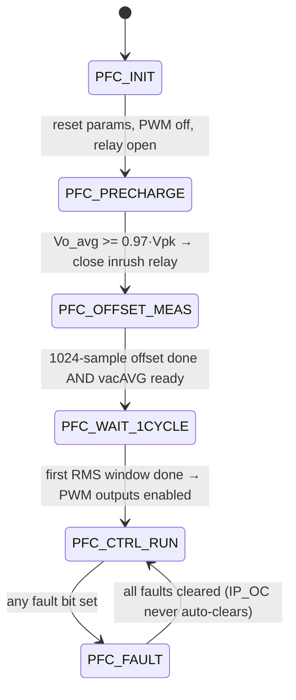

# PFC Control — Theory, Design and Implementation Reference

**Project:** `pfc_1phases_dspic33ak` — single-phase, single-stage boost PFC on dsPIC33AK128MC106
**Branch documented:** `claude/dcm-mcm-wip` (commit `580783c` and working tree)
**Date:** 2026-07-27

---

## How to read this document

This is a *research/reference report*: it starts from first principles (the boost
converter), builds up to power-factor correction, and then derives every calculation the
firmware performs, with a pointer to the exact line that implements it.

Conventions used throughout:

| Symbol | Meaning | Firmware name |
|---|---|---|
| `Vg`, `vg` | rectified instantaneous input voltage \|v_ac\| | `pfcParam.rectifiedVac` |
| `Vo`, `vo` | DC-bus (output) voltage, instantaneous | `pfcParam.pfcVoltage.vdc` |
| `Vo_avg` | DC-bus voltage, averaged over one 100 Hz ripple period | `pfcParam.vdcAVG.output`, `outputVdc` |
| `Vo_filt` | DC-bus voltage as the voltage PI sees it (notched, §4.6) | `pfcParam.vdcFeedback` |
| `Vrms` | RMS of the rectified input | `sqrt(pfcParam.vacRMS.sqrOutput)` |
| `iL` | inductor current, sampled | `pfcParam.iL` |
| `I_avg` | *cycle-average* inductor current | `pfcParam.averageCurrent` |
| `d`, `d1` | applied ON duty ratio of the boost switch | `pfcParam.dutyRatio` |
| `d2` | demagnetising (diode conduction) duty in DCM | not stored |
| `D_ideal` | CCM steady-state duty `(Vo−Vg)/Vo` | `pfcParam.boostDutyRatio` |
| `Ts` | switching / control period, 15.625 µs | `PFC_LOOPTIME_SEC` |
| `L` | boost inductance, 680 µH | `PFC_INDUCTANCE` |
| `C` | DC-bus capacitance, 1410 µF | plant only (`C` in the `.m` file) |

Equations are given in plain ASCII inside fenced blocks so they render identically in
GitHub, VS Code and MPLAB X.

Statements are labelled where they are not directly readable from the source:
**[derived]** = obtained here from the code/parameters by calculation;
**[inferred]** = a plausible reading that has not been confirmed against hardware or a
datasheet; **[open]** = a known gap or caveat.

**Contents**

1. [The boost converter](#1-the-boost-converter)
2. [Power-factor correction fundamentals](#2-power-factor-correction-fundamentals)
3. [Firmware architecture and timing](#3-firmware-architecture-and-timing)
4. [The measurement chain](#4-the-measurement-chain)
5. [Outer loop: bus voltage → power command](#5-outer-loop-bus-voltage--power-command)
6. [Current reference generation (the multiplier)](#6-current-reference-generation-the-multiplier)
7. [Load-power feed-forward](#7-load-power-feed-forward)
8. [Inner loop: current control](#8-inner-loop-current-control)
9. [Duty feed-forward](#9-duty-feed-forward)
10. [Conduction-mode detection](#10-conduction-mode-detection)
11. [Current-sample reconstruction (DCM/MCM)](#11-current-sample-reconstruction-dcmmcm)
12. [Burst control at light load](#12-burst-control-at-light-load)
13. [Start-up: precharge, offset, soft start](#13-start-up-precharge-offset-soft-start)
14. [Protection and fault handling](#14-protection-and-fault-handling)
15. [Loop tuning: where the gains come from](#15-loop-tuning-where-the-gains-come-from)
16. [Operating-point map for this hardware](#16-operating-point-map-for-this-hardware)
17. [Verification: SiL and X2C-Scope](#17-verification-sil-and-x2c-scope)
18. [Parameter reference](#18-parameter-reference)
19. [Known limitations and open items](#19-known-limitations-and-open-items)
20. [References](#20-references)

---

## 1. The boost converter

### 1.1 Topology and switching states

```
        L            D
  Vg o--UUUU--+-----|>|-----+----o Vo
              |             |
             _|_           ---
          Q  |_| (switch)  --- C     R (load)
              |             |
  GND o-------+-------------+----o
```

In this project `Vg` is not a DC source: it is the *rectified line*, `Vg(t) =
Vpk·|sin(ω_line t)|`, produced by the input diode bridge. The bus capacitor `C` sits on
the output, so `Vo` is nearly DC and always larger than `Vg`.

Two states per switching period `Ts`:

| State | Duration | Inductor voltage | `di/dt` |
|---|---|---|---|
| **ON** (Q closed, D blocking) | `d·Ts` | `+Vg` | `+Vg/L` |
| **OFF** (Q open, D conducting) | `(1−d)·Ts` (CCM) | `Vg − Vo` (negative) | `(Vg−Vo)/L` |

A third state exists only in DCM: after the inductor current reaches zero the diode stops
conducting and `i = 0` for the rest of the period (§1.4).

### 1.2 CCM steady state — volt-second balance and the gain formula

In steady state the average voltage across an inductor over one period is zero
("volt-second balance"), because the current must return to its starting value:

```
Vg·(d·Ts)  +  (Vg − Vo)·((1−d)·Ts)  =  0
```

Expanding and dividing by `Ts`:

```
Vg·d + Vg − Vg·d − Vo + Vo·d = 0
Vg = Vo·(1 − d)
```

which gives the two forms used everywhere in this firmware:

```
Boost voltage gain :   M(d) = Vo/Vg = 1/(1 − d)
Duty for a target  :   d    = (Vo − Vg)/Vo  =  1 − Vg/Vo
```

The second form is `D_ideal` — the *ideal boost duty ratio*. It is computed once per ISR:

> `PFC_UpdateBoostDutyRatio()` — [pfc.c:260](project/pfc/pfc.c:260)
> ```c
> pfcData->boostDutyRatio = ((pVoltage->vdc - pfcData->rectifiedVac) / pVoltage->vdc);
> ```

Two consequences that dominate the control design:

* **`M ≥ 1` always.** A boost can only step up. Whenever `Vg > Vo` the converter has no
  control authority — current flows through `L` and `D` into the bus regardless of `d`.
  This is exactly what happens during precharge (§13.1).
* **`d` sweeps the full range every half line cycle.** With `Vpk = 325 V` and `Vo = 380 V`,
  `D_ideal` goes from `1.0` at the zero crossing down to `0.144` at the line peak and back,
  100 times a second. Forcing an integrator to synthesise that ramp is the root cause of
  the current-loop tracking error that the duty feed-forward removes (§9).

### 1.3 Inductor current ripple and the CCM/DCM boundary

Peak-to-peak ripple over the ON interval:

```
ΔI = (Vg/L)·d·Ts
```

Substituting the CCM duty `d = 1 − Vg/Vo`:

```
ΔI(Vg) = (Ts/L)·Vg·(1 − Vg/Vo)
```

This is a downward parabola in `Vg`, maximised at `Vg = Vo/2`:

```
ΔI_max = (Ts/L)·Vo/4 = (15.625e-6/680e-6)·380/4 = 2.18 A pk-pk    [derived]
```

The converter stays in **CCM** as long as the average current exceeds half the ripple
(the valley stays above zero):

```
CCM  ⟺  I_avg > ΔI/2 = (Ts/(2L))·Vg·(1 − Vg/Vo)
```

`Ts/L` and `2L/Ts` are pre-folded constants in the firmware:

> [pfc_userparams.h:189](project/pfc/pfc_userparams.h:189)
> ```c
> #define PFC_TS_OVER_L      (float)(PFC_LOOPTIME_SEC/PFC_INDUCTANCE)   /* 0.02298 A/V */
> #define PFC_TWO_L_OVER_TS  (float)(2.0f*PFC_INDUCTANCE/PFC_LOOPTIME_SEC) /* 87.04 V/A */
> ```

Because a PFC's `I_avg` is *forced* to follow `|sin|` while the boundary current has a
different shape, a boost PFC is normally in **mixed conduction mode (MCM)**: CCM near the
line peak, DCM near the zero crossings. §16 maps this for the present hardware.

### 1.4 DCM analysis

In DCM the current starts each period at zero, rises to a peak, falls back to zero before
the period ends, and then stays there:

```
       Ipk  .              d1 = ON,  d2 = diode conduction,  d3 = idle
           /|\
          / | \
         /  |  \
    ____/   |   \________
     |<d1>|<-d2->|<-d3->|
```

Peak and demagnetising time:

```
Ipk = (Vg/L)·d1·Ts
d2  = Ipk·L / ((Vo − Vg)·Ts) = d1·Vg/(Vo − Vg)
```

The cycle-average current is the area of the triangle divided by `Ts`:

```
I_avg = (1/2)·Ipk·(d1 + d2)
      = (1/2)·(Vg·d1·Ts/L)·d1·(1 + Vg/(Vo − Vg))
      = (Ts·Vg·d1²)/(2L)·(Vo/(Vo − Vg))
```

Recognising `Vo/(Vo−Vg) = 1/D_ideal`:

```
        I_avg = (Ts · Vg · d1²) / (2 · L · D_ideal)                       (DCM)
```

This single expression is the basis for **both** the DCM duty feed-forward (§9) and the
DCM sample reconstruction (§11). Note what it says: in DCM the average current is a
*static function of the duty* — unlike CCM, where volt-second balance pins `d` to
`D_ideal` and the current is free. The two plants are fundamentally different, which is
why the firmware needs to know which one it is in.

Two useful identities that fall out:

```
(d1 + d2) = d1/D_ideal                     ← the reconstruction factor, §11
d1 = sqrt( (2L/Ts) · I_avg · D_ideal / Vg ) ← the DCM feed-forward, §9
```

Substituting `d1 = D_ideal` into the DCM `I_avg` gives `I_avg = (Ts·Vg/2L)·(1 − Vg/Vo) =
ΔI/2` — exactly the CCM boundary of §1.3. **The DCM and CCM expressions meet
continuously at the boundary.** [derived] That is what makes the composite feed-forward of
§9 bumpless.

### 1.5 Averaged small-signal model

Averaging over `Ts` and perturbing about an operating point gives, for the boost in CCM,
the control-to-inductor-current transfer function used to tune the current loop:

```
G_id(s) = iL_hat(s)/d_hat(s) ≈ Vo/(s·L)
```

(The exact expression has a pole at the load-damped `L–C` resonance; at the current-loop
crossover — kilohertz — the `Vo/(sL)` approximation is accurate, because the bus behaves
as a stiff voltage source at those frequencies.) This is the model in the plant script:

> [SimulinkProject/mchp_pfc_foc_dsPIC33A_data.m:93](SimulinkProject/mchp_pfc_foc_dsPIC33A_data.m:93)
> ```matlab
> Gid = Vout/(s*L);
> ```

The **control-to-output-voltage** transfer function of a boost has a **right-half-plane
zero** at `ω_RHPZ = R·(1−D)²/L`. That is the classic reason a boost cannot have a fast
voltage loop. In a PFC it barely matters, because the voltage loop must already be slowed
to well below 100 Hz for a completely different reason (§2.4) — but it is the reason the
*current* loop is closed on the inductor current rather than the output voltage.

For the outer loop the relevant model is the **power balance** on the bus capacitor:

```
C·Vo·dVo/dt = Pin − Pout          (energy balance, d/dt(½C·Vo²) = Pin − Pout)
```

Linearising about `Vo`:

```
vo_hat(s)/p_hat(s) = 1/(s·C·Vo)
```

§15 compares this against the expression used to derive the shipped gains.

---

## 2. Power-factor correction fundamentals

### 2.1 What the problem is

A bridge rectifier feeding a bulk capacitor draws current only while the line exceeds the
capacitor voltage — narrow, high-amplitude pulses near the peak. Consequences:

* **Poor power factor.** `PF = P/(Vrms·Irms)`. It factors into
  ```
  PF = cos(φ1) · 1/sqrt(1 + THD_i²)
       ^^^^^^^^   ^^^^^^^^^^^^^^^^^
       displacement    distortion factor
  ```
  For a capacitor-input rectifier the displacement term is near unity but the distortion
  term is terrible (THD 100 %+, PF ≈ 0.6).
* **Harmonic currents** (3rd, 5th, 7th …) that heat neutrals and transformers and are
  limited by standards such as IEC 61000-3-2.
* **Poor utilisation** of the mains socket: at PF 0.6 a 10 A socket delivers ~1.4 kW
  instead of 2.3 kW.

An active boost PFC stage forces the input current to be proportional to, and in phase
with, the input voltage.

### 2.2 Resistor emulation

The control objective is stated compactly as *make the converter look like a resistor to
the line*:

```
i_in(t) = v_in(t) / R_emulated
```

Since the average input power is `P = Vrms²/R_emulated`, the emulated conductance
is `1/R_emulated = P/Vrms²`, and the current the converter must draw is

```
        i_ref(t) = P_command · vg(t) / Vrms²
```

This *is* the multiplier equation in the firmware ([pfc.c:922](project/pfc/pfc.c:922)) —
see §6. `P_command` is produced by the voltage loop (and the load feed-forward), so the
outer loop's job is literally "choose the emulated resistance".

Note the units: `[W]·[V]/[V²] = [A]`. The voltage-loop output is therefore in **watts**,
which is why its clamp is `PI_V_OUT_MAX = 1500` — the board's rated power.

### 2.3 Control strategy: average current mode control (ACMC)

Options for shaping the input current, and why this design uses ACMC:

| Method | Sensing | Switching freq. | Notes |
|---|---|---|---|
| Peak current mode | comparator on iL | fixed | needs slope compensation; peak ≠ average → distortion |
| Hysteretic | comparator, two thresholds | variable | simple, but variable-frequency EMI |
| Boundary/critical (BCM) | zero-current detect | variable | popular <300 W; high peak currents |
| **Average current mode (ACMC)** | **sampled iL, digital PI** | **fixed 64 kHz** | **used here**: fixed frequency, low distortion, works in CCM and (with §11) DCM |

ACMC closes a fast loop on the *average* inductor current against the sinusoidal
reference. This is where the sampling subtleties of §4.4 and §11 come from: the loop is
only as good as its estimate of the true cycle average.

### 2.4 Two-loop structure and the bandwidth split

```
                                            ┌─────────────────────────────┐
 Vo_ref ──►(+)──► voltage PI ──► P_cmd ─►(+)─► × vg/Vrms² ──► i_ref ──►(+)──► current PI ──► d_trim
             ▲   (5.3 kHz tick,     ▲     │      (multiplier)              ▲                    │
             │    6.9 Hz BW)        │     │                                │                 (+)│
             └── Vo_filt (§4.6)     │     │                                └── I_avg           │
                                    │     │                                    (reconstructed) │
                            load FF ┘     └──────────► duty FF ─────────────────────────────►(+)
                          (§7)                          (§9)                                   │
                                                                                         d ──► PWM
```

The critical constraint: **the voltage loop must be much slower than 100 Hz.** The bus of
a single-phase PFC *necessarily* carries a `2·f_line` ripple, because instantaneous input
power is `Vpk·Ipk·sin²(ωt) = (Vpk·Ipk/2)(1 − cos 2ωt)` while the load draws constant
power. If the voltage loop responded to that ripple it would modulate `P_command` at
100 Hz, and the multiplier would fold that into the current reference as **third-harmonic
distortion**. Hence:

* voltage-loop crossover designed at **12 Hz** ([data file:84](SimulinkProject/mchp_pfc_foc_dsPIC33A_data.m:84)),
  though the script's plant carries a factor-2 error and the loop actually crosses at
  **6.9 Hz** (§15.3);
* the bus feedback is averaged over exactly one 100 Hz ripple period, so the ripple is
  *structurally* nulled before it reaches the PI (§4.5);
* and a 100 Hz notch does the same job for far less phase lag, which is what keeps the
  phase margin healthy at that crossover (§4.6).

The current loop, by contrast, must be fast enough to track a rectified sinusoid plus
its harmonics — designed at 6.4 kHz, shipped at 3.2 kHz (§15).

### 2.5 Bus sizing, ripple and hold-up

With `C = 1410 µF` (`3 × 470 µF`) and `Vo = 380 V`:

```
Bus ripple (2·f_line):  v_ripple_pk = (P/Vo)/(2·ω_line·C) = P/336.6   [derived]
                        → at 375 W: 1.11 V peak, 2.2 V pk-pk

Hold-up to the UV trip: E = ½C(380² − 310²) = 34.0 J                  [derived]
                        → at 375 W: 91 ms of ride-through
```

The 91 ms figure is the quantity of interest for the pulse-load / bus-hold requirement
that motivates this project.

---

## 3. Firmware architecture and timing

### 3.1 Execution model

Everything in the control path runs in **one interrupt**: the ADC channel-1 (inductor
current) conversion-complete ISR, at the PWM rate.

> `PFC_ADCInterrupt()` — [pfc.c:114](project/pfc/pfc.c:114)
> ```c
> pfcParam.pfcVoltage.outputVoltage    = ADCBUF_VDC>>1;
> pfcParam.pfcVoltage.acVoltage        = ADCBUF_PFC_VAC;
> pfcParam.pfcCurrent.inductorCurrent  = ADCBUF_PFC_IL;
> pfcParam.pfcCurrent2.inductorCurrent = ADCBUF_PFC_IL2;
> ...
> PFC_StateMachine(&pfcParam);
> PFC_PWM_PDC = pfcParam.duty;
> ```

`main()` runs only housekeeping: LED/button service and the X2C-Scope UART pump
([main.c:94](project/main.c:94)).

| Rate | Period | What runs |
|---|---|---|
| 64 kHz | 15.625 µs | ADC ISR: measurement, state machine, current loop, PWM update |
| 5.33 kHz | 187.5 µs | voltage PI (`VOLTAGE_LOOP_EXE_RATE = 12`) |
| 16 kHz | 62.5 µs | X2C-Scope sampling (`PFC_DIAGNOSTICS_DECIMATION = 4`) |
| 100 Hz | 10 ms | `vdcAVG` and `vacRMS` window completion |
| 50 Hz | 20 ms | `vacAVG` (AC offset) window completion |
| 1 kHz | 1 ms | Timer1 board service (buttons, LEDs) |

### 3.2 PWM and the sampling instant

> [pwm.h:83](project/hal/pwm.h:83), [pwm.c:154](project/hal/pwm.c:154)

```
PWM generator            PG4, output PWM4H only (PENL = 0, no complementary switch)
Mode                     MODSEL = 4  → centre-aligned, one update/interrupt per cycle
Master PWM clock         PWM_CLOCK_MHZ = 400; the ×8 in PFC_LOOPTIME_TCY implies a
                         3.2 GHz high-resolution count → 312.5 ps per LSB   [inferred]
Period register PG4PER   PFC_LOOPTIME_TCY = 400·8·15.625 − 16 = 49984 counts (15.625 µs)
Duty register  PG4DC     dutyRatio × 49984, clamped to [0, 0.95·49984 = 47484]
Duty update    UPDTRG=1  writing PG4DC arms the update; UPDMOD=0 → applied at next SOC
ADC trigger    PG4TRIGA  = PFC_LOOPTIME_TCY − 50, CAHALF = 1 (second half of the carrier)
                          → ADC Trigger 2 (ADTR2EN1 = 1) → all four channels
```

**Why the trigger sits where it does.** In centre-aligned mode the ON pulse is centred on
the carrier's turning point, so a trigger placed 50 counts (≈16 ns) from the turning point
samples the inductor current at the **middle of the ON interval**. That placement is not
cosmetic — it is a hard prerequisite for the whole current-measurement scheme:

> **In CCM, the mid-ON sample is *exactly* the cycle average, for any duty.**
> The inductor current is a triangle with valley `Iv` at the start of the ON interval and
> peak `Ip` at its end. Its area over one period is
> `½(Iv+Ip)·d·Ts + ½(Ip+Iv)·(1−d)·Ts = ½(Iv+Ip)·Ts`, so the average is `(Iv+Ip)/2` — which
> is precisely the value the ramp takes at the midpoint of the ON interval. No filtering,
> no correction, no duty dependence. [derived]

This is why a PFC that only ever runs in CCM needs no current reconstruction at all — and
why everything in §11 exists purely to handle the DCM case, where the identity breaks.

**[open]** The exact hardware semantics of `CAHALF` in centre-aligned mode should be
confirmed on the bench (scope the gate drive against an ADC-trigger test pin). Every
result in §10 and §11 assumes mid-ON sampling; a sample taken elsewhere in the ON interval
would bias the current loop by a duty-dependent factor.

**Actuation delay.** The ISR samples at mid-ON of cycle *n*, computes, and writes `PG4DC`;
with `UPDMOD = 0` the value takes effect at the start of cycle *n+1*. The firmware
accounts for this explicitly: `pfcParam.dutyRatio` is updated at the *end* of
`PFC_CurrentControlLoop`, so when the next ISR reads it, it holds "the duty that produced
the sample I am now looking at" — see the comment at [pfc.c:809](project/pfc/pfc.c:809)
and the type documentation at [pfc.h:186](project/pfc/pfc.h:186).

### 3.3 State machine

> `PFC_StateMachine()` — [pfc.c:166](project/pfc/pfc.c:166); enum at [pfc.h:103](project/pfc/pfc.h:103)



`PFC_UpdateMeasurements()` runs **before** the switch, in every state
([pfc.c:171](project/pfc/pfc.c:171)) — the averages, RMS and rectification must keep
running even while faulted, otherwise the recovery tests would never see the line come
back.

`PFC_CTRL_RUN` is the closed-loop sequence, and the order matters:

> [pfc.c:386](project/pfc/pfc.c:386)
> ```c
> PFC_UpdateCurrentFeedback(pfcData);   /* iL ← sample (− offset) */
> PFC_FaultCheck(pfcData);              /* → PFC_FAULT on any fault */
> PFC_SoftStartUpdate(pfcData);         /* ramp piVoltage.reference */
> PFC_CurrentRefGenerate(pfcData);      /* voltage PI (÷12) + multiplier */
> PFC_UpdateBoostDutyRatio(pfcData);    /* D_ideal from *this* cycle's Vg,Vo */
> PFC_CurrentControlLoop(pfcData);      /* reconstruction, PI, duty FF, clamp */
> PFC_BurstModeUpdate(pfcData);         /* kill duty below PFC_MIN_POWER */
> ```

The pairing is deliberate: `boostDutyRatio` is **fresh** (this cycle's operating point)
while `dutyRatio` is **one cycle old** (the duty that actually produced the present
sample). §11 depends on exactly that pairing.

---

## 4. The measurement chain

### 4.1 ADC front end

> [adc.h:68](project/hal/adc.h:68), [adc.c:75](project/hal/adc.c:75)

| Signal | ADC channel | Pin | Raw macro | Format |
|---|---|---|---|---|
| `IL` inductor current | AD1CH1 (**ISR source**) | AD1AN8 / RB6 | `(AD1CH1DATA − 2048)<<4` | bipolar ±32768 |
| `VAC` line voltage | AD2CH0 | AD2AN8 / RB7 | `(AD2CH0DATA − 2048)<<4` | bipolar ±32768 |
| `VDC` bus voltage | AD1CH0 | AD1AN6 / RA7 | `AD1CH0DATA<<4` | unipolar 0…65520 |
| `IL2` load current | AD1CH3 | AD1AN7 / RA1 | `(AD1CH3DATA − 2048)<<4` | bipolar ±32768 |

All four are triggered simultaneously from PWM4 Trigger 2; the ISR vector is the **IL**
channel's completion interrupt, which guarantees the current sample is valid when the
control code runs.

**[open]** Channels AD1CH0/CH1/CH3 share ADC core 1. If that core converts its channels
sequentially in priority order, `IL2` (CH3) may still be converting when CH1's interrupt
fires, making the load-current sample one cycle stale. This is harmless for its only
consumer — the heavily filtered load feed-forward (§7) — but should be confirmed against
the family reference manual before `IL2` is used for anything faster.

### 4.2 Scaling to engineering units

Full-scale values come from the sensor front ends
([pfc_userparams.h:104](project/pfc/pfc_userparams.h:104)):

```
Voltage divider   2.2k/(300k + 2.2k) = 0.00727995 ;  3.3 V / 0.00728 = 453 V full scale
Current shunt     0.015 Ω, gain 3.1k/(560+39) = 5.1753 ; 1.65 V / (0.015·5.1753) = 21.3 A → 22 A

ADC_VOLTAGE_SCALE = 453.0/32768 = 0.013824 V per count
ADC_CURRENT_SCALE = 22.0/32768  = 0.000671 A per count
```

> [pfc.c:122](project/pfc/pfc.c:122)
> ```c
> pfcParam.pfcVoltage.vdc = (float)(pfcParam.pfcVoltage.outputVoltage*ADC_VOLTAGE_SCALE);
> pfcParam.pfcVoltage.vac = (float)(pfcParam.pfcVoltage.acVoltage*ADC_VOLTAGE_SCALE);
> pfcParam.pfcCurrent.iL  = (float)(pfcParam.pfcCurrent.inductorCurrent*ADC_CURRENT_SCALE);
> ```

Note the `>>1` applied to `ADCBUF_VDC` in the ISR: the VDC macro produces a full 16-bit
unsigned value, and the shift brings it back into the signed 15-bit range that
`ADC_VOLTAGE_SCALE` is defined against. Net resolution: **0.111 V per 12-bit ADC LSB** on
the bus, **0.0107 A per LSB** on the current. **[open]** The same `ADC_VOLTAGE_SCALE` is
applied to both the AC and DC front ends; if the two dividers ever differ, this is the
line to fix (see review §3.3/3.4).

### 4.3 AC offset removal and rectification

The AC sense sits on a mid-scale bias, so the DC component of `vac` over a **full line
period** *is* the offset:

> `PFC_Average(&vacAVG, vac)` with `sampleLimit = PFC_INPUT_FREQUENCY_COUNTER = 64000/50 = 1280`
> ([pfc.c:210](project/pfc/pfc.c:210), [pfc_userparams.h:87](project/pfc/pfc_userparams.h:87))

```
offsetVac    = mean of vac over 20 ms
rectifiedVac = |vac − offsetVac|
```

> `PFC_SignalRectification()` — [pfc.c:946](project/pfc/pfc.c:946)

Averaging over exactly one line period is what makes this work: the fundamental and all
its harmonics integrate to zero over an integer number of periods, so only the DC bias
survives.

### 4.4 RMS-square of the input

The multiplier needs `Vrms²`, not `Vrms` — so the firmware never takes the square root in
the control path:

> `PFC_SquaredRMSCalculate()` — [pfc.c:968](project/pfc/pfc.c:968)
> ```c
> pData->sum += (float)(input*input);
> pData->samples++;
> if(pData->samples >= pData->sampleLimit) {
>     pData->sqrOutput = pData->sum/pData->sampleLimit;
>     pData->status = 1; pData->samples = 0; pData->sum = 0;
> }
> ```

Window: `PFC_RMS_SQUARE_COUNTMAX = 64000/(2·50) = 640` samples = **10 ms** = one half line
period. Since `|sin|` has period `T_line/2`, a half-period window contains exactly one
whole cycle of the rectified waveform — so `sqrOutput` is an unbiased `Vrms²`.

The `>=` test with the increment *before* it is deliberate: it makes the sum contain
exactly `sampleLimit` terms for a `sampleLimit` divisor (the earlier code accumulated one
extra term, biasing `sqrOutput` high by `1/640` and stretching the window past the
half-cycle — review §1.4).

### 4.5 Bus averaging

> `PFC_Average(&vdcAVG, vdc)`, `sampleLimit = PFC_VDC_AVG_SAMPLES = 64000/(2·50) = 640`
> ([pfc.c:200](project/pfc/pfc.c:200), [pfc_userparams.h:102](project/pfc/pfc_userparams.h:102))

The window is **one full 100 Hz ripple period (10 ms)**. Averaging over an integer number
of ripple periods nulls the ripple *and all its harmonics* structurally, which is the
primary defence against third-harmonic input distortion (§2.4).

Two properties of this filter that matter for stability (both **[derived]**):

* It is a **block average, not a moving average** — `output` updates once per 10 ms and is
  held. The effective delay is therefore ≈ half the window (averaging) + half the hold:

  ```
  tau = (Tw + Th + Tsv)/2 = (10 ms + 10 ms + 0.1875 ms)/2 = 10.09 ms
  ```

  A 10 ms window costs **10 ms of delay, not 5** — the hold is as expensive as the average.
  That is ~25° of phase lag at the real 6.90 Hz crossover (§15.3).
* The same holds for `vacRMS.sqrOutput`: the multiplier's `1/Vrms²` term can be up to one
  half-cycle stale after a line step (review §2.2, still open).

Both were made 5× longer than the original 128-sample window when the ripple-nulling fix
landed. That re-verification has now been done (2026-08-02, **[derived]**), against the
corrected plant of §15.3:

| Vdc feedback path | τ | fc | PM | GM |
|---|---|---|---|---|
| old 128-sample (2 ms) window | 2.09 ms | 6.98 Hz | 53.9° | 27.4 dB |
| 640-sample (10 ms) window | 10.09 ms | 6.90 Hz | **33.8°** | 12.4 dB |
| 10 ms window + notch (§4.6) | — | 6.97 Hz | **54.1°** | 19.3 dB |

So the longer window cost ~20° of phase margin. `KP_V`/`KI_V` are nonetheless **unchanged**:
the margin is cheaper to buy back in the filter than in the gains, which is what §4.6 does.

For a PI acting on an integrator behind a boxcar, the margin has an exact closed form that
matches the full Bode calculation to 0.1° — useful when re-tuning either the window or the
gains:

```
PM = atan(fc/fz) − 360·fc·tau       [derived]
     fz = (KI_V/Tsv)/KP_V/(2π), the PI zero;  tau as above
```

### 4.6 Bus notch and anti-noise pole

> `PFC_VdcFilterUpdate()` — [pfc.c:249](project/pfc/pfc.c:249),
> constants at [pfc_userparams.h:126](project/pfc/pfc_userparams.h:126)

The block average of §4.5 rejects 100 Hz by low-passing *everything*, and that is where its
25° of lag comes from. A second-order notch reaches the same null while only being selective
at 100 Hz, so it costs far less phase:

| filter | phase @7 Hz | @100 Hz | @101 Hz | @120 Hz | broadband noise |
|---|---|---|---|---|---|
| 10 ms block average | −25.2° | −240 dB | −80 dB | −32 dB | 0.03× |
| notch Q=1 + 500 Hz pole | **−4.61°** | −137 dB | −34 dB | −10 dB | 0.14× |

The chain is a single real pole followed by an RBJ notch, both running at the voltage-loop
rate `fsw/VOLTAGE_LOOP_EXE_RATE = 5333.33 Hz`:

```
pole:   y += (vdc − y)·coeff,     coeff = 1 − exp(−2π·500/fs) = 0.445145
notch:  w0 = 2π·100/fs,  alpha = sin(w0)/(2Q),  a0 = 1 + alpha
        b = [1, −2cos(w0), 1]/a0        a = [a0, −2cos(w0), 1−alpha]/a0
        ⇒ b0 = b2 = 0.944493355,  b1 = a1 = −1.875893116,  a2 = 0.888986709
```

Three design points worth keeping **[derived]**:

* **The pole is not optional.** A bare notch does no broadband averaging at all (1.0× versus
  the boxcar's 0.03×), so ADC noise would reach `KP_V` unattenuated. The 500 Hz pole restores
  most of that for ~0.8° of phase.
* **Run it at the voltage-loop rate, never at the 64 kHz ISR.** At 64 kHz a 100 Hz biquad
  sits at a pole radius of ~0.995, and float32 cancellation against the ~380 V DC pedestal
  caps the achievable null near −33 dB — which would discard most of the benefit.
* **DC gain is exactly 1**, so `x1=x2=y1=y2=v` is a true fixed point. `PFC_VdcFilterReset()`
  exploits that to start the chain already settled instead of charging up from zero.

Only the voltage PI consumes the result, via `PFC_T.vdcFeedback`. Precharge, the OV/UV trips
and the load feed-forward keep reading `vdcAVG.output`, which is slower but far more
noise-immune — protection wants robustness, not bandwidth.

Effect on a 120 W → 375 W load step, gains unchanged **[derived]**: bus dip 11.47 → 9.00 V,
overshoot 1.66 → 0.77 V, settling 160 → 106 ms.

**Caveat — this is a 50 Hz-only tuning.** Off-tune the notch degrades much faster than the
boxcar: −34 dB at 101 Hz against −80 dB, and only −10 dB at 120 Hz. At 50 Hz ±1 % the
resulting 100 Hz feedthrough into the power command is ~0.23 %, immaterial. On **60 Hz mains
it is not adequate** — retune `f0` to 120 Hz along with `PFC_INPUT_FREQUENCY`, or set
`pfcParam.vdcNotch.enable = 0`, which restores the §4.5 behaviour exactly.

---

## 5. Outer loop: bus voltage → power command

### 5.1 The PI controller

One shared implementation for both loops:

> `PFC_ControllerPIUpdate()` — [pfc_pi.c:68](project/pfc/pfc_pi.c:68)
> ```c
> pPIParam->integralOut += pPIParam->ki * pPIParam->error;
> pPIParam->propOut      = pPIParam->kp * pPIParam->error;
> U = pPIParam->integralOut + pPIParam->propOut;
> if (U > maxOutput)      { output = maxOutput; integralOut = maxOutput; }
> else if (U < minOutput) { output = minOutput; integralOut = minOutput; }
> else                    { output = U; }
> ```

This is a **forward-Euler PI with clamping anti-windup**. Note that the discrete `ki`
already absorbs the sample period: `ki_firmware = Ki_continuous · T_exec` (§15).

**[open]** On saturation the integrator is *overwritten* with the output limit rather than
held or back-calculated. For the voltage loop that discards accumulated state (review
§2.5). The **current** loop no longer relies on this path — its saturation is handled by
explicit back-calculation on the summed duty (§8.3).

### 5.2 Execution rate and gain scheduling

> `PFC_CurrentRefGenerate()` — [pfc.c:970](project/pfc/pfc.c:970)
> ```c
> if (++pData->voltLoopExeRate >= VOLTAGE_LOOP_EXE_RATE) {
>     pData->piVoltage.error = pData->piVoltage.reference - pData->vdcFeedback;
>     ...
>     PFC_ControllerPIUpdate(&pData->piVoltage);
>     pData->voltLoopExeRate = 0;
> }
> ```

`VOLTAGE_LOOP_EXE_RATE = 12` → the voltage PI runs at 64 kHz/12 = **5.333 kHz**
(187.5 µs). The error is formed against `vdcFeedback` — the *conditioned* bus voltage, never
the instantaneous one: the notched signal of §4.6 when `vdcNotch.enable` is set, otherwise
the 10 ms block average of §4.5.

**Gain scheduling with hysteresis** ([pfc.c:982](project/pfc/pfc.c:982)):

```
|error| > PFC_VOLTAGE_ERR_GAIN_HI (12 V)  →  ki = KI_V/2   (large transient: less integral)
|error| < PFC_VOLTAGE_ERR_GAIN_LO ( 8 V)  →  ki = KI_V     (small error: full integral)
otherwise                                 →  hold previous ki
```

The dead band between 8 V and 12 V is what makes this safe: a bare threshold would let
`ki` dither tick-to-tick at the switch point, which is a limit-cycle generator. `ki` lives
in the PI struct, so the hysteresis needs no extra state.

Halving `ki` for *large* errors (rather than raising it) is the deliberate choice: during
a big transient the proportional term already commands a large correction, and a fast
integrator on top of it is what causes overshoot on a bus with 91 ms of stored energy.

### 5.3 Output limits and the meaning of the output

```
piVoltage.minOutput = 0        → the PFC can never command negative power (no regeneration)
piVoltage.maxOutput = 1500     → PI_V_OUT_MAX, the board's rated power in watts
```

The zero floor has a consequence worth knowing: once the load feed-forward carries the
load (§7), the voltage PI legitimately sits **near zero at full load** and cannot trim
downwards. That is exactly the trap the burst-mode fix addressed (§12).

---

## 6. Current reference generation (the multiplier)

> [pfc.c:913](project/pfc/pfc.c:913)
> ```c
> float powerCommand = pData->piVoltage.output;
> if (pData->loadFF.enable) powerCommand += pData->loadFF.powerFF;
> pData->powerCommand = powerCommand;
> pData->currentReference = (float)((powerCommand * pData->rectifiedVac * KMUL)
>                                   / pData->vacRMS.sqrOutput);
> ```

```
                    P_command · |vg| · KMUL
        i_ref  =  ──────────────────────────         [A]
                            Vrms²
```

This is the resistor-emulation law of §2.2. Three things to note:

* **`KMUL = 1`.** In fixed-point ports this constant absorbs the sensor normalisations
  (`Kvin`, `KiL`, `Kvo`). Here everything is in SI floats, so it is unity — but it is left
  in place as the single knob if the sensing scales are ever renormalised.
* **The `1/Vrms²` term is the line feed-forward.** It makes the loop gain from
  `P_command` to actual input power independent of line voltage: without it, the outer
  loop's gain would vary as `Vrms²` (a 4:1 range over 110–255 Vrms) and one set of PI
  gains could not serve the whole input range.
* **`i_ref` inherits the shape of `vg`** — including the flat notch at the zero crossing.
  Near the zero crossing the reference is ~0 while `D_ideal → 1`; that combination is the
  single most dangerous corner in the whole control law, and both §9 (the `Vg` floor) and
  §10 (mode detection) exist partly to handle it.

Boundary check ([pfc.c:926](project/pfc/pfc.c:926)):

```
i_ref clamped to [0, PFC_IREF_PEAK_MAX = 14.14 A]
```

14.14 A = `√2 × 10 Arms` design input current, deliberately **below** the 16.97 A software
OCP trip (§14) so the controller clamps before protection fires.

**[open]** `vacRMS.sqrOutput` is a divisor with no lower bound. It is only non-zero after
the first RMS window closes (which the state machine enforces before entering
`PFC_CTRL_RUN`), but a total line loss mid-run drives it toward zero — see review §3.1.

---

## 7. Load-power feed-forward

### 7.1 Why

The voltage loop is deliberately slow (§2.4). A load step therefore produces a bus
excursion whose depth is set by how long the loop takes to react — tens of milliseconds.
But the load current is *measurable*: `IL2` is the output/load current, sensed on the load
path after the DC link.

Adding the measured load power directly to the power command cancels the load disturbance
in the bus power balance, leaving the slow voltage loop to trim only losses and modelling
error:

```
P_command = P_voltagePI + gain · Vo_avg · I_load_filt
```

> Computed every ISR in `PFC_UpdateMeasurements()` — [pfc.c:206](project/pfc/pfc.c:206)
> ```c
> pfcData->loadFF.currentFilt += (pfcData->loadFF.current - pfcData->loadFF.currentFilt)
>                                * pfcData->loadFF.filtCoeff;
> pfcData->loadFF.powerFF = pfcData->loadFF.gain * pfcData->outputVdc
>                                * pfcData->loadFF.currentFilt;
> ```

The filter is a first-order IIR with `α = PFC_LOAD_FF_FILT_COEFF = 0.05` at 64 kHz:

```
f_corner ≈ α/(2π·Ts) = 0.05/(2π·15.625e-6) ≈ 509 Hz    [derived]
```

`Vo_avg` (not instantaneous `vdc`) is used deliberately, so bus ripple is not injected
into the power command.

### 7.2 Why the gain must be below 1.0

This is the subtle part, and it is documented at length in
[pfc_userparams.h:149](project/pfc/pfc_userparams.h:149). For any load whose current rises
with bus voltage — a resistor being the worst case, `I = Vo/R`:

```
P_FF  = gain·Vo·I = gain·Vo²/R
P_out = Vo²/R

d(P_FF − P_out)/dVo = 2·(gain − 1)·Vo/R
```

At `gain = 1.0` this derivative is **exactly zero**. The feed-forward has cancelled the
load's own self-regulation — the term that normally restores the bus (a bus that sags
draws less load power) — and the bus loses its restoring force. Simultaneously the voltage
PI has nothing left to do and parks against its zero clamp, so it cannot trim downwards
either. The result observed in SiL on 2026-07-27 was an **11.4 Hz limit cycle with 12.5 V
pk-pk** on `vdcAVG`.

Shipped value:

```
PFC_LOAD_FF_GAIN = 0.9
  → leaves −0.197 W/V of damping at 380 V into a 385 Ω load       [derived, matches source note]
  → parks the voltage PI at ≈ 40 W, clear of the 1 W burst threshold
  → still removes 90 % of a load step from the slow loop
0.8 is the documented fall-back if margin matters more than the last volt of dip.
```

### 7.3 Status

```
PFC_LOAD_FF_ENABLE_DEFAULT = 1     (verified in SiL 2026-07-26)
PFC_LOAD_CURRENT_SCALE     = ADC_CURRENT_SCALE   ← placeholder!
```

**[open]** The load-current scale is currently a *copy of the inductor-current scale*. That
is correct for SiL (the model injects `Iout` through the same `Get_ADCBUF_PFC_IL2`
conversion) but is **not** verified against the hardware's load-current front end. The
header instructs setting `PFC_LOAD_FF_ENABLE_DEFAULT` back to `0` on hardware until the
scale *and sign* are measured on the bench. `powerFF` is computed unconditionally even
when disabled, so it can be observed in X2C-Scope before being switched in.

---

## 8. Inner loop: current control

> `PFC_CurrentControlLoop()` — [pfc.c:799](project/pfc/pfc.c:799)

### 8.1 Sequence

```c
if (pData->iL < 0) pData->iL = PFC_IL_MIN;   /* 0.0001 A floor: noise/offset guard */

PFC_CurrentSampleCorrection(pData);          /* §11 — consumes LAST cycle's dutyRatio */

pData->piCurrent.reference = pData->currentReference;
pData->piCurrent.input     = pData->averageCurrent;
pData->piCurrent.error     = pData->currentReference - pData->averageCurrent;
PFC_ControllerPIUpdate(&pData->piCurrent);

pData->dutyFF = dutyFFEnable ? PFC_DutyFeedForward(pData) : 0.0f;   /* §9 */
dutyRatio     = pData->dutyFF + pData->piCurrent.output;
```

Note the error is formed against `averageCurrent` — the *reconstructed* cycle average —
not the raw sample. In CCM they are the same thing (§3.2); in DCM they differ by the
factor derived in §11.

### 8.2 The PI is a trim, not the controller

With the duty feed-forward enabled the PI's job changes completely, and so do its limits:

> [pfc.c:515](project/pfc/pfc.c:515)
> ```c
> if (pfcData->dutyFFEnable != 0u) {
>     pfcData->piCurrent.maxOutput =  PFC_DUTY_TRIM_MAX;   /* +0.25 */
>     pfcData->piCurrent.minOutput = -PFC_DUTY_TRIM_MAX;   /* −0.25 */
> } else {
>     pfcData->piCurrent.maxOutput = PFC_MAX_DUTY;         /* legacy: PI supplies all duty */
>     pfcData->piCurrent.minOutput = 0;
> }
> ```

The trim must be allowed to go **negative** (the feed-forward can overshoot), and the tight
symmetric bound is itself the anti-windup: the PI only has to cover losses — measured at
0.003…0.013 of duty in CCM — plus inductance/model error.

### 8.3 Back-calculation anti-windup on the sum

> [pfc.c:839](project/pfc/pfc.c:839)
> ```c
> if (dutyRatio > PFC_MAX_DUTY) {
>     pData->piCurrent.integralOut -= (dutyRatio - PFC_MAX_DUTY);
>     dutyRatio = PFC_MAX_DUTY;
> } else if (dutyRatio < PFC_MIN_DUTY) {
>     pData->piCurrent.integralOut += (PFC_MIN_DUTY - dutyRatio);
>     dutyRatio = PFC_MIN_DUTY;
> }
> pData->dutyRatio = dutyRatio;
> ```

The clamp is applied to `dutyFF + trim`, and the integrator is given back **exactly what
the clamp removed**. This keeps the integrator on the boundary of feasibility instead of
winding past it, and — unlike the PI's internal clamp — it does not destroy the
accumulated state. It matters here because `dutyFF` alone can hit `PFC_MAX_DUTY` near the
zero crossing (where `D_ideal → 1`), and the old behaviour (slamming `integralOut` to
`PI_I_OUT_MAX`) would leave the trim saturated for many cycles afterwards.

`dutyRatio` is written **after** the clamp, which is what makes it a faithful record of the
duty that will actually be applied — the precondition for §10 and §11.

### 8.4 Conversion to PWM counts

> [pfc.c:852](project/pfc/pfc.c:852)
> ```c
> duty = (dutyRatio * PFC_LOOPTIME_TCY);
> pData->duty = clamp(duty, PFC_MIN_DUTY_COUNTS, PFC_MAX_DUTY_COUNTS);
> ```

```
PFC_LOOPTIME_TCY     = 49984 counts      (15.625 µs at 312.5 ps/count)
PFC_MAX_DUTY_COUNTS  = 0.95 × 49984 = 47484
PFC_MIN_DUTY_COUNTS  = 0
```

The 0.95 ceiling is a hardware limit, not a control one: the boost switch needs a minimum
OFF time for the diode to commutate and for the bootstrap/gate drive to recover.

---

## 9. Duty feed-forward

> `PFC_DutyFeedForward()` — [pfc.c:738](project/pfc/pfc.c:738)

### 9.1 The problem it solves

Without feed-forward, the current PI's *integrator* has to synthesise the entire
`(Vo−Vg)/Vo` duty profile — a swing from ~0.14 to 1.0 and back, 100 times a second. An
integrator only moves at `Ki·error` per tick, so tracking a ramp costs a **sustained**
error:

```
e_sustained ≈ (dD/dt)/(KI_I/Ts)
```

Measured in SiL at 375 W: **0.8…1.3 A of error on a 2.2 A peak reference — 31 % THD,
PF 0.933**. This is a *velocity* error, not a tuning problem: no realistic `Ki` fixes it,
because raising `Ki` far enough destabilises the loop.

Feeding the operating-point duty forward leaves the PI with only losses to trim. The
measured result after the fix was **THD 31 % → 1.5 %**.

### 9.2 The two branches

```
CCM :   d_ff = D_ideal = (Vo − Vg)/Vo
DCM :   d_ff = sqrt( (2L/Ts) · i_ref · D_ideal / Vg )
```

The CCM branch is just volt-second balance (§1.2): in CCM the duty is fixed by the voltage
ratio *independently of the current*, so the ideal ratio **is** the correct feed-forward.

The DCM branch inverts the DCM average-current law of §1.4. In DCM volt-second balance no
longer pins the duty, so the feed-forward must be *current-dependent* — and it is the
reference, not the measurement, that is inverted (open-loop by construction).

> [pfc.c:770](project/pfc/pfc.c:770)
> ```c
> arg = (PFC_TWO_L_OVER_TS * pData->currentReference * pData->boostDutyRatio) / vg;
> ff  = (arg > 0.0f) ? sqrtf(arg) : 0.0f;
> ```

### 9.3 Continuity at the boundary

Substituting `i_ref = ΔI/2 = (Ts·Vg/2L)·D_ideal` (the boundary current) into the DCM
expression:

```
d_ff = sqrt( (2L/Ts) · (Ts·Vg·D_ideal/2L) · D_ideal / Vg ) = sqrt(D_ideal²) = D_ideal
```

— identical to the CCM branch. **The composite feed-forward is continuous across the
CCM/DCM boundary** [derived], so mode switching introduces no duty step. This also removed
a ~1 A current step that had been observed at boundary crossings when a carried-over duty
sat above `D_ideal`.

### 9.4 Guards

```c
if (vg < PFC_DUTY_FF_VG_MIN /* 1.0 V */) vg = PFC_DUTY_FF_VG_MIN;
...
if (ff > PFC_MAX_DUTY) ff = PFC_MAX_DUTY; else if (ff < 0.0f) ff = 0.0f;
```

* **`Vg` is floored, not tested.** Falling back to the CCM branch at the zero crossing
  would be badly wrong: there `D_ideal → 1` while the demanded current is ~0, so the CCM
  branch would command near-maximum duty *into the notch*. Flooring keeps the expression
  finite, and because `i_ref` is itself proportional to `Vg`, the numerator vanishes faster
  than the floored denominator — `d_ff` tapers smoothly to zero. Above 1 V the expression
  is exact.
* **`boostDutyRatio < 0`** (i.e. `Vg > Vo` — a sag, or precharge) would make the argument
  negative; the `arg > 0` test catches it.
* **`D_ideal > PFC_MAX_DUTY`** on either side of the zero crossing is a region where the
  converter simply cannot follow, so the value is capped rather than commanded and clipped.

### 9.5 Runtime switch

`PFC_DUTY_FF_ENABLE_DEFAULT = 1`, held in `pfcParam.dutyFFEnable` so the legacy behaviour
(PI supplies the whole duty) can be A/B'd from X2C-Scope without a rebuild. Note that the
PI's output limits are chosen at init time from this flag ([pfc.c:515](project/pfc/pfc.c:515)),
so **toggling it at run time does not re-set the limits** — worth remembering when
comparing methods on a live board. **[open]**

---

## 10. Conduction-mode detection

> `PFC_ConductionModeDetect()` — [pfc.c:650](project/pfc/pfc.c:650)

### 10.1 Valley estimation

Walk the CCM current trajectory forward from the mid-ON sample to the end of the period:

```
rise over the remaining half of the ON time :  +(Vg/L)·(d·Ts/2)
fall over the whole OFF time                :  +((Vg − Vo)/L)·(1 − d)·Ts
```

Collecting terms:

```
        i_valley = i_sample + (Ts/L)·[ Vg·(1 − d/2) − Vo·(1 − d) ]
```

> ```c
> pData->iValleyEst = pData->iL
>                   + (PFC_TS_OVER_L * ((vg * (1.0f - (0.5f * d)))
>                                     - (vo * (1.0f - d))));
> return (pData->iValleyEst < 0.0f) ? 1u : 0u;
> ```

Interpretation:

* **In CCM** the current really does follow that path, so the estimate *is* the valley and
  is `≥ 0`.
* **In DCM** the current hits zero before the OFF time is up and then stays there. The
  continued-slope estimate keeps going and lands **negative**. The magnitude of the
  negative excursion is a measure of how deep into DCM the converter is.

### 10.2 Why a fixed-zero threshold matters

The alternative (legacy) test infers DCM by comparing a *lagged controller output*
(`d1`) against a *computed ratio* (`D_ideal`) — see §11.2. That is a comparison between
two noisy, time-skewed quantities, and right at the boundary it jitters on sample noise.
Every toggle is a duty discontinuity, and duty discontinuities at a fixed point in the
line cycle appear as **input-current distortion**.

The valley estimate compares against a **fixed zero**. The decision still depends on
measurements, but the threshold does not move, so boundary chatter is greatly reduced.

Reference: H. S. Nair and N. L. Narasamma, *"An Improved Digital Algorithm for Boost PFC
Converter Operating in Mixed Conduction Mode"*, IEEE JESTPE vol. 8 no. 4, Dec 2020,
eq. (4) and (6) — cited in [pfc.h:141](project/pfc/pfc.h:141). The mid-ON sampling
assumption in that paper matches this implementation exactly.

### 10.3 Always evaluated

`PFC_ConductionModeDetect()` runs **every cycle regardless of the selected method**
([pfc.c:696](project/pfc/pfc.c:696)), and `iValleyEst` is published in the struct. This is
deliberate instrumentation: a single X2C-Scope run shows what valley estimation *would
have* decided while a different method is actually driving the loop. It costs a handful of
floating-point operations.

### 10.4 Model sensitivity

The estimate depends on `L` through `Ts/L`. **[open]** `PFC_INDUCTANCE = 680 µH` is a
single constant; if the boost choke is a swinging/powder core, `L` falls with current and
the constant is only correct at one operating point. The detector degrades gracefully (the
boundary shifts slightly), but any future *predictive* duty computation would inherit the
error directly — flagged in
[pfc_userparams.h:182](project/pfc/pfc_userparams.h:182).

---

## 11. Current-sample reconstruction (DCM/MCM)

> `PFC_CurrentSampleCorrection()` — [pfc.c:691](project/pfc/pfc.c:691),
> `PFC_DcmAverageFactor()` — [pfc.c:602](project/pfc/pfc.c:602)

### 11.1 The error being corrected

Recall §3.2: **in CCM the mid-ON sample is exactly the cycle average.** In DCM it is not.

In DCM the sample at mid-ON reads approximately `Ipk/2` (half-way up the rising ramp),
but the true cycle average is lower, because the current idles at zero for part of the
period:

```
sample  ≈ Ipk/2
I_avg   = (Ipk/2)·(d1 + d2)
       ⟹  I_avg = sample · (d1 + d2)  with  (d1 + d2) = d1/D_ideal < 1
```

So the correction factor is:

```
        factor = d1 / D_ideal  =  dutyRatio / boostDutyRatio      (capped to [0,1])
```

> ```c
> factor = pData->dutyRatio / pData->boostDutyRatio;
> if (factor > 1.0f) factor = 1.0f; else if (factor < 0.0f) factor = 0.0f;
> ```

**If this correction is omitted**, the loop over-reads the current by `1/(d1+d2)` and
therefore settles at a current that same factor *below* reference — a systematic, angle-
dependent gain error concentrated near the zero crossings, i.e. exactly where crossover
distortion already lives.

The two operands must come from the right cycles, and they do (§3.3): `dutyRatio` is the
duty that produced *this* sample (one cycle old), `boostDutyRatio` is *this* cycle's
operating point.

**[open]** `d2 = d1·Vg/(Vo−Vg)` assumes an ideal converter. The diode forward drop, winding
DCR and `Rds_on` all stretch the real demagnetising time slightly, so the factor is
marginally optimistic.

### 11.2 The three selectable methods

`pfcParam.sampleCorrectionEnable` (a `PFC_DCM_COMP_T`, [pfc.h:126](project/pfc/pfc.h:126))
is writable at run time so all three can be compared on one build:

| Value | Name | Behaviour |
|---|---|---|
| 0 | `PFC_DCM_COMP_OFF` | Raw sample straight to the loop. Exact in CCM, biased in DCM. The baseline. |
| 1 | `PFC_DCM_COMP_RATIO` | Legacy: `factor = min(d1/D_ideal, 1)`. **The unity cap doubles as the mode detector** — DCM is whenever the cap does not bind. |
| 2 | `PFC_DCM_COMP_VALLEY_EST` | **Default.** Decide the mode by the valley estimate (§10), then apply the same factor *only if* DCM was detected. |

> ```c
> case PFC_DCM_COMP_RATIO:
>     pData->sampleCorrFactor = PFC_DcmAverageFactor(pData);
>     pData->dcmDetected = (pData->sampleCorrFactor < 1.0f) ? 1u : 0u;
>     break;
> case PFC_DCM_COMP_VALLEY_EST:
>     pData->dcmDetected = dcmByValley;
>     pData->sampleCorrFactor = (dcmByValley != 0u) ? PFC_DcmAverageFactor(pData) : 1.0f;
>     break;
> ...
> pData->averageCurrent = pData->iL * pData->sampleCorrFactor;
> ```

The difference between methods 1 and 2 is *only* the mode decision — the correction
arithmetic is identical. Method 1 lets losses and transients (which push `d1` past
`D_ideal`) decide the mode; method 2 does not.

`PFC_DCM_COMPENSATION_METHOD = 2` is the shipped default
([pfc_userparams.h:239](project/pfc/pfc_userparams.h:239)).

### 11.3 Instrumentation

Three fields are published every cycle for exactly this comparison:

| Field | Meaning |
|---|---|
| `dcmDetected` | 1 when the **active** method called this cycle DCM — log it to see how much each method chatters at the boundary |
| `iValleyEst` | predicted end-of-OFF current in A; negative ⟹ DCM. Always computed |
| `sampleCorrFactor` | the factor actually applied, i.e. `(d1+d2)`; 1.0 in CCM or when OFF |

---

## 12. Burst control at light load

> `PFC_BurstModeUpdate()` — [pfc.c:276](project/pfc/pfc.c:276)

```c
if(pfcData->powerCommand < PFC_MIN_POWER /* 1.0 W */) {
    pfcData->duty = 0;
    pfcData->piCurrent.integralOut = 0;
    pfcData->dutyRatio = 0;
    pfcData->dutyFF = 0;
}
```

Below a threshold power there is nothing useful to do: switching losses dominate, the
current reference is in the noise, and the bus is held by the passive rectifier path
anyway. Holding the switch off and freezing the current integrator is both more efficient
and better behaved than trying to regulate.

**The test must be on `powerCommand`, not `piVoltage.output`.** This was a real bug found
in SiL on 2026-07-27: once the load feed-forward carries the load, the voltage-PI output
legitimately sits near zero **at full load**. Testing it alone reads that as "no load" and
switches the converter off *under load*. The observed symptom: duty forced to zero for
22 % of the loaded run, in stretches up to 20 ms, while the feed-forward was asking for
375 W — an **11.4 Hz relaxation oscillation with 12 V pk-pk** on the bus. `powerCommand`
is published in the struct specifically so this test can see the true command
([pfc.h:194](project/pfc/pfc.h:194)).

Setting `dutyRatio = 0` alongside `duty = 0` is equally deliberate: the switch is held off,
so the duty that produces the *next* sample really is zero. Leaving `dutyRatio` stale would
feed the conduction-mode detector and the DCM factor a duty that was never applied.

**[open]** The threshold has no hysteresis (review §2.7), so at a load hovering near 1 W
the converter can chatter in and out of burst.

---

## 13. Start-up: precharge, offset, soft start

### 13.1 Precharge and the inrush relay

> `PFC_StatePrecharge()` — [pfc.c:316](project/pfc/pfc.c:316)

The bus charges *passively* through the diode bridge and an inrush resistor, asymptoting
at the rectified peak minus the bridge drops. The relay then short-circuits the inrush
resistor — so the surge it draws is proportional to **how far the bus still is from that
asymptote**.

```c
if((pfcData->vacRMS.status == 1) && (pfcData->vacAVG.status == 1)) {
    const float peak = sqrtf(2.0f * pfcData->vacRMS.sqrOutput);
    if(pfcData->vdcAVG.output >= (PFC_PRECHARGE_PEAK_FRACTION * peak)) {
        PFC_INRUSH_RELAY = 1;
        return PFC_OFFSET_MEAS;
    }
}
```

Two design decisions here:

* **The threshold is a fraction of the measured peak (0.97), not a fixed voltage.** A fixed
  threshold cannot serve the declared input range: at the 110 Vrms under-voltage limit the
  peak is only 156 V, so the old fixed 280 V could never be reached and precharge would
  hang below ~200 Vrms. SiL on 2026-07-26 showed that fixed threshold closing 33 V short of
  the asymptote and drawing **23 A**.
* **It waits for both windows (`vacRMS.status` and `vacAVG.status`) before trusting the
  peak.** Until `vacAVG` converges, `offsetVac` is still 0, so `rectifiedVac` — and hence
  `sqrOutput` — is wrong on hardware, where the AC sense sits on a mid-scale bias. Both
  windows close within 20 ms, long before the bus approaches the threshold.

At 230 Vrms, 0.97 leaves ~7 V of margin to the asymptote; at 110 Vrms, ~2.5 V (the bridge
drop is a fixed offset, so the margin shrinks with line but stays positive).

### 13.2 Current-offset measurement

> `PFC_StateOffsetMeas()` — [pfc.c:350](project/pfc/pfc.c:350),
> `PFC_MeasureCurrentOffset()` — [pfc_measure.c:89](project/pfc/pfc_measure.c:89)

Averages `PFC_OFFSET_COUNT_MAX = 1024` samples (16 ms) of inductor current with the switch
off, giving the sensor's zero-current reading. On completion the state also seeds
`piVoltage.reference` with the **present** bus voltage, so soft start begins from where the
bus actually is rather than from zero.

Offset subtraction is compiled out by default:

> [pfc.c:228](project/pfc/pfc.c:228)
> ```c
> pfcData->iL = pfcData->pfcCurrent.iL;
> #ifdef ENABLE_PFC_CURRENT_OFFSET_CORRECTION
>     pfcData->iL -= pfcData->pfcCurrent.offset;
> #endif
> ```

The unconditional first line matters: an earlier version had the *whole* copy inside the
`#ifdef`, so disabling offset correction silently disconnected the current feedback
(review §1.3). In SiL the offset calibration is meaningless — the model injects an exactly
zero-offset current — so it must stay disabled there.

### 13.3 Soft start

> `PFC_SoftStartUpdate()` — [pfc.c:237](project/pfc/pfc.c:237)

```c
if (reference < PFC_OUPUT_VOLTAGE_REFERENCE) {
    if (rampRate == 0) { reference += RAMP_COUNT; rampRate = RAMP_RATE; }
    else               { rampRate--; }
} else                 { reference = PFC_OUPUT_VOLTAGE_REFERENCE; }
```

```
RAMP_COUNT = PFC_VOLTAGE_BASE/32768 = 0.01382 V per step
RAMP_RATE  = 5  → one step every 6 ISRs = 93.75 µs
           ⟹ ramp rate ≈ 147 V/s                                      [derived]
           ⟹ 325 V (passive peak) → 380 V takes ≈ 0.37 s              [derived]
```

**[open]** The rate is expressed in raw counts rather than V/s (review §2.6); a
`PFC_SOFTSTART_VOLTS_PER_SEC` parameter would be clearer and would survive a change of
`PFC_VOLTAGE_BASE`.

Ramping the *reference* (rather than jumping it) keeps the voltage-PI error small, which
keeps the power command — and hence the input current — bounded during start-up.

---

## 14. Protection and fault handling

### 14.1 Fault detection

> `PFC_FaultCheck()` — [pfc.c:1022](project/pfc/pfc.c:1022)

The mask is **recomputed from scratch** each pass (`uint16_t faults = PFC_FAULT_NONE;`
then `|=`), so faults can neither accumulate nor alias. Latching and recovery are the
`PFC_FAULT` state's job, not the detector's.

| Bit | Fault | Test | Limit |
|---|---|---|---|
| `1<<0` | `IP_UV` input under-voltage | `vacRMS.sqrOutput < 110²` | 12100 V² |
| `1<<1` | `IP_OV` input over-voltage | `vacRMS.sqrOutput ≥ 255²` | 65025 V² |
| `1<<2` | `OP_OV` output over-voltage | `vdcAVG.output ≥ 410 V` | |
| `1<<3` | `OP_UV` output under-voltage | `vdcAVG.output < 310 V`, **armed only after soft start reaches nominal** | |
| `1<<4` | `IP_OC` input over-current | `\|iL\| ≥ PFC_INPUT_OVER_CURRENT_PEAK` | 12 Arms × √2 = 16.97 A |

All the input tests work on **`Vrms²`**, never `Vrms` — the thresholds are pre-squared in
[pfc_calc_params.h:71](project/pfc/pfc_calc_params.h:71), so no square root is ever taken
in the fault path.

The `OP_UV` arming condition (`piVoltage.reference >= PFC_OUPUT_VOLTAGE_REFERENCE`) is
essential: during the soft-start ramp the bus is *legitimately* below nominal.

### 14.2 Recovery

> `PFC_StateFault()` — [pfc.c:411](project/pfc/pfc.c:411)

PWM off, duty and feed-forward zeroed, then each auto-recovering fault is cleared against
its **own hysteresis limit** — never against its trip limit:

```
IP_UV clears when  sqrOutput >= 130²   (trip at 110²)
IP_OV clears when  sqrOutput <  240²   (trip at 255²)
OP_OV clears when  vdcAVG    <  395 V  (trip at 410 V)
OP_UV clears when  vdcAVG    >= 320 V  (trip at 310 V)
IP_OC never clears — latched until PFC_ServiceInit()
```

On full clearance the integrators are zeroed, the reference is re-seeded to the present bus
voltage (avoiding a step), and PWM is re-enabled.

Two subtleties:

* **`IP_OC` is deliberately latching.** Once PWM is disabled the inductor current decays to
  zero in microseconds, so *any* threshold-based clear would self-clear immediately —
  giving an infinite retry into a short.
* **`OP_UV` recovery must sit below the passive bus level.** With PWM off the bus is capped
  at the rectified peak (~325 V at 230 Vrms), so a 320 V recovery threshold auto-recovers at
  nominal line but holds off at low line — a slow hiccup rather than a hard latch. This is
  why the UV band (10 V) is narrower than the OV band (15 V).

**[open]** The names `..._LIMIT_LO/_HI` are inconsistent between the input and output
faults (review §4.10); read the comparison, not the name.

---

## 15. Loop tuning: where the gains come from

All four gains trace back to the plant design script
[SimulinkProject/mchp_pfc_foc_dsPIC33A_data.m](SimulinkProject/mchp_pfc_foc_dsPIC33A_data.m).
The firmware constants are the **discrete-time** versions: because the PI integrates as
`integralOut += ki·error` once per execution, `ki_firmware = Ki_continuous × T_exec`.

### 15.1 Current loop

```
Plant           G_id = Vo/(sL)
Design target   fc_i = fsw/10 = 6.4 kHz,  zero at fz_i = fc_i/10 = 640 Hz

Kp_i = 2π·fc_i·L/(KiL·Vo) = 2π·6400·680e-6/380      = 0.071959     ✓ original KP_I
Ki_i = Kp_i·2π·fz_i                                  = 289.4  s⁻¹
KI_I = Ki_i·Ts = 289.4 × 15.625e-6                   = 0.0045213    ✓ original KI_I
```

**Shipped values are exactly half** ([pfc_userparams.h:344](project/pfc/pfc_userparams.h:344)):

```c
#define KP_I   0.036f      // was 0.071959f
#define KI_I   0.0022607f  // was 0.0045213f
```

Halving both preserves the 640 Hz zero and moves the crossover to
`ωc = Kp·Vo/L = 0.036·380/680e-6 = 20.1 krad/s` ⇒ **3.2 kHz**. [derived]

Why that is a sensible detune **[inferred]**: the digital loop carries roughly 1.5
sample periods of delay (mid-ON sample + next-cycle actuation, §3.2), worth
`360°·fc·1.5·Ts` of phase — **−54°** at 6.4 kHz but only **−27°** at 3.2 kHz. With the PI
zero a factor 5 below crossover contributing +79°, the phase margin works out at roughly
30° at the original gains versus ~52° at the shipped ones. The halving buys back the
margin the continuous-time design ignored.

### 15.2 Voltage loop

```
Plant used in the script   Gvc = 2·Kmul/(Kvin·KiL·C·Vo·s)
Design target              fc_v = 12 Hz,  zero at fz_v = 5 Hz

Kp_v = C·Vo·2π·fc_v/(2·Kmul) = 1410e-6·380·75.4/2   = 20.199    ✓ KP_V
Ki_v = Kp_v·2π·fz_v                                  = 634.6 s⁻¹
KI_V = Ki_v·Tsv                                      = ?
```

`KI_V = 0.0992` implies `Tsv = 0.0992/634.6 = 156.3 µs = 10/64 kHz` — i.e. the constant was
derived with the voltage loop executing **every 10 ISRs** (`Osr = 10` in the script,
[data file:69](SimulinkProject/mchp_pfc_foc_dsPIC33A_data.m:69)).

**The firmware runs it every 12** (`VOLTAGE_LOOP_EXE_RATE = 12`, `Tsv = 187.5 µs`). [derived]

```
Effective Ki_continuous = KI_V/Tsv = 0.0992/187.5e-6 = 529 s⁻¹   (vs 634.6 designed)
⟹ the integral zero sits at 4.2 Hz instead of 5 Hz — about 17 % low.
```

This mismatch is **beneficial and must not be "fixed"**: it lowers the PI zero, which is
worth ~4° of phase margin at the real crossover. Raising `KI_V` to 0.119 to match `Osr = 12`
would *reduce* the margin. What it does mean is that **`KI_V` and `VOLTAGE_LOOP_EXE_RATE` are
coupled** — changing the divisor without rescaling `KI_V` changes the loop. The header
already warns about this ([pfc_userparams.h:328](project/pfc/pfc_userparams.h:328)).

### 15.3 Two corrections to the voltage-loop design

Both were flagged as open in earlier revisions of this document. **Confirmed numerically
2026-08-02** — the 12 Hz figure in the script is not what the hardware runs.

**1. The plant expression carries a spurious factor of 2.** The linearised bus model (§1.5)
is `vo_hat/p_hat = 1/(s·C·Vo)`; the script uses `2/(s·C·Vo)`. The factor 2 is correct for the
*squared-voltage* formulation, `Vo²(s)/P(s) = 2/(sC)`, but the design then divides by `Vo`
instead of the `2·Vo` that converting `Vo²→Vo` requires, so the 2 survives into a plant that
should not have it.

That `powerCommand` is genuinely in watts — the premise of the linearised model — is
confirmed twice over: `PI_V_OUT_MAX = 1500` equals `Pout_max`, and the multiplier
`Iref = P·vac/Vrms²` (§6) makes `mean(vac·iL) = P` identically. The plant was further
validated by reproducing this document's own ripple formula from §2.5: a nonlinear bus
energy-balance simulation gives **2.23 Vpp at 375 W**, matching `P/336.6` exactly.

```
Script plant       Gvc = 2/(C·Vo·s) = 3.733/s
Physical plant     Gvc = 1/(C·Vo·s) = 1.866/s          [derived, validated]
⟹ loop gain at the intended crossover is 0.5, and the real crossover is
   6.90 Hz — not the nominal 12 Hz.
```

**2. The feedback filter's delay is not in the design.** The 10 ms block average plus hold
(§4.5) contributes ~25° of lag at that genuine 6.90 Hz crossover.

Taken together, against the physical plant:

| configuration | fc | PM | GM |
|---|---|---|---|
| script's own model, no filter (the "12 Hz design") | 7.28 Hz | 55.3° | 58.4 dB |
| as shipped before the notch: 10 ms block average | 6.90 Hz | 33.8° | 12.4 dB |
| as shipped now: block average + notch (§4.6) | 6.97 Hz | **54.1°** | 19.3 dB |

The first correction pushes in the safe direction (slower, more damped). The second did not:
it left the loop at 33.8°, which is stable but visibly under-damped — 1.66 V of overshoot and
13 ringing crossings on a 375 W load step. §4.6 recovers it without touching the gains.

Note this also explains why the load feed-forward of §7 buys so much on load steps: the
voltage loop is genuinely slow, half the bandwidth its nominal specification claims.

**If you retune anyway**, the exact-margin formula in §4.5 gives the design directly. Two
worked points **[derived]**, both keeping the PI zero at `fc/3`:

| target | KP_V | KI_V | fc | PM |
|---|---|---|---|---|
| keep the block average alone | 22.386 | 0.06066 | 6.9 Hz | 46.5° |
| with the notch of §4.6 | 95.742 | 1.07444 | 28.6 Hz | 50.0° |

The second is a genuine option for a pulse-type load — it cuts the bus dip to 3.6 V and
settling to 22 ms — but it needs the `1/Vrms²` staleness of §4.5 addressed as well, and at
`KP_V = 95.7` the proportional term alone saturates `PI_V_OUT_MAX` at only 15.7 V of error,
so the crude voltage-PI anti-windup (§5.1, open item 7) starts to matter.

---

## 16. Operating-point map for this hardware

All figures for `Vrms = 230 V` (`Vpk = 325.3 V`), `Vo = 380 V`, `L = 680 µH`,
`Ts = 15.625 µs`. [derived]

### 16.1 CCM/DCM boundary

For unity power factor, `I_avg(θ) = Ipk·sin θ` with `Ipk = 2P/Vpk`. The boundary condition
of §1.3 becomes:

```
Ipk·sinθ > (Vpk·Ts/(2L))·sinθ·(1 − (Vpk/Vo)·sinθ)
⟺  Ipk > (Vpk·Ts/(2L))·(1 − (Vpk/Vo)·sinθ)
```

with `Vpk·Ts/(2L) = 325.3 × 0.011489 = 3.737 A` and `Vpk/Vo = 0.856`.

| Condition | Occurs at | Threshold |
|---|---|---|
| **Pure CCM** (whole half-cycle) | worst case `sinθ → 0` | `Ipk > 3.737 A` ⇒ **P > 608 W** |
| **Pure DCM** (whole half-cycle) | easiest case `sinθ = 1` | `Ipk < 0.538 A` ⇒ **P < 88 W** |
| **MCM** (mixed) | — | **88 W < P < 608 W** |

### 16.2 DCM fraction versus load

Solving `sinθ_boundary = (1 − Ipk/3.737)/0.856`:

| Output power | `Ipk` | DCM for `θ <` | DCM share of the half-cycle |
|---|---|---|---|
| 87.5 W | 0.54 A | 90.0° | 100 % |
| 150 W | 0.92 A | 61.6° | 68 % |
| 250 W | 1.54 A | 43.5° | 48 % |
| **375 W** | **2.31 A** | **26.6°** | **≈ 30 %** |
| 500 W | 3.07 A | 12.0° | 13 % |
| 608 W | 3.74 A | 0° | 0 % |

(The share is `2·θ_boundary/180°`, since DCM occurs symmetrically at both ends of the
half-cycle.)

**This is why the DCM work exists.** The stated load profile for this project is pulsed and
predominantly *low power*; at the 375 W SiL operating point roughly a third of every half
cycle is spent in DCM, and below ~88 W the converter never enters CCM at all. A CCM-only
control law — a CCM-only duty feed-forward in particular — would be wrong for most of the
duty cycle of the actual application.

### 16.3 Other derived quantities

```
Max ripple current           ΔI_max = 2.18 A pk-pk (at Vg = 190 V)
Bus ripple at 375 W          2.2 V pk-pk at 100 Hz
Hold-up 380 V → 310 V trip   34.0 J ⇒ 91 ms at 375 W
Duty range over a half cycle D_ideal: 0.144 (at peak) … 1.0 (at zero crossing)
Soft-start ramp              147 V/s ⇒ ~0.37 s from the passive peak to 380 V
```

---

## 17. Verification: SiL and X2C-Scope

### 17.1 Software-in-the-loop

[SimulinkProject/](SimulinkProject/) compiles the **actual firmware sources** into an
S-function — not a re-implementation:

> [pfc_sf_wrapper.c:23](SimulinkProject/pfc_sf_wrapper.c:23)
> ```c
> #include "..\project\pfc\pfc_measure.c"
> #include "..\project\pfc\pfc_pi.c"
> #include "..\project\pfc\pfc.c"
> ```

Register access is stubbed ([regs_stub.h](SimulinkProject/regs_stub.h)); the plant feeds
`Vdc`, `Vac`, `Il`, `Iout` in engineering units, which the stub converts to ADC counts with
the same scaling constants the firmware uses. Each step calls `PFC_ADCInterrupt()` once, at
`Ts = 1/64 kHz`, and returns the duty as a fraction plus the whole `PFC_T` struct on a bus
for logging.

Practical notes carried forward from previous sessions:

* The S-function caches C globals across runs. `pfc_sf_Start_wrapper()` `memset`s
  `pfcParam` and re-runs `PFC_ServiceInit()` for exactly this reason; if state still looks
  stale, `clear mex` between runs.
* Current-offset auto-calibration is meaningless in SiL (the injected current has no
  offset) — keep `ENABLE_PFC_CURRENT_OFFSET_CORRECTION` undefined.
* Renaming a field in `PFC_T` breaks the bus mirror in
  [pfc_bus_copy.h](SimulinkProject/pfc_bus_copy.h) / [pfc_bus_defs.m](SimulinkProject/pfc_bus_defs.m) —
  update all three together.
* Standard scenario: precharge → no load until t = 1 s → load step → end at t = 1.4 s.

### 17.2 X2C-Scope

The firmware calls `DiagnosticsStepIsr()` every `PFC_DIAGNOSTICS_DECIMATION = 4` ISRs
([pfc.c:140](project/pfc/pfc.c:140)) ⇒ **62.5 µs scope sample time**. (The README's 50 µs
figure is stale; entering the wrong value silently mis-scales the time axis.)

[tools/x2c_diag.py](tools/x2c_diag.py) drives the link from Python via `pyx2cscope`,
bypassing the MPLAB X plugin.

The most informative variables for the control work in this document:

| Variable | Shows |
|---|---|
| `pfcParam.iL`, `averageCurrent`, `currentReference` | current-loop tracking and the reconstruction's effect |
| `pfcParam.dutyRatio`, `dutyFF`, `piCurrent.output` | how much the PI is having to trim the feed-forward |
| `pfcParam.dcmDetected`, `iValleyEst`, `sampleCorrFactor` | mode decisions and boundary chatter (§11.3) |
| `pfcParam.powerCommand`, `piVoltage.output`, `loadFF.powerFF` | outer-loop/feed-forward split, burst-mode margin |
| `pfcParam.vdcAVG.output`, `vacRMS.sqrOutput` | bus regulation, line feed-forward |
| `pfcParam.vdcFeedback`, `vdcNotch.output` | what the voltage PI actually closes on; ripple left after the notch (§4.6) |
| `pfcParam.state`, `faultStatus` | state-machine and protection behaviour |

---

## 18. Parameter reference

### 18.1 Power stage and timing

| Constant | Value | Where | Meaning |
|---|---|---|---|
| `PFC_PWMFREQUENCY_HZ` | 64 000 | [pwm.h:83](project/hal/pwm.h:83) | switching = control frequency |
| `PFC_LOOPTIME_SEC` | 15.625 µs | [pwm.h:85](project/hal/pwm.h:85) | `Ts` |
| `PFC_LOOPTIME_TCY` | 49984 | [pwm.h:95](project/hal/pwm.h:95) | period in PWM counts (312.5 ps each) |
| `PFC_ADC_SAMPLING_POINT` | 49934 | [pwm.h:97](project/hal/pwm.h:97) | TRIGA compare, `CAHALF = 1` |
| `PFC_MAX_DUTY` / `PFC_MIN_DUTY` | 0.95 / 0 | [pwm.h:90](project/hal/pwm.h:90) | duty-ratio clamp |
| `PFC_INDUCTANCE` | 680 µH | [pfc_userparams.h:186](project/pfc/pfc_userparams.h:186) | must match the plant |
| `PFC_TS_OVER_L` | 0.02298 A/V | [pfc_userparams.h:189](project/pfc/pfc_userparams.h:189) | slope constant (§10) |
| `PFC_TWO_L_OVER_TS` | 87.04 V/A | [pfc_userparams.h:192](project/pfc/pfc_userparams.h:192) | DCM feed-forward (§9) |

### 18.2 Sensing

| Constant | Value | Meaning |
|---|---|---|
| `PFC_VOLTAGE_BASE` | 453 V | full-scale voltage (3.3 V / divider 0.00728) |
| `ADC_VOLTAGE_SCALE` | 453/32768 | 0.01382 V per count |
| `PFC_INPUT_MAX_CURRENT` | 22 A | full-scale current (1.65 V / (0.015 Ω × 5.1753)) |
| `ADC_CURRENT_SCALE` | 22/32768 | 0.000671 A per count |
| `PFC_LOAD_CURRENT_SCALE` | `= ADC_CURRENT_SCALE` | **placeholder — verify on hardware** |

### 18.3 Filter windows

| Constant | Samples | Time | Purpose |
|---|---|---|---|
| `PFC_VDC_AVG_SAMPLES` | 640 | 10 ms | one 100 Hz ripple period — nulls bus ripple |
| `PFC_RMS_SQUARE_COUNTMAX` | 640 | 10 ms | one half line period — unbiased `Vrms²` |
| `PFC_INPUT_FREQUENCY_COUNTER` | 1280 | 20 ms | one line period — AC offset |
| `PFC_OFFSET_COUNT_MAX` | 1024 | 16 ms | current-offset average |
| `PFC_LOAD_FF_FILT_COEFF` | α = 0.05 | ≈ 509 Hz | load-current IIR |
| `PFC_VDC_NOTCH_B0..A2` | Q = 1 @ 100 Hz | biquad | bus-ripple notch, voltage PI only (§4.6) |
| `PFC_VDC_NOTCH_LPF_COEFF` | α = 0.445145 | 500 Hz | anti-noise pole ahead of the notch |

### 18.4 Control gains and limits

| Constant | Value | Meaning |
|---|---|---|
| `KP_I` / `KI_I` | 0.036 / 0.0022607 | current PI (half the 6.4 kHz design → ~3.2 kHz) |
| `KP_V` / `KI_V` | 20.199 / 0.0992 | voltage PI (W/V; discrete `ki` assumes `Tsv = 10/fsw`) — real fc 6.9 Hz, PM 54° with the notch (§15.3) |
| `VOLTAGE_LOOP_EXE_RATE` | 12 | voltage PI every 12 ISRs → 5.33 kHz |
| `PFC_VOLTAGE_ERR_GAIN_HI/LO` | 12 V / 8 V | gain-scheduling hysteresis band |
| `PI_V_OUT_MAX` | 1500 | power-command clamp, watts |
| `PFC_DUTY_TRIM_MAX` | 0.25 | ± limit on the current-PI trim (with duty FF on) |
| `KMUL` | 1.0 | multiplier scaling constant |
| `PFC_IREF_PEAK_MAX` | 14.14 A | current-reference clamp (√2 × 10 Arms) |
| `PFC_IL_MIN` | 0.0001 A | positive floor on the measured current |
| `PFC_MIN_POWER` | 1.0 W | burst-mode threshold (tested on `powerCommand`) |

### 18.5 Set-points and protection

| Constant | Value |
|---|---|
| `PFC_OUPUT_VOLTAGE_NOMINAL` | 380 V |
| `PFC_OUTPUT_OVER_VOLTAGE` / recovery | 410 V / 395 V |
| `PFC_OUTPUT_UNDER_VOLTAGE` / recovery | 310 V / 320 V |
| `PFC_INPUT_UNDER_VOLTAGE_LO` / `_HI` | 110 Vrms / 130 Vrms |
| `PFC_INPUT_OVER_VOLTAGE_LO` / `_HI` | 240 Vrms / 255 Vrms |
| `PFC_INPUT_OVER_CURRENT` | 12 Arms ⇒ 16.97 A peak trip |
| `PFC_PRECHARGE_PEAK_FRACTION` | 0.97 of `√2·Vrms` |
| `RAMP_COUNT` / `RAMP_RATE` | 0.01382 V / 5 ⇒ ≈147 V/s |

### 18.6 Runtime-writable mode switches

| Field | Default | Effect |
|---|---|---|
| `pfcParam.sampleCorrectionEnable` | 2 (`VALLEY_EST`) | current-reconstruction method (§11.2) |
| `pfcParam.dutyFFEnable` | 1 | duty feed-forward on/off (§9.5 — limits are *not* re-set on toggle) |
| `pfcParam.loadFF.enable` | 1 | load-power feed-forward (§7.3 — set 0 on hardware until scaled) |
| `pfcParam.loadFF.gain` | 0.9 | feed-forward gain (must stay < 1, §7.2) |
| `pfcParam.vdcNotch.enable` | 1 | bus notch + anti-noise pole (§4.6 — set 0 for 60 Hz mains) |
| `pfcParam.vdcNotch.b0..a2`, `.lpfCoeff` | see §4.6 | notch coefficients, retunable live without a rebuild |

---

## 19. Known limitations and open items

Control-relevant items only; see [PFC_CODE_REVIEW.md](PFC_CODE_REVIEW.md) for the full
list including style and maintainability.

| # | Item | Impact | Ref |
|---|---|---|---|
| 1 | `PFC_LOAD_CURRENT_SCALE` is a placeholder copy of the inductor scale | load feed-forward will be mis-scaled on hardware; set `enable = 0` until measured | §7.3 |
| 2 | Mid-ON sampling not yet confirmed on a scope | every DCM result in §10–§11 assumes it | §3.2 |
| 3 | `KI_V` derived for `Tsv = 10/fsw`, code runs 12 | integral zero ~17 % low; the two constants are coupled. **Beneficial — do not "fix"** | §15.2 |
| 4 | ~~Voltage-loop plant carries a factor 2~~ | **Confirmed 2026-08-02**: real crossover is 6.90 Hz, not 12 Hz. Plant validated against the §2.5 ripple formula | §15.3 |
| 5 | ~~`KP_V`/`KI_V` never re-verified after 128 → 640 samples~~ | **Done 2026-08-02**: the window cost ~20° of PM (54° → 34°). Gains kept; margin recovered by the §4.6 notch (→ 54°) | §4.5 |
| 5a | The §4.6 notch is tuned for a 50 Hz line only | −10 dB at 120 Hz vs the boxcar's −32 dB; **inadequate on 60 Hz mains** — retune `f0` or set `vdcNotch.enable = 0` | §4.6 |
| 6 | `1/Vrms²` and `Vdc_avg` update once per window and hold | up to one half-cycle of lag after a line step | §4.5, review §2.2 |
| 7 | Voltage-PI anti-windup overwrites the integrator | loses state on saturation | §5.1, review §2.5 |
| 8 | Burst threshold has no hysteresis | chatter at loads near 1 W | §12 |
| 9 | `L` treated as a constant | mode-detector boundary shifts if the choke is swinging | §10.4 |
| 10 | `vacRMS.sqrOutput` divides with no lower bound | line-loss corner case | §6 |
| 11 | Toggling `dutyFFEnable` at run time does not re-set the PI output limits | A/B comparison is not symmetric | §9.5 |
| 12 | Whole control path runs in one 64 kHz ISR | no headroom analysis; `sqrtf` in the DCM branch is on the critical path | review §3.2 |
| 13 | No explicit zero-crossing / phase compensation beyond the `Vg` floor | residual crossover distortion | review §2.9 |

---

## 20. References

**Primary sources in this repository**

* [project/pfc/pfc.c](project/pfc/pfc.c) — the entire control law
* [project/pfc/pfc.h](project/pfc/pfc.h) — `PFC_T`, mode enums, field semantics
* [project/pfc/pfc_userparams.h](project/pfc/pfc_userparams.h) — all tunables, with design rationale in the comments
* [project/pfc/pfc_pi.c](project/pfc/pfc_pi.c) — the shared PI
* [project/hal/pwm.c](project/hal/pwm.c), [pwm.h](project/hal/pwm.h) — carrier, duty register, ADC trigger placement
* [project/hal/adc.c](project/hal/adc.c), [adc.h](project/hal/adc.h) — channel map and raw scaling
* [SimulinkProject/mchp_pfc_foc_dsPIC33A_data.m](SimulinkProject/mchp_pfc_foc_dsPIC33A_data.m) — plant parameters and the gain derivations of §15
* [PFC_CODE_REVIEW.md](PFC_CODE_REVIEW.md) — defect/finding log, with fix status
* [tools/README.md](tools/README.md) — X2C-Scope from Python

**External**

1. H. S. Nair and N. L. Narasamma, "An Improved Digital Algorithm for Boost PFC Converter
   Operating in Mixed Conduction Mode", *IEEE Journal of Emerging and Selected Topics in
   Power Electronics*, vol. 8, no. 4, Dec 2020 — the mid-ON sampling and valley-estimation
   basis of §10/§11 (eq. 4 and 6).
2. Microchip AN1106, "Power Factor Correction in Power Conversion Applications Using the
   dsPIC DSC" — the reference design this firmware descends from.
3. R. W. Erickson and D. Maksimović, *Fundamentals of Power Electronics*, 3rd ed. —
   Ch. 2 (volt-second balance), Ch. 5 (DCM), Ch. 7–9 (averaged modelling), Ch. 18 (low-harmonic rectifiers).
4. L. H. Dixon, "Average Current Mode Control of Switching Power Supplies", Unitrode/TI
   application note U-140 — the ACMC structure of §2.3.
5. dsPIC33AK128MC106 Family Data Sheet (DS70005539) and the corresponding PWM/ADC
   Family Reference Manual sections — for confirming the `CAHALF` semantics of §3.2.
